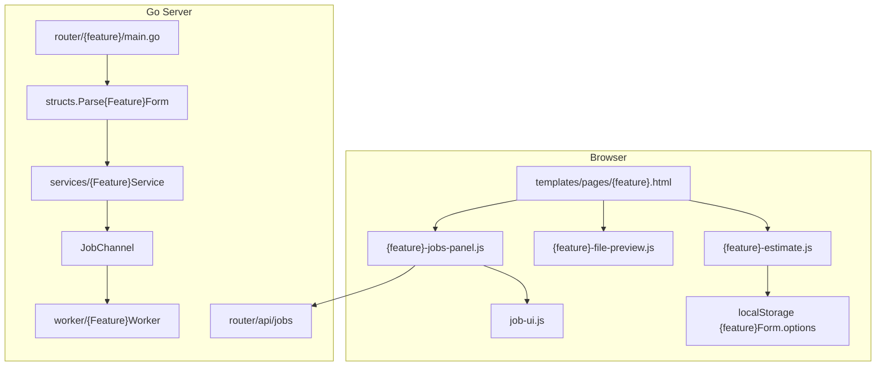

# Plan: Common Conventions (Split làm mẫu)

## Mục tiêu deliverable

Tạo file plan tham chiếu tại [`.cursor/plans/project_common_conventions.plan.md`](.cursor/plans/project_common_conventions.plan.md) — **single source of truth** cho Agent khi thêm/sửa feature. File này chứa đủ: cấu trúc thư mục, quy ước đặt tên, template HTML/JS/Go, state persistence, file input restore, và checklist end-to-end.

**Không refactor code hiện có trong phase này** — chỉ document + ghi rõ các lệch chuẩn đã biết (merge thiếu `pageshow`, split có dead `resultBox` JS, v.v.).

---

## Kiến trúc tổng quan



**Luồng submit chuẩn (PRG):** POST multipart → upload `uploads/` → `Parse*Form` → `*Service.CreateJob` → `channels.JobChannel <- job` → `303 See Other` redirect về GET cùng URL.

---

## 1. Cấu trúc file (full-stack)

### Frontend (mẫu: Split)

| Vai trò | Path | Ghi chú |
|---------|------|---------|
| Page template | `templates/pages/{feature}.html` | `{{define "content"}}`, không tự include layout |
| Layout shell | `templates/layouts/root.html` | Auto qua `templates.Render()` |
| Shared partials | `templates/partials/job_modals.html`, `sidebar.html` | Mọi feature page include `jobModals` |
| Page CSS | `public/static/css/jobs-ui.css` | **Không** tạo CSS riêng trừ home (`home.css`) |
| Global form CSS | `public/static/css/root.css` | `.form-field`, `.input-row`, `.estimate-box`, input styles |
| Shell CSS | `public/static/css/layout.css` | Sidebar, navbar, CSS variables |
| Shared job JS | `public/static/js/job-ui.js` | `window.JobUI` — fetch, render, modals |
| Estimate module | `public/static/js/{feature}-estimate.js` | Form logic, localStorage, estimate box |
| File preview | `public/static/js/{feature}-file-preview.js` | DataTransfer, preview UI, `pageshow` |
| Jobs panel | `public/static/js/{feature}-jobs-panel.js` | History table, polling, pagination |

**Script load order trong template (theo split):**
1. `job-ui.js`
2. `{feature}-jobs-panel.js`
3. `{feature}-estimate.js`
4. `{feature}-file-preview.js`
5. Inline `DOMContentLoaded` gọi `init{Feature}*()`

### Backend (mẫu: Split)

| Vai trò | Path | Ghi chú |
|---------|------|---------|
| Router | `router/{feature}/main.go` | `Bootstrap()` đăng ký route |
| Form parser + DTO | `structs/{Feature}JobExtrasDto.go` | `Parse{Feature}Form`, `ToJSON`, validation |
| Options DTO (nếu cần) | `structs/{Feature}OptionsDto.go` | Shared options, enums |
| Service | `services/{Feature}Service/main.go` | `CreateJob(videoPath, name, extrasJSON, userID)` |
| Worker | `worker/{Feature}Worker/main.go` | `Process(job, ctx)` |
| Enum job type | `enums/JobType.go` | Thêm constant mới |
| Worker dispatch | `worker/channels/main.go` | `switch job.Type` case mới |
| Router bootstrap | `router/main.go` | Gọi `{feature}.Bootstrap()` |
| Sidebar nav | `templates/partials/sidebar.html` | Link + `ActivePage` highlight |

**Chuẩn hóa router POST** (ưu tiên pattern merge/gif/extract-audio, không copy silent-return của split):

```go
func handleFeature(w http.ResponseWriter, r *http.Request) {
    userID := middleware.GetUserID(w, r)
    data := structs.PageData{ ActivePage: "{feature}", ... }

    if r.Method == "POST" {
        handleFeaturePost(w, r, userID)
        return
    }
    templates.Render(w, "templates/pages/{feature}.html", data)
}
```

POST handler bắt buộc:
- `r.MultipartReader()` streaming (không dùng `ParseMultipartForm`)
- Upload path: `uploads/{md5(filename)}{nanotimestamp}{ext}`
- Empty upload → `400` với message tiếng Việt rõ ràng
- Parse form → `http.Error 400` nếu invalid
- Redirect `303` về `/video/{feature}`
- Legacy URL redirect `301` nếu có route cũ (split hiện **chưa có** — ghi chú trong doc)

---

## 2. Quy ước đặt tên

### URL & routing

| Item | Convention | Split example |
|------|------------|---------------|
| Primary route | `/video/{kebab-feature}` | `/video/split` |
| ActivePage | kebab-case, khớp sidebar | `"split"` |
| API job type | snake_case enum | `"split"`, `"extract_audio"` |
| Form action | Khớp primary route | `action="/video/split"` |

### HTML IDs & form names

| Item | Convention | Split example |
|------|------------|---------------|
| Form id | `{feature}Form` | `splitForm` |
| File input id | `file` (primary), `fileAddMore` (secondary) | — |
| File input name | `file` (multi) hoặc `files` (merge only) | `name="file"` |
| Form field names | `snake_case`, khớp backend parser | `split_mode`, `output_format` |
| Field element id | `snake_case`, thường = name | `id="split_size"` |
| Panel toggles | `{feature}{Purpose}Panel` | `splitBySizePanel` |
| Jobs section prefix | `{feature}Jobs*` | `splitJobsTableBody` |
| Estimate box | `estimateBox` / `estimateTime` | **Chuẩn** — GIF dùng `gifEstimateBox` (exception) |

### JavaScript

| Item | Convention | Example |
|------|------------|---------|
| File | `{feature}-{concern}.js` | `split-estimate.js` |
| Init export | `window.init{Feature}{Concern}` | `initSplitEstimate` |
| Module wrapper | IIFE `(function () { ... })();` | Không ES modules |
| Constants | `SCREAMING_SNAKE` | `FORM_STORAGE_KEY` |
| Private helpers | `camelCase` | `collectFormState` |
| `"use strict"` | Bắt buộc cho file mới | Split cũ thiếu — không copy |

### CSS (BEM-like)

| Pattern | Example |
|---------|---------|
| Block | `.form-field`, `.file-preview-item`, `.history-table` |
| Element | `.file-preview-item__thumb`, `.page-header__subtitle` |
| Modifier | `.btn--primary`, `.btn--ghost`, `.file-preview-item--duplicate` |
| Layout utility | `.gap-col-16`, `.input-row`, `.container` |

### Go

| Item | Convention | Example |
|------|------------|---------|
| Package folder | lowercase, no separator | `router/split`, `extractaudio` |
| DTO struct | `{Feature}JobExtrasDto` | `SplitJobExtrasDto` |
| Parse function | `Parse{Feature}Form(fields map[string]string)` | — |
| Service package | `{Feature}Service` | `SplitService` |
| Worker package | `{Feature}Worker` hoặc `{Feature}VideoWorker` | `SplitVideoWorker` |

---

## 3. UI conventions (theo split.html)

### Page shell

```html
{{define "content"}}
<link href="{{asset "css/jobs-ui.css"}}" rel="stylesheet" />
<div class="container">
  <div class="page-header">
    <h2>Tiêu đề VN <span class="page-header__subtitle" lang="en">/ English</span></h2>
    <p class="page-description--en">{{.Description}}</p>
  </div>
  <form id="{feature}Form" action="/video/{feature}" method="post" enctype="multipart/form-data"
    onsubmit="this.querySelector('button[type=submit]').disabled=true; this.querySelector('button[type=submit]').innerText='Processing...'">
    <!-- fields -->
  </form>
  <section class="home-section"> <!-- jobs history --> </section>
</div>
{{template "jobModals" .}}
<!-- videoPreviewModal nếu có preview video -->
<!-- scripts -->
{{end}}
```

### Form field pattern

Mỗi field = `.form-field` + `label[for]` + control + `.field-hint` (tiếng Việt, dùng `<strong>` cho keyword):

```html
<div class="form-field">
  <label for="size">Độ phân giải đầu ra</label>
  <select id="size" name="size">...</select>
  <p class="field-hint">Giải thích ngắn. <strong>Keyword</strong> nổi bật.</p>
</div>
```

### Input styles (đã có trong root.css — **không inline style**)

- File: dashed border, `accept` phù hợp (`video/*`, `image/*`)
- Select/number/text: full width, focus ring `#c7d2fe`
- Disabled fields: gray background khi panel ẩn
- Number + unit: bọc trong `.input-row` (input flex:1, select flex:0 0 100px)
- Advanced options: `<details class="advanced-options"><summary>...</summary>`
- Conditional panels: `hidden` attribute + `disabled` inputs khi ẩn
- Submit: full-width primary button trong `.main form` (styled by root.css)
- Estimate: `#estimateBox.estimate-box` hidden until files probed

### File preview block (multi-file pages)

```html
<input id="file" type="file" name="file" accept="video/*" required multiple />
<input id="fileAddMore" type="file" accept="video/*" multiple hidden aria-hidden="true" tabindex="-1" />
<div id="filePreviewSection" class="file-preview-section" hidden>
  <div class="file-preview-section__header">...</div>
  <div id="filePreviewList" class="file-preview-list" role="list"></div>
</div>
```

### Jobs history block (copy từ split, đổi prefix)

IDs bắt buộc: `{feature}JobsEmpty`, `{feature}JobsTableWrap`, `{feature}JobsTableBody`, `{feature}JobsCardList`, `{feature}JobsSkeleton`, `{feature}JobsPagination`, `{feature}JobsRange`, `{feature}JobsPageInfo`, `{feature}JobsPagePrev`, `{feature}JobsPageNext`.

### Video preview modal (nếu preview video)

```html
<dialog id="videoPreviewModal" class="video-preview-modal">
  <h3 id="videoPreviewTitle"></h3>
  <p id="videoPreviewMeta"></p>
  <video id="videoPreviewPlayer" controls playsinline></video>
</dialog>
```

### UI rules cho Agent

- Copy tiếng Việt + English subtitle như split
- Không dùng inline `style=` (trừ spacing tạm `height: 32px` giữa form và history)
- Không thêm `#resultBox` legacy JS (dead code trên split)
- `field-hint` bắt buộc cho options phức tạp (encode, format, audio)
- Mobile: table ẩn, `.history-card-list` hiện (CSS trong jobs-ui.css)

---

## 4. State persistence (localStorage)

### Nguyên tắc

| Persist | Không persist |
|---------|---------------|
| Select, number, radio, text options | File objects (`FileList`) |
| Mode toggles (`split_mode`) | Estimate runtime (`fileStats`) |
| Advanced encode settings | Jobs panel page number (reset mỗi visit) |

### Pattern chuẩn (từ split-estimate.js)

```javascript
const FORM_STORAGE_KEY = "{feature}Form.options"; // camelCase feature

const PERSISTED_FIELD_IDS = [
  "size", "output_format", "crf", /* ... */
];

function collectFormState() {
  const state = { /* radio groups */ };
  PERSISTED_FIELD_IDS.forEach(id => {
    const el = document.getElementById(id);
    if (el) state[id] = el.value;
  });
  return state;
}

function applySavedFormState() {
  const saved = readFormStateFromStorage();
  if (!saved) return;
  // restore radio + fields
  // THEN update conditional panel visibility
}

function persistFormState() {
  writeFormStateToStorage(collectFormState());
}

// Bind: change on selects/radios, input on numbers
// Init order: applySavedFormState() BEFORE panel visibility logic
```

**localStorage key theo feature:** `splitForm.options`, `mergeForm.options`, `gifForm.options`, `extractAudioForm.options`.

**Sau POST redirect:** form options được restore từ localStorage; files bị mất (expected).

---

## 5. File input & browser restore (bfcache)

### DataTransfer pattern (bắt buộc cho add/remove/reorder files)

```javascript
function setInputFiles(input, files) {
  const dt = new DataTransfer();
  for (let i = 0; i < files.length; i++) dt.items.add(files[i]);
  input.files = dt.files;
  if (files.length === 0) input.value = "";
  input.dispatchEvent(new Event("change", { bubbles: true }));
}
```

### BFCache restore (bắt buộc)

Khi user back/forward, browser có thể giữ `input.files` nhưng DOM preview stale:

```javascript
function syncFromFileInput() {
  const fileInput = document.getElementById("file");
  if (!fileInput || !fileInput.files || fileInput.files.length === 0) return;
  fileInput.dispatchEvent(new Event("change", { bubbles: true }));
}

// Trong init:
syncFromFileInput(); // restore on first load if browser kept files
window.addEventListener("pageshow", e => {
  if (e.persisted) syncFromFileInput();
});
```

### Object URL cleanup

```javascript
window.addEventListener("beforeunload", revokeAllUrls);
```

### Cross-module coordination

- `file-preview.js` và `estimate.js` **cùng listen** `#file` `change` event
- Không dùng global callback (`window.onMergeFilesChanged`) trừ khi feature phức tạp (GIF timeline)
- `file-preview.js` gọi `syncFromFileInput()` cuối `init`; `estimate.js` probe files trên `change`

### Probe metadata

Tạo `<video preload="metadata">` + `URL.createObjectURL(file)` để đọc duration. Revoke URL khi unload.

---

## 6. Jobs panel pattern (split-jobs-panel.js)

```javascript
function init{Feature}JobsPanel() {
  JobUI.init({ modals: { errorModal, downloadModal, ... }, onCancelSuccess: loadJobs, onRetrySuccess: loadJobs });
  bindEvents();
  loadJobs();
  startPolling(); // POLL_INTERVAL_MS = 5000
}

function loadJobs() {
  JobUI.fetchJobs({ type: "{job_type_enum}", limit: PAGE_SIZE, page: state.page })
    .then(/* render table + cards + pagination + skeleton */);
}
```

- `PAGE_SIZE = 5`
- Dùng `JobUI.badgeHtml`, `actionButtonsHtml`, `bindRowActions`, `updatePagination`
- `type` filter phải khớp `enums.JobType` string (`extract_audio` không phải `extract-audio`)

---

## 7. Backend DTO & validation pattern

Tham chiếu [`structs/SplitJobExtrasDto.go`](structs/SplitJobExtrasDto.go):

1. Struct `{Feature}JobExtrasDto` với JSON tags
2. `allowed*` maps cho whitelist validation
3. `Parse{Feature}Form(fields map[string]string) (Dto, error)` — defaults + cross-field rules
4. `ToJSON() (string, error)` — serialize cho `entities.Job.Extras`
5. Unit tests: `structs/{Feature}JobExtrasDto_test.go` — cover defaults, invalid, edge cases

Encode options chung: reuse [`structs/FfmpegEncodeOptionsDto.go`](structs/FfmpegEncodeOptionsDto.go) khi feature có video encode.

---

## 8. Service & Worker pattern

### CreateJob (SplitService)

```go
func CreateJob(videoPath, name, extras, userID string) (entities.Job, error) {
    job := entities.Job{
        Identifier: uuid.New().String(),
        Status:     enums.StatusPending,
        Type:       enums.JobType{Feature},
        Extras:     extras,
        UserID:     userID,
    }
    Global.DB.Create(&job)
    // JobFileData input record
    return job, nil
}
```

### Worker Process

1. Skip nếu job đã terminal status
2. Load input `JobFileData` (type input)
3. Parse extras JSON → DTO
4. Process với `context.Context` (hỗ trợ cancel)
5. Write output `JobFileData` records
6. Update job status completed/failed

### Đăng ký feature mới

1. `enums/JobType.go` — constant
2. `worker/channels/main.go` — case + cancel context
3. `services/JobPresenterService` — encode summary nếu hiển thị trong API
4. `job-ui.js` `TYPE_LABELS` — label tiếng Việt
5. `templates/partials/sidebar.html` — nav link

---

## 9. Checklist: thêm feature `{feature}` mới

### Frontend
- [ ] `templates/pages/{feature}.html` — form + jobs section + modals + scripts
- [ ] `public/static/js/{feature}-estimate.js` — localStorage + estimate
- [ ] `public/static/js/{feature}-file-preview.js` — DataTransfer + pageshow (nếu có file upload)
- [ ] `public/static/js/{feature}-jobs-panel.js` — JobUI integration
- [ ] Styles: chỉ thêm vào `jobs-ui.css` nếu cần component mới
- [ ] `ActivePage` khớp sidebar

### Backend
- [ ] `router/{feature}/main.go` — GET/POST + legacy redirect
- [ ] `structs/{Feature}JobExtrasDto.go` + tests
- [ ] `services/{Feature}Service/main.go`
- [ ] `worker/{Feature}Worker/main.go`
- [ ] `enums/JobType.go` + `worker/channels/main.go`
- [ ] `router/main.go` Bootstrap
- [ ] `sidebar.html` nav item

### Verify
- [ ] Refresh trang → form options restore từ localStorage
- [ ] Back button sau navigate → file preview + estimate sync (`pageshow`)
- [ ] Submit → 303 redirect, jobs panel poll thấy job mới
- [ ] Empty upload → 400 message rõ
- [ ] Mobile jobs: card list hiển thị

---

## 10. Exceptions đã biết (không copy mù)

| Feature | Khác chuẩn split | Ghi chú cho Agent |
|---------|------------------|-------------------|
| Merge | `name="files"`, drag-sort, `handleMergeSubmit()` | Multi-file single job |
| GIF | `gifEstimateBox`, timeline/segments JS, no video modal | Domain-specific UI |
| Extract-audio | Audio options thay encode video | Còn lại giống split |
| Home | `home-dashboard.js`, cross-type jobs, `home.css` | Dashboard, không có form upload |
| Split router | Silent return khi empty upload, no legacy redirect | Feature mới **không** làm vậy |

---

## 11. Nội dung file plan sẽ chứa (sections)

File [`.cursor/plans/project_common_conventions.plan.md`](.cursor/plans/project_common_conventions.plan.md) sẽ được viết đầy đủ với:

1. Architecture diagram + data flow
2. File tree template (copy-paste skeleton)
3. HTML skeleton đầy đủ (form + jobs + modal + init script)
4. JS skeleton cho 3 modules (estimate, file-preview, jobs-panel)
5. Go skeleton cho router + DTO + service
6. localStorage + pageshow code blocks
7. CSS class reference table
8. Naming cheat sheet
9. New feature checklist
10. Known exceptions table

**Optional follow-up (không nằm trong scope plan doc):** extract `form-state.js` / `file-preview-core.js` để giảm duplicate sau khi doc ổn định.
