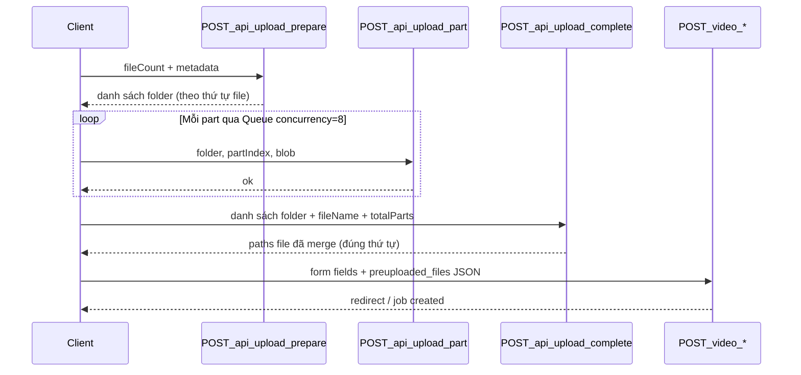

# Plan: Chunked Upload với Queue (8 luồng)

## Bối cảnh hiện tại

- Mọi upload đều gửi **toàn bộ file** trong 1 request `multipart/form-data` ([`router/split/main.go`](router/split/main.go), [`router/merge/main.go`](router/merge/main.go), …).
- [`public/static/js/dependencies/queue.js`](public/static/js/dependencies/queue.js) là ES module (`export default class Queue`) nhưng **chưa được dùng** ở đâu; các trang hiện load script classic (`<script src=...>`).
- File input sau upload được lưu flat tại `uploads/{md5}{nano}{ext}` rồi tạo job.

## Kiến trúc đề xuất



**Lưu trữ tạm:** `uploads/tmp/chunks/{uploadSessionId}/{fileIndex}/file.part.{n}`

**File hoàn chỉnh:** merge xong → move/rename sang `uploads/{md5}{nano}{ext}` (giữ convention hiện tại) → xóa folder chunk.

---

## Phần 1: Server — Upload API mới

### 1.1 Router mới

Tạo [`router/api/upload/main.go`](router/api/upload/main.go), đăng ký trong [`router/main.go`](router/main.go):

| Endpoint | Method | Mô tả |
|----------|--------|-------|
| `/api/upload/prepare` | POST | Tạo N folder chunk |
| `/api/upload/part` | POST | Nhận 1 part (multipart) |
| `/api/upload/complete` | POST | Merge parts → trả paths |

Tất cả dùng `middleware.GetUserID` để gắn session với user cookie.

### 1.2 Service layer

Tạo [`services/ChunkUploadService/main.go`](services/ChunkUploadService/main.go):

**`Prepare(userID string, req PrepareRequest) ([]UploadSlot, error)`**
- Input: `file_count` + optional `files[]` với `{ name, size, total_parts }` (metadata giúp validate ở complete).
- Tạo `uploadSessionId = uuid`, loop `0..fileCount-1` → `uploads/tmp/chunks/{sessionId}/{i}/`.
- Ghi manifest `uploads/tmp/chunks/{sessionId}/manifest.json`: `{ user_id, created_at, slots: [...] }`.
- Trả về: `[{ folder, index, session_id }]`.

**`SavePart(userID, folder, partIndex int, reader io.Reader) error`**
- Validate `folder` nằm trong `uploads/tmp/chunks/`, thuộc `user_id` trong manifest.
- Validate `partIndex >= 1`.
- Ghi `file.part.{partIndex}` (atomic: write temp rồi rename).

**`Complete(userID, req CompleteRequest) ([]CompletedFile, error)`**
- Input: `items[]` = `{ folder, file_name, total_parts }` theo đúng thứ tự client cần.
- Với mỗi item: kiểm tra đủ `total_parts` file `.part.*`, merge tuần tự bằng `io.Copy` (không load RAM).
- Output path: `uploads/{md5(name)}{nano}{ext}` giống handler hiện tại.
- Xóa folder chunk + cập nhật/xóa manifest.
- Trả: `[{ path, name, size, index }]`.

### 1.3 DTO

Tạo [`structs/UploadApiDto.go`](structs/UploadApiDto.go) cho request/response JSON.

### 1.4 Config

Thêm vào [`config/site.go`](config/site.go):
- `UploadChunkSizeBytes` (env `UPLOAD_CHUNK_SIZE_MB`, mặc định **5 MB**)
- `UploadChunkConcurrency` — chỉ document cho client; server không cần.
- `UploadChunkTTLHours` (mặc định 24h) cho cleanup folder orphan.

### 1.5 Bảo mật & giới hạn

- **Path traversal:** `filepath.Clean` + prefix check `uploads/tmp/chunks/`.
- **Ownership:** manifest `user_id` phải khớp cookie.
- **Giới hạn part:** reject nếu `partIndex > total_parts` hoặc `total_parts` vượt ngưỡng (vd. file 10GB / 5MB = ~2000 parts → cap hợp lý).
- **Max body part:** `http.MaxBytesReader` trên handler part (~chunk size + overhead).

### 1.6 Cleanup orphan chunks

Mở rộng [`worker/FileRetentionWorker/main.go`](worker/FileRetentionWorker/main.go) hoặc thêm goroutine trong `ChunkUploadService`: xóa `uploads/tmp/chunks/*` có `created_at` > TTL và chưa complete. `StorageService.walkUploads` đã classify `tmp/` — không cần đổi logic stats.

---

## Phần 2: Client — Module upload dùng Queue

### 2.1 Module mới

Tạo [`public/static/js/chunk-upload.js`](public/static/js/chunk-upload.js) (ES module):

```javascript
import Queue from "./dependencies/queue.js";

const CONCURRENCY = 8;
const CHUNK_SIZE = /* đọc từ window.__UPLOAD_CONFIG hoặc hardcode 5MB, sync với server */;

export async function uploadFiles(files, { onProgress } = {}) { ... }
```

**Luồng trong `uploadFiles`:**

1. Tính `totalParts` cho từng file: `Math.ceil(file.size / CHUNK_SIZE)`.
2. `POST /api/upload/prepare` với `{ file_count, files: [{ name, size, total_parts }] }`.
3. Flatten tất cả part jobs từ mọi file vào một mảng; mỗi job là async function nhận `next` callback theo API của Queue:

```javascript
const queue = new Queue({ concurrency: 8, autostart: false });
for (const { file, folder, fileIndex } of slots) {
  for (let part = 1; part <= totalParts; part++) {
    queue.push((next) => {
      uploadPart(file, folder, part)
        .then(() => { onProgress?.(...); next(); })
        .catch((err) => next(err));
    });
  }
}
await queue.start(); // reject nếu queue emit error → gọi queue.end()
```

4. `POST /api/upload/complete` với danh sách folder + metadata.
5. Trả `[{ path, name, index }]` đúng thứ tự.

**`uploadPart`:** `FormData` gồm `folder`, `part_index`, `file` (blob slice `file.slice(start, end)`).

**Progress:** `onProgress({ uploadedParts, totalParts, fileIndex, fileName })` để UI hiển thị %.

### 2.2 Bridge cho form classic

Tạo [`public/static/js/chunk-upload-bridge.js`](public/static/js/chunk-upload-bridge.js) (IIFE, không module) expose `window.ChunkUpload.submitFormWithChunks(form, fileInput, options)`:
- `preventDefault` form submit.
- Gọi `uploadFiles` từ module (dynamic `import()`).
- Inject hidden input `preuploaded_files` = JSON paths.
- Clear/disable file input để form POST không gửi lại binary.
- Submit form bình thường (giữ hidden fields hiện có: `file_order`, `items_meta`, …).

Load trong template:

```html
<script type="module" src="{{asset "js/chunk-upload-bridge.js"}}"></script>
```

(hoặc inline `import()` trong bridge script `type=module`).

Inject chunk size config từ server qua template: `window.__UPLOAD_CHUNK_SIZE = {{.UploadChunkSize}}`.

---

## Phần 3: Tích hợp tool handlers

Sửa 4 handler POST để **hỗ trợ 2 mode**:

1. **Legacy:** multipart file parts (giữ tương thích).
2. **Chunked:** field `preuploaded_files` (JSON array `[{path, name}]`) — bỏ qua file parts, validate path thuộc `uploads/` và file tồn tại.

Files cần sửa:
- [`router/split/main.go`](router/split/main.go)
- [`router/merge/main.go`](router/merge/main.go)
- [`router/gif/main.go`](router/gif/main.go)
- [`router/extractaudio/main.go`](router/extractaudio/main.go)

Extract helper chung (vd. [`router/uploadutil/resolve_inputs.go`](router/uploadutil/resolve_inputs.go)):

```go
func ResolveUploadedFiles(r *http.Request, reader *multipart.Reader) ([]InputFile, error)
// Nếu preuploaded_files có → parse JSON + validate
// Else → stream multipart như hiện tại
```

### 3.1 Cập nhật UI submit

| Trang | Thay đổi |
|-------|----------|
| [`templates/pages/split.html`](templates/pages/split.html) | `onsubmit` → gọi `ChunkUpload.submitFormWithChunks` |
| [`templates/pages/merge.html`](templates/pages/merge.html) | `handleMergeSubmit` → validate rồi chunk upload |
| [`templates/pages/gif.html`](templates/pages/gif.html) | tương tự |
| [`templates/pages/extract-audio.html`](templates/pages/extract-audio.html) | tương tự |

Thêm progress UI đơn giản (progress bar + %) tái dùng style từ [`public/static/js/job-ui.js`](public/static/js/job-ui.js).

**Editor** (`editor-api.js`) — **phase 2**: logic phức tạp hơn (nhiều file keyed); API chunked đã sẵn có thể dùng sau.

---

## Phần 4: Chi tiết API contract

### POST `/api/upload/prepare`

```json
// Request
{ "file_count": 3, "files": [
  { "name": "a.mp4", "size": 52428800, "total_parts": 10 },
  { "name": "b.mp4", "size": 10485760, "total_parts": 2 }
]}

// Response 200
{ "session_id": "uuid", "slots": [
  { "index": 0, "folder": "uploads/tmp/chunks/uuid/0" },
  { "index": 1, "folder": "uploads/tmp/chunks/uuid/1" }
]}
```

### POST `/api/upload/part`

`multipart/form-data`:
- `folder` (string)
- `part_index` (int, 1-based)
- `file` (binary chunk)

Response: `{ "ok": true }`

### POST `/api/upload/complete`

```json
// Request
{ "items": [
  { "folder": "uploads/tmp/chunks/uuid/0", "file_name": "a.mp4", "total_parts": 10 },
  { "folder": "uploads/tmp/chunks/uuid/1", "file_name": "b.mp4", "total_parts": 2 }
]}

// Response 200
{ "files": [
  { "index": 0, "path": "uploads/abc...mp4", "name": "a.mp4", "size": 52428800 },
  { "index": 1, "path": "uploads/def...mp4", "name": "b.mp4", "size": 10485760 }
]}
```

---

## Phần 5: Xử lý lỗi

| Tình huống | Hành vi |
|------------|---------|
| 1 part fail | Queue `end(error)` → dừng toàn bộ, UI hiện lỗi, không gọi complete |
| Complete thiếu part | 400 + message rõ part nào thiếu |
| User refresh giữa chừng | Orphan folder bị TTL cleanup |
| Upload xong nhưng job fail | File input đã ở `uploads/` — FileRetentionWorker xử lý theo job lifecycle hiện tại |

---

## Thứ tự triển khai đề xuất

1. **ChunkUploadService** + DTO + 3 API endpoints + unit test merge logic
2. **chunk-upload.js** + test thủ công với `curl`/file lớn
3. **resolve_inputs helper** + sửa 1 handler (merge — multi-file, cover nhiều case nhất)
4. **UI progress** + tích hợp 4 trang video tools
5. **Cleanup worker** + env docs trong [`.env.example`](.env.example)
6. Editor integration (optional follow-up)

## Files chính sẽ tạo/sửa

**Tạo mới:**
- `router/api/upload/main.go`
- `services/ChunkUploadService/main.go`
- `structs/UploadApiDto.go`
- `router/uploadutil/resolve_inputs.go`
- `public/static/js/chunk-upload.js`
- `public/static/js/chunk-upload-bridge.js`

**Sửa:**
- `router/main.go`, `config/site.go`, `.env.example`
- `router/split|merge|gif|extractaudio/main.go`
- `templates/pages/split|merge|gif|extract-audio.html`
- `worker/FileRetentionWorker/main.go` (cleanup chunks)
