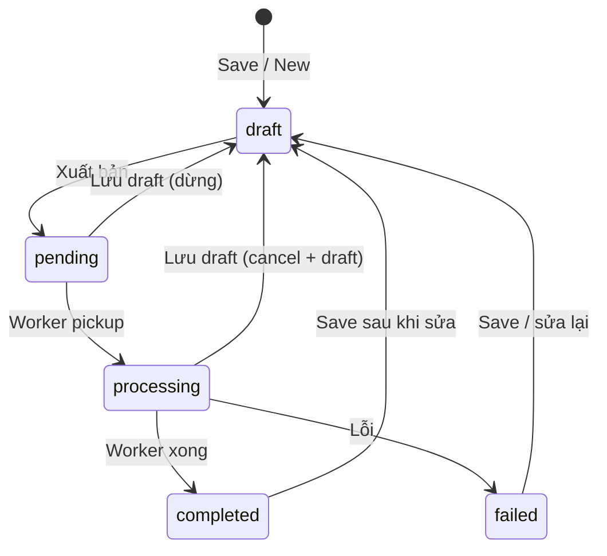
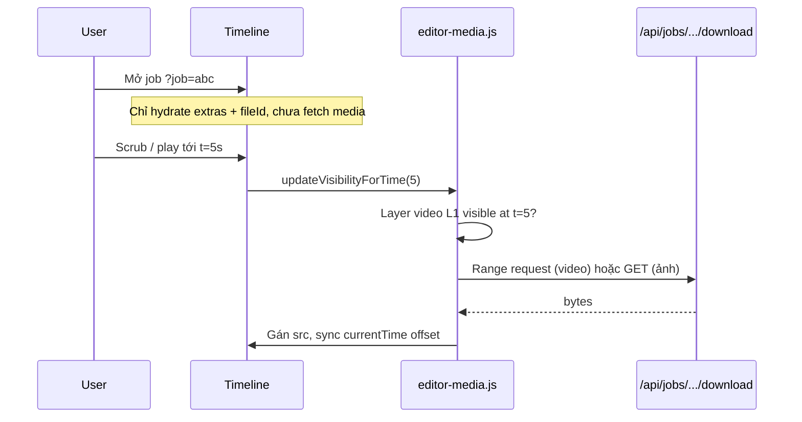

# Editor Job Backend Integration

## 1. Thống kê tính năng hiện tại (page editor)

Trang [`/video/editor`](templates/pages/editor.html) hiện là **mock UI client-side**, chưa có backend.

| Nhóm | Tính năng | Module | Ghi chú |
|------|-----------|--------|---------|
| Frame | Khung canvas 16:9 / 9:16 / 1:1, tọa độ 0–1 | `editor-frame.js` | Bound layer cố định |
| Layers | Text, ảnh, video, shape, brush/draw, blur | `editor-layers.js`, `editor-draw.js` | Kéo thả, z-index, visibility |
| Transform | Drag, resize 8 góc/cạnh, rotate, nudge phím mũi tên | `editor-transform.js` | Shift = uniform scale |
| Timeline | Playhead, play/pause, caption segments start/end | `editor-timeline.js`, `editor-captions.js` | Ẩn/hiện layer theo thời gian |
| Insert | Upload file (video/ảnh), drag-drop vào canvas | `editor-mock.js` | **Blob URL — mất khi reload** |
| History | Undo/redo (Ctrl+Z / Ctrl+Shift+Z), panel history | `editor-history.js` | Max 50 entries |
| Shortcuts | Ctrl+D duplicate layer, Delete xóa layer, Esc thoát draw tool | `editor-mock.js` | |
| Export JSON | Dialog copy JSON (mock) | `editor-mock.js` → `exportJSON()` | **Giữ nguyên** — preview client, không phải Xuất bản |
| Backend | Không có | — | Không save, không job, không persist |

**Payload export hiện tại** (`exportJSON()`):

```json
{
  "frame": { "width": 1920, "height": 1080 },
  "framePreset": "16:9",
  "duration": 30,
  "layers": [ /* text/image/video/shape/draw/blur — src là blob URL */ ]
}
```

---

## 2. Mô hình dữ liệu (theo yêu cầu đã làm rõ)



| Thành phần | Lưu ở đâu | Nội dung |
|------------|-----------|----------|
| Project config | `jobs.extras` | `frame`, `framePreset`, `duration`, `layers` (transform, timing, text, shape props…) |
| Media upload | `job_file_data` (type=`input`) | Video/ảnh thật trên disk `uploads/...` |
| Layer tham chiếu file | Trong `layers[]` bên `extras` | **`fileId` + `mediaUrl`** (path server) — không blob; `src` chỉ gán runtime sau lazy load |

**Quy ước layer media sau Save** (trong `job.extras`):

```json
{
  "id": "layer-3",
  "kind": "video",
  "fileId": 42,
  "mediaUrl": "/api/jobs/{identifier}/files/42/download",
  "x": 0.1, "y": 0.1, "width": 0.8, "height": 0.8,
  "start": 0, "end": 15.5
}
```

- Layer chưa upload (blob mới): Save gửi file kèm `clientKey` → BE tạo `job_file_data` → trả `fileId` + `mediaUrl` → FE cập nhật state, revoke blob.
- Layer đã có `fileId`: giữ nguyên, không upload lại.

| Output encode | Phase sau | Worker stub phase 1 chỉ `completed`; FFmpeg sau |

## 3. Luồng nút trên UI

| Nút | Hành vi |
|-----|---------|
| **Save** | Tạo job mới (nếu chưa có) hoặc cập nhật job hiện tại; status → `draft`; upload file mới; ghi `extras`; cập nhật URL layer |
| **Duplicate** | Clone job + `extras` + clone rows `job_file_data` (input); job mới status `draft`; mở editor job mới |
| **Xuất bản** | Save trước (nếu dirty) → status `pending` → `channels.JobChannel <- job`; worker chạy khi đến lượt |
| **Lưu draft** (dừng job) | `pending` → `draft`; `processing` → cancel context → `draft`; xóa output partial nếu có |
| **Export JSON** | Giữ dialog mock hiện tại (copy JSON local), tách biệt với Xuất bản |

**Mở lại để edit:** `/video/editor?job={identifier}` — GET load **chỉ config** (`extras` + metadata file); **không** tải binary media ngay.

---

## 2b. Lazy load media theo timeline (khi mở lại job)

Khi mở job đã lưu, FE **không** gán `src` cho mọi video/ảnh cùng lúc. Chỉ tải file khi playhead vào khoảng thời gian layer đó hiển thị.



### Phân tách dữ liệu lưu vs runtime

| Field | Trong `job.extras` (persist) | Runtime only |
|-------|------------------------------|--------------|
| `fileId` | Có | — |
| `mediaUrl` | Có — path `/api/jobs/{id}/files/{fileId}/download` | — |
| `src` | Không (hoặc chỉ lưu `mediaUrl`, không blob) | Gán sau khi load |
| `mediaState` | Không | `idle` → `loading` → `ready` / `error` |

Layer media sau Save (persist):

```json
{
  "id": "layer-3",
  "kind": "video",
  "fileId": 42,
  "mediaUrl": "/api/jobs/abc/files/42/download",
  "start": 0,
  "end": 15.5
}
```

### Module mới: `editor-media.js`

Trách nhiệm:

- **`init(opts)`** — nhận `getState`, `getCurrentTime`, `getJobIdentifier`
- **`ensureLayerMedia(layer)`** — nếu `mediaState === 'ready'` thì skip; nếu layer visible theo timeline → bắt đầu load
- **`releaseLayerMedia(layer)`** — optional: thu hồi `src` + pause video khi playhead ra xa (tiết kiệm RAM)
- **`onTimeUpdate(t)`** — gọi từ `editor-mock.js` / `editor-timeline.js`:
  1. Tìm layers `(kind === 'video' || kind === 'image')` có `fileId` và `t ∈ [start, end)`
  2. `ensureLayerMedia` cho các layer đó
  3. Prefetch nhẹ: layers sắp visible trong `±PREFETCH_SEC` (vd. 2s) — chỉ metadata hoặc `preload="metadata"` cho video
  4. `releaseLayerMedia` cho layers cách playhead > `RELEASE_SEC` (vd. 10s)

### Sửa `editor-layers.js`

- `renderLayerEl` cho video/ảnh từ server: **không** set `src` ngay nếu có `fileId` + chưa `ready`
  - Video: `preload="none"`, placeholder skeleton/loading trong layer
  - Ảnh: placeholder cho đến khi `ensureLayerMedia` gán `img.src`
- `syncVideoLayerPlayback`: chỉ seek/play khi `mediaState === 'ready'`; nếu chưa load thì gọi `EditorMedia.ensureLayerMedia(layer)` rồi retry sau `loadeddata`
- `updateVisibilityForTime`: hook vào `EditorMedia.onTimeUpdate(currentTime)` **trước** khi sync playback

### Backend hỗ trợ partial load

- Download endpoint dùng `http.ServeFile` — **đã hỗ trợ HTTP Range** (browser video seek không cần tải full file)
- Response header: `Accept-Ranges: bytes`, `Content-Disposition: inline` cho preview
- GET `/api/editor/jobs/{identifier}` trả thêm **`files[]` metadata** từ `job_file_data` (`id`, `name`, `size`, `duration`) — timeline/duration hiển thị đúng **không cần** load video

### Luồng mở job (cập nhật)

1. `GET /api/editor/jobs/{identifier}` → `extras` + `files` metadata + `status`
2. `loadFromServer`: hydrate `state.layers` với `fileId`/`mediaUrl`, `mediaState: 'idle'`
3. Render UI ngay (text/shape/draw hiện đủ; video/ảnh hiện placeholder)
4. User scrub timeline → media tải dần theo vị trí playhead
5. Layer vừa upload local (blob, chưa Save): vẫn dùng blob ngay — lazy load chỉ áp dụng **sau reload / mở job đã lưu**

### Test bổ sung

8. Mở job có 3 video layer dài → Network tab **không** thấy 3 request download ngay
9. Scrub tới segment video A → chỉ request file A
10. Scrub sang segment video B → request file B; A có thể release nếu bật eviction
11. Video seek trong layer hoạt động (Range request, không tải full trước)

---

## 4. Backend — files cần thêm/sửa

### Enum & struct

- [`enums/JobType.go`](enums/JobType.go): thêm `JobTypeEditor = "editor"`
- **Mới** [`structs/EditorJobExtrasDto.go`](structs/EditorJobExtrasDto.go): parse/validate config JSON; helper `SanitizeLayersForStorage()`

### Service

- **Mới** [`services/EditorService/main.go`](services/EditorService/main.go):
  - `CreateDraft(userID, extrasJSON, files)` → job `draft` + input rows
  - `UpdateDraft(identifier, userID, extrasJSON, newFiles)` → merge files, update extras
  - `DuplicateJob(identifier, userID)` → new identifier, `draft`
  - `PublishJob(identifier, userID)` → validate draft → `pending`
  - `RevertToDraft(identifier, userID)` → stop + `draft`
  - `GetEditorJob(identifier, userID)` → job + extras + input files map

### Worker (phase 1 — done ngay)

- **Mới** [`worker/EditorVideoWorker/main.go`](worker/EditorVideoWorker/main.go): đọc `extras`, set progress 1.0, return nil (chưa FFmpeg)
- [`worker/channels/main.go`](worker/channels/main.go): thêm case `JobTypeEditor`

### API routes

- **Mới** [`router/api/editor/main.go`](router/api/editor/main.go):

| Method | Route | Mô tả |
|--------|-------|-------|
| POST | `/api/editor/jobs` | Tạo draft (multipart: `config` JSON + files) |
| GET | `/api/editor/jobs/{identifier}` | Load job cho editor |
| PUT | `/api/editor/jobs/{identifier}` | Save draft |
| POST | `/api/editor/jobs/{identifier}/duplicate` | Nhân bản |
| POST | `/api/editor/jobs/{identifier}/publish` | Xuất bản → pending + enqueue |
| POST | `/api/editor/jobs/{identifier}/draft` | Dừng → draft |

- [`router/main.go`](router/main.go): bootstrap `api/editor`
- [`router/editor/main.go`](router/editor/main.go): truyền `?job=` vào template; load job server-side nếu cần SEO/title

### Download input files (bắt buộc cho preview sau reload)

Hiện [`router/api/jobs/main.go`](router/api/jobs/main.go) chỉ serve **output** qua `GetOutputFileByIdentifierAndUser`.

- Mở rộng [`services/JobFileDataService`](services/JobFileDataService/main.go): `GetFileByIdentifierAndUser(identifier, userID, fileID)` — input **hoặc** output
- Cập nhật `handleDownload`: editor job cho phép input; `Content-Disposition: inline` cho video/ảnh preview (output vẫn attachment)

### Presenter & job list

- [`services/JobPresenterService/main.go`](services/JobPresenterService/main.go): case `editor` — summary kiểu `"1920×1080 · 16:9 · 5 layers"`
- [`public/static/js/job-ui.js`](public/static/js/job-ui.js): thêm label `editor: "Editor"`, status `draft: "Draft"`

---

## 5. Frontend — files cần thêm/sửa

### Toolbar mới ([`templates/pages/editor.html`](templates/pages/editor.html))

Thêm vào header/toolbar:

```html
<button id="editorSave">Save</button>
<button id="editorDuplicate">Duplicate</button>
<button id="editorPublish">Xuất bản</button>
<button id="editorRevertDraft">Lưu draft</button>
<span id="editorJobStatus"></span>
```

Include `job_modals.html` + jobs panel (theo convention split/gif).

### JS modules

- **Mới** [`public/static/js/editor-api.js`](public/static/js/editor-api.js): fetch wrapper cho 6 API endpoints; build `FormData` (config + files keyed by `clientKey`)
- **Mới** [`public/static/js/editor-media.js`](public/static/js/editor-media.js): lazy load / release media theo timeline (xem §2b)
- **Mới** [`public/static/js/editor-jobs-panel.js`](public/static/js/editor-jobs-panel.js): lịch sử job `type=editor`, click row → `?job=identifier`
- **Sửa** [`public/static/js/editor-mock.js`](public/static/js/editor-mock.js):
  - Track `clientKey` trên layer mới (blob chưa save)
  - `loadFromServer(jobDto)` — hydrate config + `fileId`/`mediaUrl`, **không** prefetch media
  - `onTimeUpdate` → delegate `EditorMedia.onTimeUpdate(t)`
  - `saveDraft()` / `publish()` / `duplicate()` / `revertDraft()`
  - Sau save thành công: replace blob → `mediaUrl`, `history.replaceState` với `?job=`
  - Disable edit khi `processing` (chỉ xem + nút Lưu draft)
- **Sửa** [`public/static/js/editor-layers.js`](public/static/js/editor-layers.js): placeholder khi `mediaState !== 'ready'`; gán `src` qua `EditorMedia`

### Phân biệt Export JSON vs Xuất bản

- **Export JSON** (`#editorExport`): dialog preview — có thể hiển thị config đã sanitize (fileId thay blob) nhưng không enqueue
- **Xuất bản** (`#editorPublish`): gọi API publish → job queue

---

## 6. Chi tiết Save (multipart)

```
POST/PUT /api/editor/jobs/{identifier}
  config: JSON string (EditorJobExtrasDto)
  file_{clientKey}: binary (chỉ layer mới, chưa có fileId)
```

BE xử lý:

1. Parse config
2. Với mỗi `file_{clientKey}`: lưu disk → `JobFileData` input → map `clientKey → fileId`
3. Thay `clientKey` trong layers bằng `fileId` + `src`
4. Ghi `job.extras`, `status = draft`

Response trả job identifier + layers đã resolve (FE sync state).

---

## 7. Duplicate

1. Clone row `jobs` (UUID mới, `draft`, copy `extras`)
2. Clone rows `job_file_data` input (cùng `Path` — shared file on disk, không copy binary)
3. Redirect FE sang job mới

---

## 8. Revert to draft (dừng job)

Tách khỏi `/job/cancel` (cancel → `cancelled`):

- `pending`: update status `draft`, không enqueue
- `processing`: gọi cancel func trong `JobCancelMap` → update `draft` (không `cancelled`)
- Xóa output rows nếu worker đã tạo partial (`DeleteOutputFilesByJobId`)

Chỉ cho phép khi status ∈ `{pending, processing}`.

---

## 9. Worker phase 1 vs FFmpeg (sau)

Phase 1 (`EditorVideoWorker`): stub — đọc `extras`, mark `completed` ngay.

Phase 2 (ngoài scope): worker đọc `extras` + input paths từ `job_file_data`, FFmpeg render → output rows.

Queue behavior giống split/gif: startup re-enqueue mọi job `pending` ([`worker/channels/main.go`](worker/channels/main.go) line 35–42).

---

## 10. Thứ tự implement đề xuất

1. Enum + DTO + EditorService (CRUD draft, duplicate, publish, revert)
2. API routes + mở rộng file download cho input
3. EditorVideoWorker stub + channel dispatch
4. `editor-api.js` + toolbar buttons + save/load flow
5. `editor-media.js` + hook timeline lazy load
6. Jobs panel + JobPresenter/editor labels
7. Manual test: new → save → reload → lazy load khi scrub → xuất bản → mở lại edit

## 11. Test thủ công

1. Mở `/video/editor` → thêm video + text → Save → URL có `?job=`
2. Reload → text/shape hiện ngay; video/ảnh **chưa** download cho đến khi scrub tới segment đó
3. Duplicate → job mới draft, nội dung giống
4. Xuất bản → pending → processing → completed (nhanh)
5. Lưu draft khi pending/processing → quay draft, edit được
6. Export JSON vẫn mở dialog copy (không ảnh hưởng job status)
7. Jobs panel: click job draft/completed → mở editor tiếp
