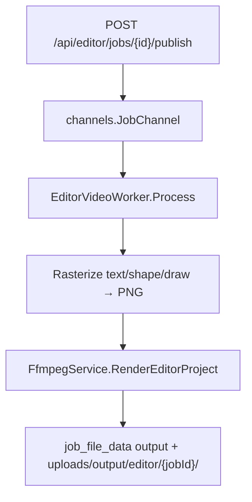

# Editor Job Phase 2 — FFmpeg Render

## Bối cảnh

**Phase 1 đã xong** (draft/save/publish/lazy-load). [`worker/EditorVideoWorker/main.go`](worker/EditorVideoWorker/main.go) hiện chỉ parse extras và set `Progress: 1` — không tạo file output.

**Phase 2** (theo plan §9): worker đọc `extras` + `job_file_data` input → FFmpeg composite → output rows → job `completed`.



---

## 1. Mở rộng struct & parse layer

### [`structs/EditorJobExtrasDto.go`](structs/EditorJobExtrasDto.go)

Thêm encode/output (mặc định server-side, không bắt buộc FE UI):

```go
type EditorJobExtrasDto struct {
    Frame       EditorFrameDto           `json:"frame"`
    FramePreset string                   `json:"framePreset"`
    Duration    float64                  `json:"duration"`
    Layers      []map[string]interface{} `json:"layers"`
    Encode      FfmpegEncodeOptionsDto   `json:"encode,omitempty"`
    OutputExt   string                   `json:"output_ext,omitempty"` // default "mp4"
}
```

Thêm `DefaultEditorEncodeOptions()` — mirror [`structs/DefaultMergeEncodeOptions()`](structs/MergeJobExtrasDto.go): `libx264`, `crf=23`, `preset=medium`, `yuv420p`, `aac`, `fps=30`.

### Mới [`structs/EditorLayerDto.go`](structs/EditorLayerDto.go)

Typed parser từ `map[string]interface{}` cho worker/FFmpeg:

- Fields: `ID`, `Kind`, `FileID`, `X/Y/Width/Height`, `Rotation`, `Opacity`, `ZIndex`, `Visible`, `Start`, `End`, `AlwaysVisible`
- Text: `Text`, `FontSize`, `Color`
- Shape: `Shape`, `Stroke`, `Fill`, `StrokeWidth`
- Draw: `Paths []EditorDrawPathDto` (`points [][]float64`, `stroke`, `width`)
- Blur: `BlurAmount`
- Helpers: `ParseEditorLayer()`, `PixelRect(frameW, frameH)`, `EnableExpr()` → FFmpeg `enable='between(t,start,end)'` hoặc luôn bật nếu `alwaysVisible`
- `SortLayersByZIndex()` — bỏ `kind=bound` (không lưu trong extras)

Unit tests trong [`structs/EditorLayerDto_test.go`](structs/EditorLayerDto_test.go).

---

## 2. Rasterize vector layers (Go, không phụ thuộc browser)

### Mới [`services/EditorRasterService/main.go`](services/EditorRasterService/main.go)

Dùng [`github.com/fogleman/gg`](https://github.com/fogleman/gg) (thêm vào `go.mod`) + font bundled [`assets/fonts/DejaVuSans.ttf`](assets/fonts/) (hoặc font có sẵn trong repo).

| Kind | Cách render |
|------|-------------|
| `text` | `gg` DrawString, căn giữa/trái theo box layer, fontSize scale theo `layer.height * frameH` |
| `shape` | Port logic từ [`editor-draw.js`](public/static/js/editor-draw.js) `shapeSvgMarkup` → `gg` (rect, circle, line, arrow) |
| `draw` | Port `paintDrawLayer` paths → `gg` stroke paths |
| `blur` | **Không rasterize** — xử lý trong FFmpeg filter chain |

Output: PNG RGBA trong temp dir `uploads/tmp/editor/{jobId}/layer-{id}.png`.

---

## 3. FfmpegService — composite pipeline

### Mới [`services/FfmpegService/editor_render.go`](services/FfmpegService/editor_render.go)

```go
type EditorRenderOptions struct {
    Extras      structs.EditorJobExtrasDto
    Layers      []structs.EditorLayerDto
    FilePaths   map[int]string // fileId → disk path
    OutputPath  string
    TempDir     string
    Encode      structs.FfmpegEncodeOptionsDto
    OnProgress  func(float64)
}
func RenderEditorProject(ctx context.Context, opts EditorRenderOptions) (structs.SegmentResultDto, error)
```

**Luồng render:**

1. **Base canvas**: `color=c=black:s={W}x{H}:d={duration}:r={fps}` (lavfi input `[base]`)
2. **Sort layers** theo `zIndex` (chỉ `visible=true`)
3. **Với mỗi layer** (chain `filter_complex`):
   - **image** (`fileId`): input file → `scale` + `rotate` + `format=rgba` + `colorchannelmixer=aa={opacity}` → `overlay=x:y:enable=...`
   - **video** (`fileId`): `trim=duration={end-start}`, `setpts`, scale/rotate/opacity, overlay; offset audio: `adelay={start*1000}|{start*1000}` cho mix sau
   - **text/shape/draw**: dùng PNG từ `EditorRasterService` → `-loop 1 -t {layerDur}` → overlay
   - **blur**: tại vị trí z-order: `split` composite hiện tại → `crop` vùng blur → `gblur=sigma={blurAmount/4}` → `overlay` lại (xấp xỉ CSS `backdrop-filter`)
4. **Audio**: thu thập audio từ các video layer → `amix=inputs=N:duration=longest:dropout_transition=0` (nếu không có video audio → `-an`)
5. **Encode**: `BuildEncodeArgs(encode)` + `-movflags +faststart`
6. **Progress**: coarse theo bước — rasterize layers (0–0.2), build+run ffmpeg (0.2–1.0); honor `ctx.Done()`

**Quy ước timing** (khớp FE [`editor-captions.js`](public/static/js/editor-captions.js)):

- `alwaysVisible` → hiện suốt `0..duration`
- Ngược lại: `start ≤ t < end`
- Video trong layer: play source từ `t=0` trong khoảng `(end-start)` giây

**Tọa độ**: `x,y,width,height` normalized 0–1 → pixel `x*W`, `y*H`, `w*W`, `h*H` (round int).

### Mới [`services/FfmpegService/editor_render_test.go`](services/FfmpegService/editor_render_test.go)

Test pure functions: `buildOverlayFilter`, `enableExpr`, input list ordering — **không** gọi ffmpeg thật trong unit test.

---

## 4. EditorVideoWorker — thay stub

Sửa [`worker/EditorVideoWorker/main.go`](worker/EditorVideoWorker/main.go) theo pattern [`worker/ExtractAudioWorker/main.go`](worker/ExtractAudioWorker/main.go):

```go
// Pseudocode flow
extras := resolveExtras(job)                    // parse + default encode
inputFiles := GetJobFileDataByJobId(..., input)
filePaths := map[fileId]path
layers := parseAndSortLayers(extras.Layers)

outputDir := uploads/output/editor/{job.ID}
os.RemoveAll(outputDir)
DeleteOutputFilesByJobId(job.ID)               // xóa output DB cũ khi re-publish

// Rasterize vector layers → temp PNGs
pngPaths := EditorRasterService.RenderLayers(...)

result, err := FfmpegService.RenderEditorProject(ctx, ...)
CreateJobFileData(output, type=output)
```

- `select { case <-ctx.Done() }` giữa các bước
- `updateJobFailed` khi lỗi (trừ cancel)
- `onProgress` → `JobService.UpdateJob(job.ID, {Progress: p})`

---

## 5. Cleanup khi publish lại

Sửa [`services/EditorService/main.go`](services/EditorService/main.go) `PublishJob`:

- Gọi `JobFileDataService.DeleteOutputFilesByJobId(job.ID)` trước khi set `pending` — tránh output rows cũ khi user Save → Xuất bản lại sau `completed`.

---

## 6. Frontend polish (nhỏ, cần cho E2E)

### [`public/static/js/editor-mock.js`](public/static/js/editor-mock.js)

- **Status polling** khi `jobStatus ∈ {pending, processing}`: poll `EditorAPI.getJob` mỗi 3s; cập nhật `#editorJobStatus`, `isReadOnly`; dừng khi `completed|failed|draft`
- Khi `completed`: toast "Xuất bản xong — tải file trong Jobs panel"

### [`public/static/js/editor-jobs-panel.js`](public/static/js/editor-jobs-panel.js)

- Editor job `pending|processing`: nút cancel gọi `EditorAPI.revertDraft` thay vì generic `/job/cancel` (tránh status `cancelled`)

### Không thêm encode UI

Dùng default server encode; `output_ext` mặc định `mp4`. Download hoạt động qua [`job-ui.js`](public/static/js/job-ui.js) khi `output_files` có data (đã có sẵn).

---

## 7. Test thủ công (plan §11 + Phase 2)

1. Tạo project: video + text + shape → Save → Xuất bản
2. Jobs panel: `pending → processing → completed`, progress tăng
3. Download output mp4 — kiểm tra composite đúng vị trí/timing
4. Mở job `completed` → Save (draft) → sửa → Xuất bản lại — output cũ bị thay
5. `Lưu draft` khi `processing` — cancel worker, quay draft, không file output partial
6. Project chỉ text/shape (không video) — render được (canvas đen + overlays)
7. Blur layer trên video — vùng blur hiển thị (xấp xỉ preview)

---

## Thứ tự implement

1. `EditorLayerDto` + tests + `DefaultEditorEncodeOptions` trong extras
2. `EditorRasterService` (text/shape/draw PNG)
3. `FfmpegService.RenderEditorProject` + filter builder tests
4. `EditorVideoWorker` thật + `PublishJob` cleanup output
5. FE polling + jobs-panel revert-draft
6. Manual E2E với ffmpeg local

## Rủi ro / giới hạn chấp nhận

- **Blur**: FFmpeg `gblur` trên crop — xấp xỉ CSS `backdrop-filter`, không pixel-perfect
- **Text**: font server (DejaVu) có thể khác font browser — chấp nhận trong Phase 2
- **Rotation**: `rotate` filter quanh tâm — cần offset overlay; test với layer xoay 45°
- **Nhiều video audio**: `amix` — volume không auto-duck; đủ cho Phase 2
