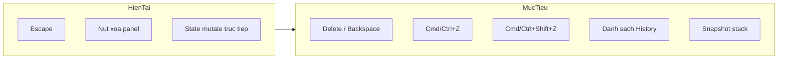
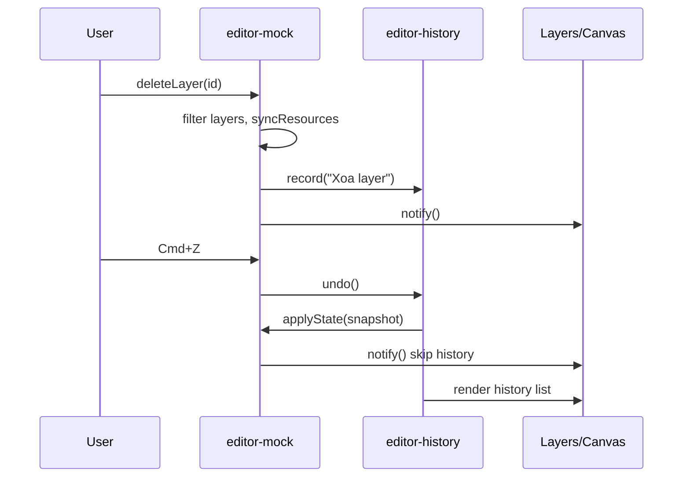

# Editor — Phím tắt xóa layer & History/Undo

## Hiện trạng

| Tính năng | Trạng thái |
|-----------|------------|
| Phím tắt | Chỉ **Escape** (thoát draw tool) trong [`bindToolbar()`](public/static/js/editor-mock.js) |
| Xóa layer | Nút × trong panel → `deleteLayer()` — không có phím tắt |
| Undo/History | Không có — `state` mutate trực tiếp, `revokeLayerResources()` gọi ngay khi xóa |



---

## 1. Module mới: `editor-history.js`

**File:** [`public/static/js/editor-history.js`](public/static/js/editor-history.js) (mới)

Quản lý snapshot stack theo mô hình index pointer (giống Photoshop):

```js
// entries[i] = { label, frame, framePreset, layers, selectedId }
// index trỏ tới trạng thái hiện tại
```

**API chính:**

| Hàm | Mô tả |
|-----|-------|
| `init({ getState, applyState, listEl })` | Wire vào `editor-mock.js` |
| `record(label)` | Sau mỗi thao tác: truncate redo branch, deep-clone state, push entry |
| `undo()` / `redo()` | Di chuyển index, gọi `applyState(snapshot)` |
| `jumpTo(index)` | Click item trong danh sách → nhảy tới bước đó |
| `render()` | Vẽ list, highlight bước hiện tại |
| `canUndo()` / `canRedo()` | Dùng cho disable UI |

**Deep clone:** `JSON.parse(JSON.stringify(...))` cho layers (không có circular ref). Đủ cho mock UI hiện tại.

**Blob URL lifecycle** — vấn đề quan trọng vì `deleteLayer` hiện gọi `revokeLayerResources` ngay:

- Thay `revokeLayerResources` trong delete bằng `syncResources(prevLayers, nextLayers)` — chỉ revoke URL không còn trong **bất kỳ** snapshot nào còn giữ (hoặc đơn giản hơn: chỉ revoke khi snapshot bị purge khỏi stack, max 50 entries).
- Khi `applyState` restore layer đã xóa → `src` blob URL vẫn còn hợp lệ.

**`applyState(snapshot)`** trong `editor-mock.js`:
- Gán `state.frame`, `state.framePreset`, `state.layers`, `state.selectedId`
- `EditorFrame.setDimensions(...)` nếu frame đổi
- Gọi `notify()` với flag nội bộ `isRestoringHistory = true` để **không** ghi thêm history

---

## 2. Điểm ghi history (phạm vi: tất cả thay đổi)

Gọi `EditorHistory.record(label)` tại các commit point:

| Nguồn | Label ví dụ | Cách hook |
|-------|-------------|-----------|
| `addLayer` | "Thêm text" / "Thêm hình" | Cuối hàm |
| `deleteLayer` | "Xóa [tên layer]" | Cuối hàm (sau khi bỏ revoke ngay) |
| `reorderLayers` | "Sắp xếp layers" | Cuối hàm |
| `setFramePreset` / `setFrameDimensions` | "Đổi frame 9:16" | Cuối hàm |
| `updateLayer` (không `live`) | "Sửa thuộc tính [layer]" | Cuối hàm khi `!opts.live && !isRestoringHistory` |
| `updateLayer` (`live: true`) | "Sửa [layer]" | **Debounced** 400ms — gom nhiều kéo slider thành 1 bước |
| Transform drag/resize/rotate | "Di chuyển [layer]" | Callback mới từ [`editor-transform.js`](public/static/js/editor-transform.js) `finishInteraction()` khi `interactionMoved` |
| Caption segment drag | "Chỉnh timing [layer]" | Đã gọi `updateLayer` non-live ở `onSegmentPointerUp` — tự ghi history |
| Draw commit (shape/brush/blur) | "Vẽ [loại]" | Qua `addLayer` |

**Không ghi history khi:**
- `isRestoringHistory === true` (undo/redo/jump)
- `updateLayer(..., { live: true })` trước khi debounce fire (chỉ ghi 1 lần sau khi dừng chỉnh)
- Init lần đầu — push entry "Bắt đầu" sau `init()` hoàn tất

**Transform hook** — sửa `finishInteraction()`:

```js
// editor-transform.js
if (interactionMoved && onInteractionEnd) onInteractionEnd();
```

Truyền `onInteractionEnd` từ `editor-mock.js` → `EditorHistory.record("Di chuyển layer")`.

---

## 3. Phím tắt

Mở rộng handler trong [`bindToolbar()`](public/static/js/editor-mock.js) (hoặc tách `bindKeyboardShortcuts()`):

| Phím | Hành vi |
|------|---------|
| **Delete** / **Backspace** | Xóa layer đang chọn (không xóa bound layer `__bound__`) |
| **Cmd/Ctrl+Z** | `EditorHistory.undo()` |
| **Cmd/Ctrl+Shift+Z** | `EditorHistory.redo()` |
| **Escape** | Giữ nguyên — thoát draw tool |

**Guard chung** `shouldIgnoreShortcut(e)`:
- Đang focus `input` / `textarea` / `select` (dùng pattern sẵn có `isPropertiesFocused()` + kiểm tra `contenteditable`)
- Không chặn Cmd/Ctrl+Z trong input text (browser native undo cho text field vẫn hoạt động nếu không `preventDefault` khi đang gõ)

Logic xóa:

```js
if ((e.key === "Delete" || e.key === "Backspace") && !shouldIgnoreShortcut(e)) {
  var layer = getSelectedLayer();
  if (layer && !EditorLayers.isBoundLayer(layer)) {
    e.preventDefault();
    deleteLayer(layer.id);
  }
}
```

---

## 4. UI danh sách History

**HTML** — thêm section trong panel trái, dưới Layers ([`editor.html`](templates/pages/editor.html)):

```html
<aside class="editor-panel editor-panel--layers">
  <h3>Layers</h3>
  <ul id="editorLayersList">...</ul>
  ...
  <h3 class="editor-panel__title editor-panel__title--history">History</h3>
  <ol id="editorHistoryList" class="editor-history-list" reversed></ol>
</aside>
```

- Mỗi item: label + thời điểm tương đối (hoặc số thứ tự)
- Bước hiện tại: class `editor-history-item--current`
- Click item → `EditorHistory.jumpTo(index)`
- `reversed` hoặc CSS `flex-direction: column-reverse` để bước mới nhất ở trên

**CSS** [`editor.css`](public/static/css/editor.css):
- `.editor-panel--layers` chia flex: layers list `flex: 1`, history `max-height: 180px` scroll
- `.editor-history-item` hover/active states, font 12px, truncate label dài

---

## 5. Tích hợp init

[`editor.html`](templates/pages/editor.html) — load script trước `editor-mock.js`:

```html
<script src="{{asset "js/editor-history.js"}}"></script>
<script src="{{asset "js/editor-mock.js"}}"></script>
```

[`editor-mock.js`](public/static/js/editor-mock.js) `init()`:

```js
EditorHistory.init({
  getState: function () { return { frame, framePreset, layers, selectedId }; },
  applyState: applyHistoryState,
  listEl: $("editorHistoryList"),
  maxEntries: 50,
});
// sau notify() lần đầu:
EditorHistory.record("Bắt đầu");
```

Chạy `go run cmd/assetbuild` sau khi thêm file JS mới.

---

## Luồng undo



---

## Kiểm tra thủ công

1. Chọn layer → **Delete** / **Backspace** → layer biến mất; bound layer không xóa được
2. **Cmd/Ctrl+Z** → layer quay lại (ảnh/video blob URL vẫn hiện đúng)
3. **Cmd/Ctrl+Shift+Z** → redo xóa
4. Thêm text, kéo transform, đổi frame preset → mỗi thao tác có 1 dòng trong History
5. Click dòng history cũ → canvas + layers panel nhảy đúng trạng thái
6. Kéo slider opacity liên tục → chỉ 1 entry history (debounce)
7. Gõ trong ô text properties → Delete không xóa layer; Cmd+Z vẫn undo text trong ô (native)
8. Escape vẫn thoát brush/shape tool
