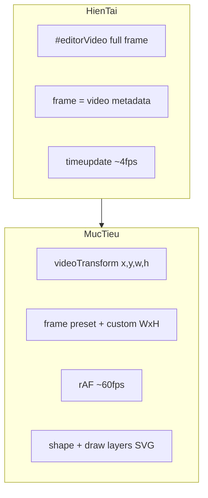
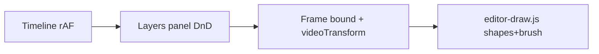

# Video Editor — Timeline, Layers, Frame Bound, Drawing

## Hiện trạng

| Yêu cầu | Trạng thái hiện tại |
|---------|---------------------|
| Timeline mượt khi play | Playhead cập nhật qua `timeupdate` (~4 lần/giây) — giật |
| Kéo thả layers | Canvas: đã có ([`editor-transform.js`](public/static/js/editor-transform.js)); Panel: chỉ nút ↑/↓ |
| Edit frame bound | Cố định = `videoWidth × videoHeight` ([`editor-mock.js`](public/static/js/editor-mock.js) L454–456) |
| Video trong bound | Full-bleed `object-fit: contain`, `pointer-events: none` |
| Vẽ hình / paint | Chưa có |



---

## 1. Timeline transition mượt hơn

**File:** [`public/static/js/editor-timeline.js`](public/static/js/editor-timeline.js)

- Thêm vòng `requestAnimationFrame` khi video đang play:
  - Mỗi frame: đọc `videoEl.currentTime` → cập nhật `playheadEl.style.left`
  - Gọi `onTimeUpdate(t)` để sync layer visibility (thay vì chỉ dựa `timeupdate`)
- `timeupdate` giữ lại làm fallback khi pause/scrub
- Tối ưu DOM: time display chỉ cập nhật khi giây thay đổi (không mỗi frame)
- CSS nhỏ trong [`editor.css`](public/static/css/editor.css): `will-change: left` trên `.editor-timeline__playhead`
- Khi scrub (pointer drag): tắt rAF, cập nhật trực tiếp — không dùng CSS `transition` lúc play (sẽ lag)

---

## 2. Kéo thả layers trong panel

**Files:** [`editor-layers.js`](public/static/js/editor-layers.js), [`editor.css`](public/static/css/editor.css)

- Pointer-based reorder (pattern giống [`editor-transform.js`](public/static/js/editor-transform.js) — `setPointerCapture`, threshold 4px):
  - Kéo row trong `#editorLayersList` → ghost indicator vị trí drop
  - Thả → gán lại `zIndex` cho toàn bộ layers theo thứ tự mới
- Thêm handle kéo (⋮⋮) bên trái mỗi row; click row vẫn select như cũ
- Giữ nút ↑/↓ làm shortcut
- Row **"Video gốc"** (xem mục 3) không reorder được, luôn z-index thấp nhất

---

## 3. Frame bound editable + video là element

### Data model mở rộng

```json
{
  "frame": { "width": 1080, "height": 1920 },
  "videoSource": { "width": 1920, "height": 1080, "name": "...", "duration": 120 },
  "videoTransform": { "x": 0, "y": 0.125, "width": 1, "height": 0.75 },
  "layers": [ ... ]
}
```

- `frame`: kích thước **output canvas** (không còn bằng video gốc)
- `videoSource`: metadata file gốc (read-only sau upload)
- `videoTransform`: vị trí/kích thước video trong frame (normalized 0–1), mặc định cover full frame

### UI — Properties khi không chọn layer

**File:** [`editor-mock.js`](public/static/js/editor-mock.js) — `renderProperties()` khi `selectedId === null` hoặc `selectedId === '__video__'`:

- **Frame bound:**
  - Preset dropdown: `Gốc video`, `16:9`, `9:16`, `1:1`, `4:3`, `Tùy chỉnh`
  - Inputs `frameWidth` / `frameHeight` (enabled khi preset = Tùy chỉnh)
  - Đổi preset → tính W×H (giữ một cạnh hoặc fit theo chiều dài video gốc)
- **Video transform** (khi chọn "Video gốc"): X/Y/Rộng/Cao %, opacity (optional)

### Preview resize thực tế

**Files:** [`editor-frame.js`](public/static/js/editor-frame.js), [`editor.css`](public/static/css/editor.css), [`editor.html`](templates/pages/editor.html)

- `EditorFrame.setDimensions(w, h)` cập nhật `aspect-ratio` trên `.editor-frame` → khung preview scale đúng tỷ lệ output
- Tách video ra khỏi full-bleed:

```html
<!-- editor.html: bọc video trong layer container -->
<div id="editorVideoLayer" class="editor-video-layer">
  <video id="editorVideo" ...></video>
</div>
<div id="editorOverlay" ...></div>
```

- `#editorVideoLayer` dùng cùng CSS positioning `%` như layer (`left/top/width/height` từ `videoTransform`)
- Select "Video gốc" → reuse `EditorTransform` với target `videoTransform` thay vì layer

### Layers panel

- Thêm row cố định **"Video gốc"** ở cuối danh sách; click → `selectedId = '__video__'`, hiện transform box trên video layer
- Video vẫn sync playback; transform chỉ ảnh hưởng layout preview

### Export JSON

- Cập nhật `exportJSON()` để gồm `videoSource`, `videoTransform`

---

## 4. Vẽ hình — shapes + brush (vector)

**File mới:** [`public/static/js/editor-draw.js`](public/static/js/editor-draw.js)

### Toolbar ([`editor.html`](templates/pages/editor.html))

```
[+ Text] [+ Logo] [+ Video] | [Shapes ▾] [Brush] | ...
```

- **Shapes dropdown:** Hình chữ nhật, Tròn, Đường thẳng, Mũi tên
- **Brush:** bật chế độ vẽ tự do
- Mini toolbar phụ (hoặc properties): màu stroke, độ dày nét, fill (shapes)

### Layer kinds mới

| kind | Lưu trữ | Render |
|------|---------|--------|
| `shape` | `shape`, `stroke`, `fill`, `strokeWidth`, transform | `<svg>` inline trong layer div |
| `draw` | `paths: [{ points: [[nx,ny],...], stroke, width }]` | `<svg><path d="..."/></svg>` |

- Tọa độ path **normalized trong bounding box** của layer → scale khi resize layer
- Shapes: click-drag trên frame tạo layer mới (giống Figma draw rect)
- Brush: pointerdown→move→up ghi points; pointerup → commit thành `draw` layer, auto-fit bounding box + padding

### Tích hợp module

- [`editor-layers.js`](public/static/js/editor-layers.js): render `shape`/`draw`, label panel
- [`editor-transform.js`](public/static/js/editor-transform.js): shapes/draw dùng chung drag/resize/rotate
- [`editor-mock.js`](public/static/js/editor-mock.js): tool state (`activeTool: null | 'shape-rect' | 'brush'`), bind toolbar, properties cho shape/draw layers
- [`editor-captions.js`](public/static/js/editor-captions.js): segment màu riêng cho `shape`/`draw` trên timeline (nếu có timing)

### Chế độ vẽ vs chọn

- Khi tool active: click frame → vẽ (không deselect ngay)
- Esc hoặc click tool Select (cursor mặc định) → thoát draw mode
- Brush đang vẽ: tạm overlay canvas/SVG absolute trên frame, commit khi pointerup

### CSS

[`editor.css`](public/static/css/editor.css): `.editor-layer--shape svg`, `.editor-layer--draw`, `.editor-toolbar__draw-tools`, cursor `crosshair` khi brush active

---

## Thứ tự triển khai đề xuất



1. Timeline rAF — độc lập, ít rủi ro
2. Layers DnD — độc lập
3. Frame bound + video element — thay đổi data model, cần cẩn thận với transform/export
4. Drawing — module mới, phụ thuộc frame bound ổn định

---

## Files thay đổi

| File | Thay đổi |
|------|----------|
| [`templates/pages/editor.html`](templates/pages/editor.html) | Video layer wrapper, toolbar shapes/brush |
| [`public/static/css/editor.css`](public/static/css/editor.css) | Video layer, DnD ghost, draw cursors, playhead |
| [`public/static/js/editor-timeline.js`](public/static/js/editor-timeline.js) | rAF playback loop |
| [`public/static/js/editor-layers.js`](public/static/js/editor-layers.js) | Panel DnD, video row, shape/draw render |
| [`public/static/js/editor-frame.js`](public/static/js/editor-frame.js) | `applyVideoTransform()`, helpers |
| [`public/static/js/editor-transform.js`](public/static/js/editor-transform.js) | Hỗ trợ target `videoTransform` |
| [`public/static/js/editor-mock.js`](public/static/js/editor-mock.js) | State mới, frame presets, properties, tools |
| [`public/static/js/editor-draw.js`](public/static/js/editor-draw.js) | **Mới** — shapes + brush |
| [`public/static/js/editor-captions.js`](public/static/js/editor-captions.js) | Segment style cho shape/draw |

Sau khi sửa assets: `go run cmd/assetbuild`

---

## Kiểm tra thủ công

1. Play video → playhead chạy mượt ~60fps, time display vẫn đúng
2. Kéo row trong Layers → z-order đổi, thứ tự overlay khớp
3. Đổi frame preset 9:16 → khung preview đổi tỷ lệ; video gốc vẫn hiện, có thể kéo/resize
4. Custom W×H → frame cập nhật đúng
5. Thêm rect/circle/arrow → xuất hiện layer SVG, transform được
6. Brush vẽ → commit thành layer, resize không méo nét
7. Export JSON có `frame`, `videoSource`, `videoTransform`, layers `shape`/`draw` với paths vector
