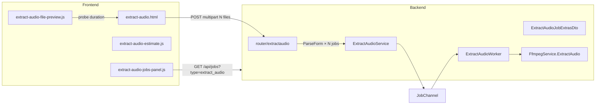
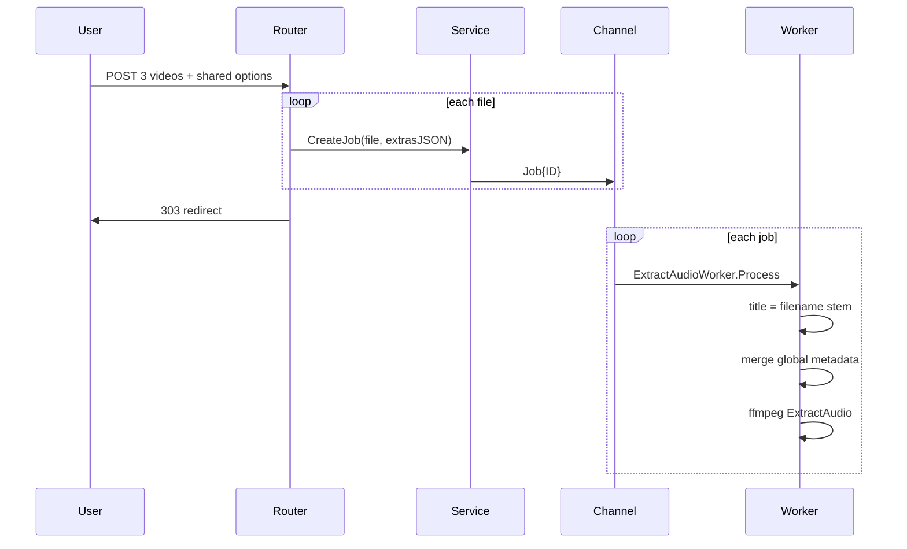

# Plan: Tách âm thanh khỏi video (Extract Audio)

## Bối cảnh

App hiện có 3 job type (`split`, `merge`, `gif`) theo vertical slice: router → service → worker → FFmpeg. **Split** là reference chính vì:
- Upload **nhiều video** → **mỗi file 1 job** ([`router/split/main.go`](router/split/main.go))
- Preview multi-file ([`public/static/js/split-file-preview.js`](public/static/js/split-file-preview.js))
- Jobs history + polling qua `JobUI.fetchJobs({ type: "..." })`

Chưa có code tách audio, volume/speed filter, hay ghi metadata tag. `FfmpegEncodeOptionsDto` chỉ có `AudioCodec`/`AudioBitrate` cho video output.

**Lựa chọn đã xác nhận (metadata):** title tự động = tên file gốc (bỏ extension) cho từng job; artist/album/year/comment là field tùy chọn **chung** cho batch (để trống = không ghi).

---

## Kiến trúc tổng thể



---

## URL & naming

| Item | Giá trị |
|------|---------|
| Route | `/video/extract-audio` (+ redirect `/extract-audio` như gif/merge) |
| `ActivePage` | `extract-audio` |
| Job type enum | `JobTypeExtractAudio = "extract_audio"` |
| Output dir | `uploads/output/extract-audio/{jobID}/` |

---

## UI — Form & Preview

Tạo [`templates/pages/extract-audio.html`](templates/pages/extract-audio.html) dựa trên [`templates/pages/split.html`](templates/pages/split.html):

### Upload & preview (tái sử dụng split)

- `<input type="file" name="file" multiple accept="video/*">`
- Copy/adapt [`split-file-preview.js`](public/static/js/split-file-preview.js) → `extract-audio-file-preview.js`:
  - Giữ: thumbnail list, index badge, remove, add more, `#videoPreviewModal`
  - Bỏ logic split-specific (nếu có)
- Không cần timeline/segment như GIF

### Định dạng đầu ra

```html
<select name="output_format">
  <option value="mp3" selected>MP3</option>
  <option value="m4a">M4A (AAC)</option>
  <option value="wav">WAV (lossless)</option>
  <option value="flac">FLAC (lossless)</option>
  <option value="ogg">OGG (Vorbis)</option>
</select>
```

### Bitrate

```html
<select name="audio_bitrate">
  <option value="original" selected>Original — giữ bitrate gốc / copy stream</option>
  <option value="64k">64 kbps</option>
  <option value="96k">96 kbps</option>
  <option value="128k">128 kbps</option>
  <option value="192k">192 kbps</option>
  <option value="256k">256 kbps</option>
  <option value="320k">320 kbps</option>
</select>
```

**UX rules (JS `toggleBitrateField`):**
- `original` = default
- Ẩn/disable bitrate khi chọn `wav` hoặc `flac` (lossless, không có ý nghĩa bitrate CBR)
- Khi `original` + format khác codec nguồn → backend transcode với bitrate probe từ audio stream

### Tính năng nâng cao (`<details>`)

**Âm lượng:**
```html
<input type="range" name="volume" min="0" max="200" value="100" />
<!-- 100 = giữ nguyên, 0 = mute, 200 = gấp đôi -->
```
Hiển thị label `%` realtime. Chỉ áp dụng filter khi `volume != 100`.

**Tốc độ phát (speed):**

Có thể làm được với FFmpeg filter `atempo` — thay đổi tốc độ **giữ nguyên pitch** (không bị chipmunk).

```html
<select name="speed">
  <option value="0.5">0.5× — chậm gấp đôi</option>
  <option value="0.75">0.75×</option>
  <option value="1" selected>1× — giữ nguyên (mặc định)</option>
  <option value="1.25">1.25×</option>
  <option value="1.5">1.5×</option>
  <option value="2">2× — nhanh gấp đôi</option>
</select>
```

**Lưu ý kỹ thuật:**
- `atempo` chỉ nhận giá trị **0.5–2.0** mỗi filter; nếu sau này cần range rộng hơn (vd. 4×) thì chain nhiều `atempo` (vd. `atempo=2.0,atempo=2.0`)
- `speed != 1` → **bắt buộc re-encode** (không thể `-c:a copy` kèm filter)
- Thời lượng output ≈ `input_duration / speed` (vd. video 60s × 2× speed → audio ~30s)
- Progress callback: so sánh `time=` với `input_duration / speed` thay vì duration gốc
- Kết hợp filter: `-af "volume=1.5,atempo=1.25"` (volume trước, atempo sau)
- Field hint: "Tăng tốc độ sẽ làm file ngắn hơn; giảm tốc độ sẽ làm file dài hơn."

**Metadata (chung cho batch):**
| Field | Form name | Ghi chú |
|-------|-----------|---------|
| Artist | `meta_artist` | Tùy chọn |
| Album | `meta_album` | Tùy chọn |
| Year | `meta_year` | Tùy chọn, validate 4 chữ số |
| Comment | `meta_comment` | Tùy chọn |

**Title không có trong form** — worker tự set `title = strings.TrimSuffix(input.Name, ext)` mỗi job.

### Estimate box

[`extract-audio-estimate.js`](public/static/js/extract-audio-estimate.js): heuristic đơn giản (không cần API):
- `original` + copy được + speed 1× → ~5–15% duration (rất nhanh)
- transcode → ~0.3–0.5× duration tùy format; chia thêm cho `speed` khi > 1 (output ngắn hơn)
- Hiển thị thêm output duration ước tính: `input_duration / speed` khi speed ≠ 1
- `localStorage` key `extractAudioForm.options` (pattern từ split-estimate)
- Disclaimer "ước tính tham khảo"

### Jobs history

Copy [`split-jobs-panel.js`](public/static/js/split-jobs-panel.js) → `extract-audio-jobs-panel.js`, đổi `type: "extract_audio"`, prefix IDs `extractAudioJobs*`.

---

## Backend — DTO & validation

Tạo [`structs/ExtractAudioJobExtrasDto.go`](structs/ExtractAudioJobExtrasDto.go):

```go
type ExtractAudioMetadataDto struct {
    Title   string `json:"title,omitempty"`   // set server-side per job
    Artist  string `json:"artist,omitempty"`
    Album   string `json:"album,omitempty"`
    Year    string `json:"year,omitempty"`
    Comment string `json:"comment,omitempty"`
}

type ExtractAudioJobExtrasDto struct {
    OutputFormat string                  `json:"output_format"`
    AudioBitrate string                  `json:"audio_bitrate"` // "original" | "64k" | ...
    Volume       float64                 `json:"volume"`        // 0–200, default 100
    Speed        float64                 `json:"speed"`         // 0.5–2.0, default 1.0
    Metadata     ExtractAudioMetadataDto `json:"metadata,omitempty"`
}
```

**`ParseExtractAudioForm`** (allowlist pattern như [`SplitJobExtrasDto.go`](structs/SplitJobExtrasDto.go)):
- `output_format`: mp3, m4a, wav, flac, ogg
- `audio_bitrate`: original + bitrates từ split
- `volume`: clamp 0–200, default 100
- `speed`: allowlist 0.5, 0.75, 1, 1.25, 1.5, 2; default 1
- `meta_year`: regex `^\d{4}$` hoặc empty
- Sanitize metadata strings (max length ~500, strip control chars)

3 hàm chuẩn: `ParseExtractAudioForm` → `ToJSON` → `ParseExtractAudioJobExtrasJSON`

Unit test: [`structs/ExtractAudioJobExtrasDto_test.go`](structs/ExtractAudioJobExtrasDto_test.go)

---

## Backend — Router & Service

### Router [`router/extractaudio/main.go`](router/extractaudio/main.go)

Clone flow từ [`router/split/main.go`](router/split/main.go):
1. GET → render page, `ActivePage: "extract-audio"`
2. POST → `MultipartReader` → save files → `ParseExtractAudioForm(formFields)`
3. Loop `uploadedFiles`: `ExtractAudioService.CreateJob(path, name, extrasJSON, userID)` → `JobChannel`
4. Redirect `303` → `/video/extract-audio`

Đăng ký trong [`router/main.go`](router/main.go).

### Service [`services/ExtractAudioService/main.go`](services/ExtractAudioService/main.go)

Giống [`SplitService`](services/SplitService/main.go):
- `Type: enums.JobTypeExtractAudio`
- 1 input `JobFileData`, `Extras` JSON

---

## Backend — Worker

[`worker/ExtractAudioWorker/main.go`](worker/ExtractAudioWorker/main.go):

1. Load input file
2. `ProbeMedia` → cập nhật `Duration` (+ audio codec/bitrate nếu mở rộng probe)
3. Parse extras JSON
4. Build metadata: `Title` = tên file gốc; merge artist/album/year/comment từ extras nếu non-empty
5. Output: `{stem}.{output_format}` trong `uploads/output/extract-audio/{jobID}/`
6. `FfmpegService.ExtractAudio(ctx, opts)` với progress callback → `job.Progress`
7. Tạo 1 output `JobFileData`

Thêm `case enums.JobTypeExtractAudio` trong [`worker/channels/main.go`](worker/channels/main.go).

---

## FFmpeg — `ExtractAudio`

Tạo [`services/FfmpegService/extract_audio.go`](services/FfmpegService/extract_audio.go):

```go
type ExtractAudioOptionsDto struct {
    InputPath    string
    OutputPath   string
    OutputFormat string   // mp3, m4a, wav, flac, ogg
    AudioBitrate string   // "original" | "128k" | ...
    Volume       float64   // 100 = no change
    Speed        float64   // 1.0 = no change; 2.0 = 2× faster
    Metadata     ExtractAudioMetadataDto
    SourceAudioCodec string // from probe
    SourceAudioBitrate int64 // from probe (bps)
}
```

**Logic encode:**

| Format | Codec | Bitrate original | Bitrate explicit |
|--------|-------|------------------|------------------|
| mp3 | libmp3lame | copy nếu đã mp3 **và speed=1**, else `-b:a` từ probe | `-b:a {value}` |
| m4a | aac | copy nếu aac trong m4a **và speed=1**, else transcode | `-b:a {value}` |
| wav | pcm_s16le | always transcode (lossless) | ignore bitrate |
| flac | flac | always transcode | ignore bitrate |
| ogg | libvorbis | transcode | `-b:a {value}` |

Base args: `-i input -vn` (no video)

**Audio filters** (gộp vào một `-af` chain khi cần):

```go
// buildAudioFilterChain(volume, speed) → "" | "volume=1.5" | "atempo=1.25" | "volume=1.5,atempo=1.25"
```

- **Volume** (khi `volume != 100`): `volume={volume/100}` (linear; 0 = mute)
- **Speed** (khi `speed != 1`): `atempo={speed}` (giữ pitch)
- Có filter → bắt buộc transcode, bỏ qua `-c:a copy`

Helper `buildAtempoChain(speed float64) string` — tách speed ngoài 0.5–2.0 thành chuỗi `atempo` (dự phòng cho tương lai; v1 chỉ cần preset trong range).

**Metadata** (ffmpeg `-metadata key=value`):
- `title`, `artist`, `album`, `date` (year), `comment`
- Chỉ append args cho field non-empty
- Map đúng tag theo container (MP3 ID3, Vorbis comment cho ogg, etc. — ffmpeg `-metadata` xử lý phần lớn)

**Progress:** parse ffmpeg stderr `time=` vs probed duration (pattern có sẵn trong codebase).

Mở rộng [`ProbeMedia`](services/FfmpegService/main.go) hoặc helper riêng để lấy **audio stream bitrate** (`bit_rate` từ stream audio) — cần cho mode `original` khi phải transcode.

Unit test: [`services/FfmpegService/extract_audio_test.go`](services/FfmpegService/extract_audio_test.go) — test `buildExtractAudioArgs()` (không cần ffmpeg thật nếu project đã mock pattern tương tự).

---

## Presenter & shared UI

[`services/JobPresenterService/main.go`](services/JobPresenterService/main.go):
- Thêm `case enums.JobTypeExtractAudio` trong `buildEncodeSummary`
- Ví dụ: `"MP3 · Original · 1.5× · Vol 100%"` hoặc `"FLAC · Vol 150% · Artist: X"`

[`public/static/js/job-ui.js`](public/static/js/job-ui.js): thêm `TYPE_LABELS.extract_audio = "Tách audio"`

[`templates/partials/sidebar.html`](templates/partials/sidebar.html): link "Tách Audio" → `/video/extract-audio`

[`templates/pages/home.html`](templates/pages/home.html): CTA card (optional, nhất quán với các feature khác)

Chạy `cmd/assetbuild` sau khi thêm static JS.

---

## Luồng multi-file (1 video = 1 job)



Mỗi job độc lập: progress, download, cancel/retry riêng (reuse `job-ui.js`).

---

## File checklist

| Layer | File | Action |
|-------|------|--------|
| Enum | `enums/JobType.go` | +`JobTypeExtractAudio` |
| Struct | `structs/ExtractAudioJobExtrasDto.go` | New |
| Struct test | `structs/ExtractAudioJobExtrasDto_test.go` | New |
| Router | `router/extractaudio/main.go` | New |
| Router | `router/main.go` | Register bootstrap |
| Service | `services/ExtractAudioService/main.go` | New |
| Worker | `worker/ExtractAudioWorker/main.go` | New |
| Worker | `worker/channels/main.go` | +case dispatch |
| FFmpeg | `services/FfmpegService/extract_audio.go` | New |
| FFmpeg test | `services/FfmpegService/extract_audio_test.go` | New |
| FFmpeg | `services/FfmpegService/main.go` | Extend probe audio bitrate |
| Presenter | `services/JobPresenterService/main.go` | +summary case |
| Template | `templates/pages/extract-audio.html` | New |
| Template | `templates/partials/sidebar.html` | Nav link |
| Template | `templates/pages/home.html` | CTA (optional) |
| JS | `public/static/js/extract-audio-file-preview.js` | New (from split) |
| JS | `public/static/js/extract-audio-jobs-panel.js` | New (from split) |
| JS | `public/static/js/extract-audio-estimate.js` | New |
| JS | `public/static/js/job-ui.js` | TYPE_LABELS |

---

## Test plan (manual)

1. Upload 1 video MP4 có AAC → MP3 + bitrate Original → download, verify duration khớp, title = tên file
2. Upload 3 video → 3 job riêng, cùng artist/album từ advanced panel
3. WAV/FLAC → bitrate dropdown ẩn, file lossless OK
4. Volume 0 → silent; 200 → louder (nghe thử)
5. Speed 2× → output duration ≈ half; speed 0.5× → output duration ≈ double; pitch giữ nguyên
6. Speed 1.5× + bitrate Original → verify re-encode (không copy stream)
7. Transcode 128k explicit → file size hợp lý
8. Cancel job đang chạy → status cancelled
9. Jobs table polling + download single file

---

## Phạm vi ngoài v1 (không làm trong plan này)

- Chỉnh metadata riêng từng file trong preview (user chọn auto per-file)
- Cắt đoạn audio (start/duration) — có thể thêm sau giống GIF segments
- Batch ZIP download nhiều job — dùng download từng job như split output đơn
