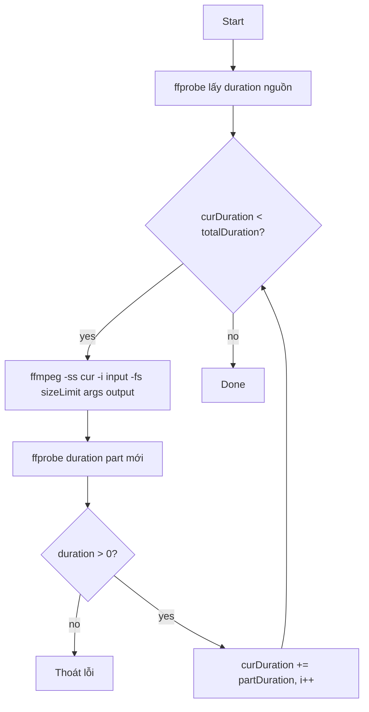
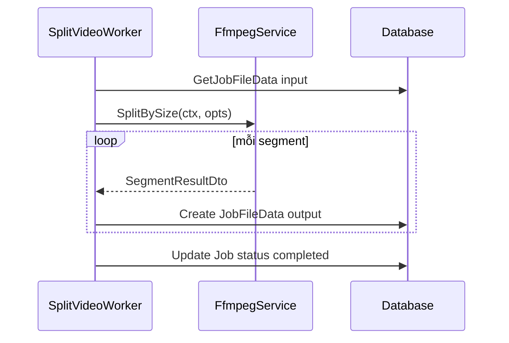

# Plan: Convert script.sh sang FfmpegService

## Phân tích logic hiện tại

[`script.sh`](script.sh) thực hiện 2 bước lặp:



**Điểm cần cải thiện khi chuyển sang Go:**
- Script bash exit code `0` khi encode fail (line 57) — Go nên trả `error` rõ ràng
- `FFMPEG_ARGS` là string raw — Go sẽ build args từ DTO có type
- Dùng `ffprobe -of json` thay vì parse awk để ổn định hơn
- Dùng `exec.CommandContext` để hỗ trợ cancel job (phù hợp worker hiện tại)

---

## Cấu trúc file đề xuất

| File | Mục đích |
|------|----------|
| [`structs/FfmpegEncodeOptionsDto.go`](structs/FfmpegEncodeOptionsDto.go) | DTO tham số encode (fps, codec, crf...) |
| [`structs/SplitBySizeOptionsDto.go`](structs/SplitBySizeOptionsDto.go) | DTO cho workflow split theo size |
| [`structs/MediaProbeDto.go`](structs/MediaProbeDto.go) | Kết quả ffprobe |
| [`structs/SegmentResultDto.go`](structs/SegmentResultDto.go) | Kết quả mỗi part |
| [`services/FfmpegService/main.go`](services/FfmpegService/main.go) | Các hàm public gọi lẻ |
| [`services/FfmpegService/exec.go`](services/FfmpegService/exec.go) | Wrapper `exec.CommandContext` (tách để test/mock) |

Giữ convention package PascalCase như codebase hiện tại (`SplitService`, `JobFileDataService`).

---

## DTO thiết kế

### `FfmpegEncodeOptionsDto` — tham số encode chung

```go
type FfmpegEncodeOptionsDto struct {
    FPS         int     // 0 = giữ nguyên
    VideoCodec  string  // "libx264", "libx265"
    AudioCodec  string  // "aac"
    CRF         int     // 0 = không set
    VideoBitrate string // "2M"
    AudioBitrate string // "128k"
    Preset      string  // "medium", "fast"
    PixelFormat string  // "yuv420p"
    Scale       string  // "1280:720", "-2:720"
    ExtraArgs   []string
}
```

Method `BuildArgs() []string` — chuyển DTO thành ffmpeg CLI args (thay cho `FFMPEG_ARGS` string trong bash).

### `SplitBySizeOptionsDto` — input cho split workflow

```go
type SplitBySizeOptionsDto struct {
    InputPath  string
    OutputDir  string
    SizeLimit  int64  // bytes
    OutputExt  string // default "mp4"
    Encode     FfmpegEncodeOptionsDto
    NamePrefix string // default "video"
}
```

### `MediaProbeDto` — kết quả ffprobe

```go
type MediaProbeDto struct {
    Duration   float64
    Width      int
    Height     int
    FPS        float64
    VideoCodec string
    AudioCodec string
    Bitrate    int64
    Format     string
}
```

### `SegmentResultDto` — mỗi part output

```go
type SegmentResultDto struct {
    Index    int
    Path     string
    Duration float64
    Size     int64
    StartAt  float64
}
```

---

## Các hàm public trong FfmpegService

Mỗi hàm gọi lẻ được, nhận `context.Context` để cancel:

| Hàm | Tương đương bash | Mô tả |
|-----|------------------|-------|
| `CheckFFmpeg(ctx)` | — | Kiểm tra `ffmpeg`/`ffprobe` có sẵn |
| `ProbeMedia(ctx, path)` | `ffprobe` line 26 | Trả `MediaProbeDto` đầy đủ |
| `GetDuration(ctx, path)` | `ffprobe` + awk | Shortcut, trả `float64` |
| `BuildEncodeArgs(opts)` | `$FFMPEG_ARGS` | Build args từ DTO |
| `EncodeSegment(ctx, input, output, startAt, sizeLimit, opts)` | `ffmpeg` line 50 | Encode **một** part |
| `SplitBySize(ctx, opts)` | toàn bộ while loop | Orchestrator, trả `[]SegmentResultDto` |

### Chi tiết implement chính

**`GetDuration` / `ProbeMedia`**
```bash
ffprobe -v quiet -print_format json -show_format -show_streams <file>
```
Parse JSON bằng `encoding/json` — không dùng awk.

**`EncodeSegment`**
```bash
ffmpeg -y -ss <startAt> -i <input> -fs <sizeLimit> <encodeArgs...> <output>
```
- `-y` overwrite output
- `-ss` trước `-i` (giữ behavior script gốc — fast seek)
- Sau encode: gọi `GetDuration` verify part > 0

**`SplitBySize`** — port logic while loop:

```go
totalDuration, _ := GetDuration(ctx, opts.InputPath)
curDuration := 0.0
for i := 1; curDuration < totalDuration; i++ {
    output := filepath.Join(opts.OutputDir, fmt.Sprintf("%s-%d.%s", prefix, i, ext))
    seg, err := EncodeSegment(ctx, opts.InputPath, output, curDuration, opts.SizeLimit, opts.Encode)
    if err != nil || seg.Duration == 0 { return nil, err }
    results = append(results, seg)
    curDuration += seg.Duration
}
```

**Optional callback** (không bắt buộc phase 1, nhưng nên thiết kế sẵn):
```go
type ProgressCallback func(done SegmentResultDto, totalDuration, encodedDuration float64)
```
Dùng sau cho SSE progress trong worker.

---

## Luồng tích hợp với worker (bước tiếp theo)

[`worker/SplitVideoWorker/main.go`](worker/SplitVideoWorker/main.go) hiện mới lấy input, chưa xử lý. Sau khi FfmpegService xong:



Mapping tham số từ job → DTO:
- `InputPath` ← `JobFileData.Path`
- `OutputDir` ← `uploads/output/<jobId>/`
- `SizeLimit` ← có thể hardcode preset hoặc thêm field vào `ChunkVideoDto` / form upload

---

## Đề xuất tính năng mở rộng cho FfmpegService

Ưu tiên theo giá trị cho project video toolkit ([`.cursor/plan/MAIN.md`](.cursor/plan/MAIN.md)):

### Phase 1 — nên làm ngay (cùng PR với split)
1. **`ProbeMedia`** — metadata đầy đủ (codec, resolution, fps, bitrate). Dùng populate `JobFileData.Duration` khi upload
2. **`CheckFFmpeg`** — health check khi app start
3. **`ProgressCallback`** — hook cho worker/SSE

### Phase 2 — bổ sung tự nhiên
4. **`SplitByTime(ctx, opts)`** — cắt theo giây/phút (bổ sung cho split theo size)
5. **`ExtractThumbnail(ctx, input, output, atSecond)`** — chụp frame preview cho UI
6. **`ExtractAudio(ctx, input, output, opts)`** — tách audio ra file riêng
7. **`ConvertFormat(ctx, input, output, opts)`** — đổi định dạng/codec độc lập

### Phase 3 — nâng cao
8. **`MergeVideos(ctx, inputs, output, opts)`** — ghép nhiều file
9. **`GenerateHLS(ctx, input, outputDir, variants)`** — streaming segments
10. **`BurnSubtitle(ctx, input, srt, output, opts)`** — hardcode subtitle
11. **`AddWatermark(ctx, input, watermark, output, opts)`** — logo/text overlay
12. **`NormalizeAudio(ctx, input, output)`** — chuẩn hóa âm lượng

### Preset helpers (tiện cho UI sau này)
```go
func PresetDiscord() FfmpegEncodeOptionsDto   // 8MB limit, h264
func PresetZalo() FfmpegEncodeOptionsDto      // tối ưu mobile
func Preset1080pH265() FfmpegEncodeOptionsDto
```

---

## Error handling & edge cases

- Input file không tồn tại → `os.Stat` trước khi gọi ffmpeg
- Part duration = 0 → return error (fix bug bash script)
- `ctx` cancel → kill ffmpeg process (`cmd.Process.Kill()`)
- Output dir chưa có → `os.MkdirAll`
- FFmpeg stderr → capture vào error message để debug (docker logs)
- Size limit quá nhỏ → detect infinite loop (max iterations hoặc `curDuration` không tăng)

---

## Test plan

- Unit test `BuildEncodeArgs` với các combo fps/crf/codec
- Integration test (cần ffmpeg trong Docker): file mẫu ngắn → `SplitBySize` → verify số part và tổng duration ≈ source
- Test cancel: `context.WithCancel` giữa segment → process bị kill

Không cần thêm dependency Go — chỉ dùng stdlib (`os/exec`, `encoding/json`, `context`).
