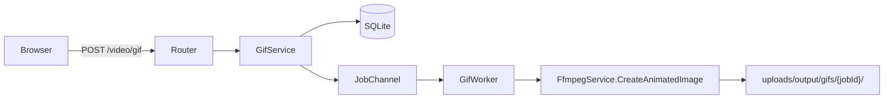
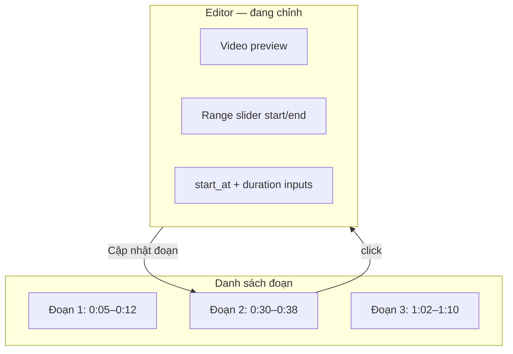

# Tạo GIF/WebP/APNG từ Video

## Bối cảnh

App hiện có pipeline **upload → job queue → worker → FFmpeg → download** cho [split](templates/pages/split.html) và [merge](templates/pages/merge.html). GIF là tính năng mới, chưa có code — chỉ nằm trong [MAIN.md](.cursor/plans/MAIN.md).

Tính năng này gần giống **merge** (1 input → 1 output) hơn split, nhưng cần UI chọn đoạn thời gian giống split và metadata kích thước từ [`ProbeMedia`](services/FfmpegService/main.go) / `videoWidth`/`videoHeight` (pattern từ [`merge-file-preview.js`](public/static/js/merge-file-preview.js)).



---

## Yêu cầu đã thống nhất

| Hạng mục | Quyết định |
|----------|------------|
| Định dạng đầu ra | GIF + WebP động + APNG |
| Phạm vi | Nâng cao: timeline, palette, loop, nhiều đoạn từ 1 video |
| Kích thước | Prefill = kích thước video gốc; chế độ giữ tỷ lệ hoặc nhập tay |
| Chất lượng | User chọn preset chất lượng (ảnh hưởng palette/dither/compression) |

---

## 1. Kích thước ảnh đầu ra

### UI behavior

Khi user chọn video, client probe metadata (reuse pattern `probeVideoMeta`):

```javascript
// merge-file-preview.js — đã có sẵn
{ duration, width: video.videoWidth, height: video.videoHeight }
```

→ Tự động điền `width` và `height` = kích thước gốc.

**Hai chế độ** (radio/toggle):

- **Giữ tỷ lệ** (`aspect_lock`): sửa width → auto tính `height = round(width × origH / origW)`; sửa height → auto tính width tương tự. Làm tròn về số **chẵn** (FFmpeg yêu cầu với nhiều filter).
- **Tự nhập** (`manual`): width và height độc lập; hiện cảnh báo nếu tỷ lệ lệch so với gốc.

**Preset nhanh** (dropdown tùy chọn, không thay thế nhập tay):

- Original (100%)
- 720p wide / 480p / 360p / 240p — scale theo chiều rộng, giữ tỷ lệ

**Giới hạn server** (validate trong `ParseGifForm`):

- Min: 16×16, Max: 1920×1920 (hoặc không vượt gốc × 2)
- Bắt buộc số chẵn
- Cảnh báo nếu `width × height × fps × duration` ước tính vượt ngưỡng file

Lưu trong `GifJobExtrasDto`:

```go
type GifDimensionDto struct {
    Mode   string `json:"mode"`   // "aspect_lock" | "manual"
    Width  int    `json:"width"`
    Height int    `json:"height"`
}
```

Worker dùng `ProbeMedia` để double-check; nếu `aspect_lock` thì tính lại dimension cuối từ width hoặc height đã submit.

---

## 2. Chất lượng ảnh đầu ra

Preset chất lượng **theo từng định dạng**, map sang tham số FFmpeg:

### GIF

| Preset | max_colors | dither | Ghi chú |
|--------|-----------|--------|---------|
| Thấp | 64 | none | File nhỏ, màu ít |
| Trung bình | 128 | bayer | Cân bằng |
| Cao | 256 | floyd_steinberg | Mặc định khuyến nghị |
| Tùy chỉnh | user chọn | user chọn | Hiện panel nâng cao |

Pipeline FFmpeg (2-pass palette):

```
[trim]fps=N,scale=W:H:flags=lanczos,palettegen=max_colors=N:stats_mode=diff[p];[trim]fps=N,scale=W:H[p2];[p2][p]paletteuse=dither=...
```

### WebP động

| Preset | lossless | quality | method |
|--------|----------|---------|--------|
| Thấp | 0 | 50 | 4 |
| Trung bình | 0 | 75 | 4 |
| Cao | 0 | 90 | 6 |
| Tối đa | 1 | — | 6 |

Filter: `fps=N,scale=W:H:flags=lanczos` → `-c:v libwebp -loop 0`

### APNG

| Preset | compression | filter |
|--------|-------------|--------|
| Thấp | 9 (max) | palette 64 colors |
| Trung bình | 6 | palette 128 |
| Cao | 3 | palette 256, dither |

Lưu trong extras:

```go
type GifQualityDto struct {
    Preset      string `json:"preset"`       // low | medium | high | max | custom
    MaxColors   int    `json:"max_colors,omitempty"`   // GIF/APNG custom
    Dither      string `json:"dither,omitempty"`       // none | bayer | floyd_steinberg
    WebpQuality int    `json:"webp_quality,omitempty"` // 0-100
    Lossless    bool   `json:"lossless,omitempty"`
}
```

UI: dropdown "Chất lượng" + panel "Tùy chỉnh" ẩn/hiện theo preset. Hiển thị ước tính dung lượng (client-side heuristic, tương tự [`split-estimate.js`](public/static/js/split-estimate.js)).

---

## 3. Các tùy chọn nâng cao khác

### Timeline chọn đoạn

- Video preview với **range slider** (start/end) hoặc 2 thumb trên thanh thời gian
- Input số: `start_at` (giây), `duration` (giây) — sync 2 chiều với slider
- Giới hạn: tối đa 30s/đoạn (configurable), cảnh báo nếu vượt

### Nhiều GIF từ 1 video — Editor + Danh sách đoạn

UI theo mô hình **editor ở trên, danh sách đoạn ở dưới** (hoặc sidebar phải):



**Luồng tương tác:**

1. User kéo timeline / nhập start+duration trong **editor**
2. Nhấn **"Thêm đoạn"** → lưu đoạn hiện tại vào danh sách, editor reset về vị trí tiếp theo (hoặc trống)
3. **Click một đoạn trong danh sách** → fill ngược lên editor:
   - Timeline slider nhảy đúng start/end
   - Input `start_at` và `duration` cập nhật
   - Video preview seek tới `start_at`
   - Đoạn được chọn highlight (active state)
4. Sửa trong editor → nhấn **"Cập nhật đoạn"** (hoặc auto-sync debounced) để ghi đè đoạn đang chọn
5. Mỗi item danh sách có nút **Xóa**; không cho phép trùng/overlap đoạn (validate client)

**Mỗi item hiển thị:** `Đoạn N · 0:05 → 0:12 (7s)` + thumbnail frame tại start (optional phase 3).

**State JS** (`gif-segments.js`):

```javascript
var segments = [];        // [{ id, start_at, duration }]
var activeSegmentId = null; // null = đang tạo đoạn mới

function selectSegment(id) {
  activeSegmentId = id;
  var seg = segments.find(s => s.id === id);
  fillEditor(seg.start_at, seg.duration); // timeline + inputs + video seek
  renderSegmentList();
}

function addSegment() {
  var draft = readEditor(); // start_at, duration từ timeline
  if (!validateSegment(draft)) return;
  segments.push({ id: uuid(), ...draft });
  activeSegmentId = null;
  clearEditor();
  renderSegmentList();
}

function updateSegment() {
  if (!activeSegmentId) return;
  var draft = readEditor();
  Object.assign(segments.find(s => s.id === activeSegmentId), draft);
  renderSegmentList();
}
```

**Phạm vi theo đoạn vs theo job:**

- **Theo đoạn** (trong editor): `start_at`, `duration` only
- **Theo job** (chung cho tất cả đoạn): định dạng, kích thước, chất lượng, FPS, loop

→ Submit gửi `segments: [{start_at, duration}, ...]` + settings chung trong `GifJobExtrasDto`.

**Backend:** Worker loop từng segment → nhiều output `JobFileData` (pattern giống split multi-output). Download từng file hoặc ZIP (reuse [`POST /api/jobs/{id}/download-zip`](router/api/jobs/main.go)).

### Loop

- Checkbox "Lặp vô hạn" (mặc định bật) → `-loop 0` (GIF/WebP) hoặc `loop=0` filter

### FPS

- Dropdown: 5 / 10 / 15 / 24 / 30 (mặc định 10 cho GIF)
- Prefill gợi ý: `min(videoFPS, 15)` khi chọn file

---

## 4. Kiến trúc backend (mirror merge + split)

### Files mới

| File | Vai trò |
|------|---------|
| [`enums/JobType.go`](enums/JobType.go) | Thêm `JobTypeGif = "gif"` |
| `structs/GifJobExtrasDto.go` | Parse form + JSON extras |
| `structs/GifOptionsDto.go` | Options truyền vào FFmpeg |
| `services/GifService/main.go` | `CreateJob` |
| `services/FfmpegService/gif.go` | `CreateAnimatedImage`, `buildGifFilter`, `buildWebpArgs`, `buildApngArgs` |
| `worker/GifVideoWorker/main.go` | Process job |
| `router/gif/main.go` | `GET/POST /video/gif` |

### Files sửa

| File | Thay đổi |
|------|----------|
| [`worker/channels/main.go`](worker/channels/main.go) | Dispatch `JobTypeGif` |
| [`router/main.go`](router/main.go) | Register gif routes |
| [`services/JobPresenterService/main.go`](services/JobPresenterService/main.go) | Summary cho job gif |
| [`templates/partials/sidebar.html`](templates/partials/sidebar.html) | Nav link |
| [`public/static/js/job-ui.js`](public/static/js/job-ui.js) | `TYPE_LABELS.gif` |

### `GifJobExtrasDto` (đầy đủ)

```go
type GifJobExtrasDto struct {
    Segments   []GifSegmentDto  `json:"segments"`    // [{start_at, duration}]
    OutputFmt  string           `json:"output_fmt"`  // gif | webp | apng
    Dimension  GifDimensionDto  `json:"dimension"`
    Quality    GifQualityDto    `json:"quality"`
    FPS        int              `json:"fps"`
    Loop       bool             `json:"loop"`
}
```

### Worker flow

1. Load input file + parse extras
2. `ProbeMedia` → validate segments nằm trong duration
3. Với mỗi segment: gọi `FfmpegService.CreateAnimatedImage`
4. Lưu output vào `uploads/output/gifs/{jobId}/`
5. Progress: `segmentIndex / totalSegments`

---

## 5. UI — trang `/video/gif`

Cấu trúc theo pattern [split.html](templates/pages/split.html) / [merge.html](templates/pages/merge.html):

```
[Upload video]
┌─ Editor ─────────────────────────────────────┐
│ [Video preview]                               │
│ [Timeline range slider: start ↔ end]          │
│ [start_at] [duration]  [Cập nhật đoạn]       │
└───────────────────────────────────────────────┘
┌─ Danh sách đoạn ────────────────────────────┐
│ ▶ Đoạn 1: 0:05 → 0:12 (7s)            [×]    │  ← click để fill editor
│   Đoạn 2: 0:30 → 0:38 (8s)            [×]    │
│ [+ Thêm đoạn]                                 │
└───────────────────────────────────────────────┘
[Định dạng: GIF | WebP | APNG]
[Kích thước: mode toggle | width | height | preset dropdown]
[Chất lượng: preset | (custom panel)]
[FPS] [Loop checkbox]
[Ước tính dung lượng — tổng tất cả đoạn]
[Submit]
[Jobs history table — gif-jobs-panel.js]
```

### JS modules mới

- `gif-file-preview.js` — probe meta, prefill width/height, aspect lock logic
- `gif-timeline.js` — range slider sync với start/duration; `fillEditor()` / `readEditor()` API
- `gif-segments.js` — quản lý danh sách đoạn, click-to-edit, thêm/cập nhật/xóa
- `gif-estimate.js` — ước tính file size (cộng dồn theo số đoạn)
- `gif-jobs-panel.js` — clone từ `split-jobs-panel.js`, `type: "gif"`

**Aspect lock logic** (client):

```javascript
function onWidthChange(w, origW, origH, mode) {
  if (mode !== "aspect_lock") return w;
  var h = Math.round(w * origH / origW);
  return { width: w, height: h % 2 === 0 ? h : h + 1 };
}
```

---

## 6. Lộ trình triển khai (đề xuất 3 phase)

### Phase 1 — MVP core
- 1 video, 1 đoạn, GIF only
- Prefill kích thước + aspect lock / manual
- Preset chất lượng (low/medium/high)
- Job queue + download

### Phase 2 — Đa định dạng + timeline
- WebP + APNG
- Timeline slider
- Custom quality panel
- File size estimate

### Phase 3 — Nâng cao
- `gif-segments.js`: danh sách đoạn + click fill editor + cập nhật/xóa
- Nhiều đoạn → nhiều output + ZIP
- Preset kích thước nhanh (Discord/Twitter)
- Home dashboard hiển thị job gif

---

## Rủi ro cần lưu ý

- **GIF file size**: video dài + resolution cao → file rất lớn. Bắt buộc có giới hạn duration và cảnh báo UI.
- **APNG browser support**: kém hơn GIF/WebP — nên ghi chú trong UI.
- **Processing time**: palettegen 2-pass chậm; hiển thị progress per-segment.
- **Even dimensions**: validate cả client lẫn server trước khi gọi FFmpeg.
