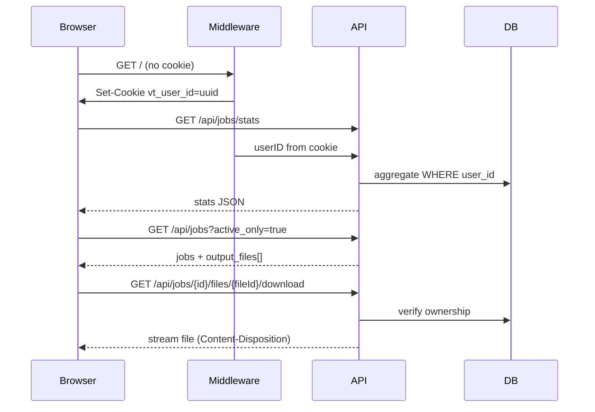
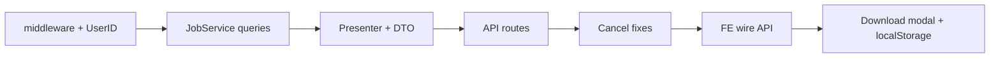

# Kế hoạch API Home Dashboard + Download đa file

## Thay đổi so với plan gốc

Plan UI gốc ([`.cursor/plans/home_dashboard_design_dfb0bc19.plan.md`](.cursor/plans/home_dashboard_design_dfb0bc19.plan.md)) giả định `download_url` trỏ tới `output.zip`. **Bỏ zip** — thay bằng:

| Số file output | UX |
|---|---|
| 1 file | Nút **Tải xuống** trực tiếp |
| Nhiều file | Nút **Chọn file tải** → modal checkbox + **Chọn tất cả** → tải các file đã chọn |

FE ghi nhớ lựa chọn qua `localStorage` (survive refresh). Tên file hiển thị: **truncate + luôn hiện 4 ký tự cuối**.

---

## Kiến trúc tổng quan



---

## Phần 1 — Backend APIs

### 1.1 Cookie middleware `vt_user_id` (vô thời hạn)

Tạo [`middleware/user_id.go`](middleware/user_id.go):

- Cookie name: `vt_user_id`, UUID v4, `HttpOnly`, `SameSite=Lax`, `Path=/`
- **Vô thời hạn** — không TTL 1 năm; cookie persist cho đến khi user xóa dữ liệu trình duyệt
- Implementation Go: set `Expires` xa (vd. `time.Now().Add(10 * 365 * 24 * time.Hour)`) hoặc `MaxAge` rất lớn (`2147483647` ~ 68 năm). **Không** dùng session cookie (không set cả `MaxAge` lẫn `Expires`)
- Mỗi request hợp lệ có thể refresh `Expires` để gia hạn thêm (optional, đảm bảo cookie không bị expire sớm do giới hạn trình duyệt)
- Helper `GetUserID(r *http.Request) string` — đọc cookie hoặc tạo mới + `Set-Cookie`
- Wrap route `/` và tất cả `/api/*`, `/job/*` qua helper này

**Migration:** job cũ có `user_id = ''` — query dùng `WHERE user_id = ? OR user_id = ''` để không mất lịch sử dev.

### 1.2 Gán UserID khi tạo job

Sửa [`services/SplitService/main.go`](services/SplitService/main.go) `CreateJob` nhận thêm `userID string`, set `Job.UserID`.

Sửa [`router/split/main.go`](router/split/main.go) POST handler: `userID := middleware.GetUserID(r)` → truyền vào `CreateJob`.

### 1.3 JobService — query mới + fix bug

Sửa [`services/JobService/main.go`](services/JobService/main.go):

**Fix `GetAllJobs`** (bug GORM hiện tại — `Where` sau `Find` không có tác dụng):

```go
Global.DB.Where("status = ?", enums.StatusProcessing).Order("id ASC").Find(&jobs)
```

**Thêm methods:**

- `GetJobByIdentifier(identifier string) (entities.Job, error)`
- `ListJobsByUser(userID string, opts ListJobsOptions) ([]entities.Job, int64, error)` — filter `status`, `created_at` range, `active_only`, pagination `OFFSET/LIMIT`, sort `created_at DESC`
- `GetStatsByUser(userID string) (JobStats, error)`:
  - `processing`: `pending` + `processing`
  - `completed_today`: `completed` AND `finished_at` >= start of today (server local)
  - `failed`: `failed` trong 7 ngày gần nhất (`created_at`)
  - `total`: count all
  - `avg_encode_seconds`: avg(`finished_at - started_at`) của `completed` trong 7 ngày

### 1.4 Response DTO + mapper

Tạo [`structs/JobApiDto.go`](structs/JobApiDto.go):

```go
type JobOutputFileDto struct {
    ID          int    `json:"id"`
    Name        string `json:"name"`
    Size        int64  `json:"size"`
    DownloadURL string `json:"download_url"`
}

type JobItemDto struct {
    Identifier    string             `json:"identifier"`
    Type          string             `json:"type"`
    Status        string             `json:"status"`
    Progress      float64            `json:"progress"`
    FileName      string             `json:"file_name"`
    FileSize      int64              `json:"file_size"`
    Duration      float64            `json:"duration"`
    EncodeSummary string             `json:"encode_summary"`
    Error         string             `json:"error"`
    CreatedAt     *time.Time         `json:"created_at"`
    StartedAt     *time.Time         `json:"started_at"`
    FinishedAt    *time.Time         `json:"finished_at"`
    OutputFiles   []JobOutputFileDto `json:"output_files"`
    // Tiện cho FE: 1 file → set luôn, nhiều file → null
    DownloadURL   *string            `json:"download_url"`
}
```

Tạo [`services/JobPresenterService/main.go`](services/JobPresenterService/main.go):

- Join input `JobFileData` (type=input) → `file_name`, `file_size`, `duration`
- Load output `JobFileData` (type=output) → `output_files[]`
- Parse `Job.Extras` → `encode_summary` (vd: `"1080P · CRF 23 · medium"`, `"keep · Copy audio"`) — map từ [`structs/SplitJobExtrasDto`](structs/SplitJobExtrasDto.go): `scale` prefix → `1080P`, `crf`, `preset`, audio codec label
- `download_url`: set khi `len(output_files) == 1`, else `null`
- Zero `time.Time` → `null` trong JSON (dùng pointer)

### 1.5 API routes

Tạo [`router/api/jobs/main.go`](router/api/jobs/main.go), wire trong [`router/main.go`](router/main.go):

#### `GET /api/jobs/stats`

Response khớp contract UI:

```json
{ "processing": 2, "completed_today": 5, "failed": 1, "total": 42, "avg_encode_seconds": 184 }
```

#### `GET /api/jobs`

Query params (khớp [`home-dashboard.js`](public/static/js/home-dashboard.js)):

| Param | Mô tả |
|---|---|
| `status` | optional, single hoặc comma-separated |
| `from`, `to` | ISO 8601, filter `created_at` |
| `active_only` | `true` → chỉ pending+processing |
| `page` | default 1 |
| `limit` | default 5 |

Response:

```json
{
  "items": [ JobItemDto ],
  "total": 38, "page": 1, "limit": 5, "total_pages": 8
}
```

#### `GET /api/jobs/{identifier}/files/{fileId}/download`

- Verify job thuộc `user_id` (cookie)
- Verify `fileId` thuộc job và `type = output`
- Stream file từ disk path với `Content-Disposition: attachment; filename="..."` 
- Không expose raw `/uploads/` — chỉ qua endpoint có auth

`download_url` trong DTO: `/api/jobs/{identifier}/files/{fileId}/download`

### 1.6 Cancel endpoint

Wire [`router/job/main.go`](router/job/main.go) trong `router/main.go`, sửa handler:

- Fix mutex leak (dùng `defer Unlock()`)
- **Pending job** (chưa trong `JobCancelMap`): update DB `status = cancelled`, `finished_at = now`, return 204
- **Processing job**: gọi `cancel()`, worker detect `context.Canceled` → set `StatusCancelled` (không `StatusFailed`)
- Sửa [`worker/channels/main.go`](worker/channels/main.go): `errors.Is(err, context.Canceled)` → `StatusCancelled`
- Return `204 No Content` on success

### 1.7 Wire FE → API

Trong [`public/static/js/home-dashboard.js`](public/static/js/home-dashboard.js): đổi `USE_MOCK = false`.

---

## Phần 2 — FE Download UX

### 2.1 Logic download theo số file

Trong `actionButtonsHtml(job)`:

```
completed + output_files.length === 1  →  <a download> Tải xuống
completed + output_files.length > 1    →  <button> Chọn file tải (N)
completed + output_files.length === 0  →  "—"
```

### 2.2 Modal chọn file (multi-file)

Thêm vào [`templates/pages/home.html`](templates/pages/home.html):

```html
<dialog id="downloadModal" class="home-modal">
  <!-- header: tên job truncate -->
  <!-- checkbox "Chọn tất cả" -->
  <!-- list: checkbox per output file (name truncate, size) -->
  <!-- footer: [Hủy] [Tải xuống đã chọn] -->
</dialog>
```

CSS trong [`public/static/css/home.css`](public/static/css/home.css): list scrollable, checkbox row layout.

### 2.3 Truncate tên file — giữ 4 ký tự cuối

Utility `truncateFileName(name, maxLen)` trong `home-dashboard.js`:

```
"clip_01_long_filename_demo.mp4"  →  "clip_01_long_filen...o.mp4"
```

Quy tắc:
- Nếu `name.length <= maxLen` (đề xuất 32) → giữ nguyên
- Else: `name.slice(0, maxLen - 7) + "..." + name.slice(-4)`
- Luôn set `title` attribute = full name (tooltip)

Áp dụng: cột File bảng, active job row, modal download list.

### 2.4 localStorage — nhớ file đã chọn

Key: `vt_download_selections` — object map `{ [jobIdentifier]: number[] }` (array of `fileId`).

```js
function loadSelections() { /* JSON.parse localStorage */ }
function saveSelections(map) { /* JSON.stringify */ }
function getSelectedForJob(id) { /* return Set */ }
function setSelectedForJob(id, fileIds) { /* persist */ }
```

Khi mở modal:
- Load selections từ localStorage → pre-check các checkbox
- "Chọn tất cả" sync state + localStorage
- Mỗi checkbox change → cập nhật localStorage ngay (không đợi bấm Tải)
- Refresh trang → mở lại modal vẫn giữ selections

Khi bấm **Tải xuống đã chọn**: trigger download từng file (tạo `<a href download>` tuần tự hoặc `window.open` staggered) cho các `fileId` đã check.

### 2.5 Cập nhật mock data (dev)

Thêm `output_files[]` vào `MOCK_JOBS` — ít nhất 1 job multi-file (3–4 segments) để test modal trước khi API sẵn sàng.

---

## Phần 3 — Thứ tự triển khai



1. Middleware cookie + gán UserID khi CreateJob
2. JobService (fix GetAllJobs + List + Stats)
3. JobPresenterService + DTO
4. API routes (`/api/jobs`, `/api/jobs/stats`, download endpoint)
5. Cancel fixes + wire `job.Bootstrap()`
6. FE: `USE_MOCK=false`, truncate helper, download modal, localStorage

---

## Files chính cần tạo/sửa

| File | Thay đổi |
|---|---|
| `middleware/user_id.go` | **Mới** — cookie read/set |
| `structs/JobApiDto.go` | **Mới** — response types |
| `services/JobPresenterService/main.go` | **Mới** — map entity → DTO |
| `services/JobService/main.go` | Fix bug + List + Stats |
| `services/SplitService/main.go` | Nhận userID |
| `router/api/jobs/main.go` | **Mới** — 3 endpoints |
| `router/job/main.go` | Fix cancel |
| `router/main.go` | Wire api + job + middleware |
| `router/split/main.go` | Pass userID |
| `worker/channels/main.go` | Cancel → StatusCancelled |
| `templates/pages/home.html` | Download modal HTML |
| `public/static/css/home.css` | Modal list styles |
| `public/static/js/home-dashboard.js` | API wire, truncate, modal, localStorage |

---

## Edge cases

- **Job completed nhưng chưa có output files** (race): hiển thị "—", poll sẽ cập nhật
- **File đã xóa trên disk**: download endpoint trả 404
- **localStorage full**: catch `QuotaExceededError`, fallback không persist
- **Select all** khi đã có partial selection → check all; uncheck all → clear key cho job đó
- **Pending cancel**: không cần worker context, chỉ DB update
