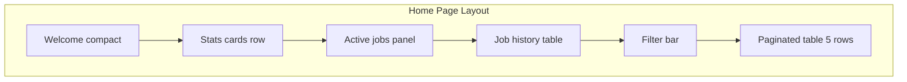

# Kế hoạch thiết kế trang Home Dashboard

## Hiện trạng

[`templates/pages/home.html`](templates/pages/home.html) chỉ có welcome box tĩnh. Backend đã có model [`entities/Job`](entities/Job.go) (`Status`, `Progress`, `UserID`, `Extras`, …) và [`entities/JobFileData`](entities/JobFileData.go) (tên file, size, duration) nhưng **chưa có API** để feed UI. Cancel endpoint [`router/job/main.go`](router/job/main.go) tồn tại nhưng chưa được wire.

Phạm vi theo yêu cầu: **UI/UX trước**, định nghĩa rõ contract API để implement backend sau.

---

## Mục tiêu UX

Trang Home là **trung tâm điều khiển** — người dùng mở app là thấy ngay:
1. Hệ thống đang làm gì (job đang chạy)
2. Tổng quan nhanh (số liệu)
3. Toàn bộ lịch sử job của mình (lọc + phân trang)



---

## Cấu trúc layout trang

Giữ shell hiện tại ([`root.html`](templates/layouts/root.html) + sidebar). Nội dung trong `.container` chia **4 vùng** theo thứ tự trên → dưới:

### 1. Welcome compact (giữ nhưng thu gọn)

- Giữ tone indigo của `.welcome-box` hiện tại
- Rút gọn: 1 dòng tiêu đề + 1 dòng mô tả ngắn
- Thêm **quick actions** bên phải (desktop) hoặc dưới (mobile):
  - Nút primary → `/video/split` ("Chia video mới")
  - Nút secondary → `/merge` ("Ghép video") — disabled/coming soon nếu route chưa có

### 2. Hàng thống kê (Stats cards)

4 card ngang, responsive (2×2 trên mobile, 4 cột desktop). Mỗi card: số lớn + label + icon nhỏ.

| Card | Nguồn dữ liệu (theo `user_id`) | Gợi ý màu accent |
|------|-------------------------------|------------------|
| Đang xử lý | `status IN (pending, processing)` | `--primary` |
| Hoàn thành hôm nay | `status = completed` AND `finished_at` today | xanh lá `#059669` |
| Thất bại | `status = failed` (có thể scope 7 ngày) | đỏ `#dc2626` |
| Tổng job | count all | `--text-muted` |

**Đề xuất thêm:** card thứ 5 tùy chọn — **Thời gian encode trung bình** (avg `finished_at - started_at` của job completed 7 ngày gần nhất). Có thể ẩn trên mobile.

CSS mới trong [`public/static/css/root.css`](public/static/css/root.css):
- `.stats-grid` — CSS grid responsive
- `.stat-card` — nền trắng, border, hover nhẹ (tương tự `.tool-section`)

### 3. Panel "Job đang xử lý"

Chỉ hiển thị job `pending` + `processing` của user hiện tại. **Ẩn cả section** khi không có job active (empty state gọn: "Không có job đang chạy").

Mỗi job là 1 **row card** (không phải bảng):

```
[Tên file]  [badge: Split]  [badge: Processing]
[████████░░░░] 67%
Thời gian: 2m 15s đã chạy · CRF 23 · 1080P
[Nút Hủy]  (chỉ khi processing)
```

- Progress bar: `width: progress * 100%`, animate transition
- Badge trạng thái: màu theo status (pending=xám, processing=indigo, failed=đỏ, completed=xanh, cancelled=vàng)
- Poll mỗi **3 giây** khi có ≥1 job active; dừng poll khi section trống

### 4. Bảng lịch sử job (full theo user)

Đây là phần chính theo yêu cầu — **toàn bộ job của user**, không chỉ đang chạy.

#### Filter bar (phía trên bảng)

| Control | Kiểu | Giá trị |
|---------|------|---------|
| Khoảng thời gian tạo | `<select>` hoặc date range đơn giản | Tất cả / Hôm nay / 7 ngày / 30 ngày / Tùy chọn (phase 2) |
| Trạng thái | `<select>` multi hoặc single | Tất cả / Pending / Processing / Completed / Failed / Cancelled |
| Nút | "Áp dụng" + "Xóa lọc" | Reset về mặc định |

Filter state lưu trong URL query (`?status=completed&from=...&page=2`) để refresh không mất context.

#### Cột bảng (desktop)

| Cột | Nội dung |
|-----|----------|
| File | Tên file input (truncate + tooltip full name) |
| Loại | Split / Merge (badge) |
| Trạng thái | Badge màu |
| Tiến độ | % hoặc "—" nếu completed/failed |
| Tạo lúc | `dd/mm/yyyy HH:mm` |
| Hoàn thành | `dd/mm/yyyy HH:mm` hoặc "—" |
| Thao tác | Download (completed) / Xem lỗi (failed) / Hủy (processing) |

Mobile: chuyển sang **card list** (mỗi job 1 card, ẩn cột ít quan trọng).

#### Phân trang

- **5 bản ghi / trang** (theo yêu cầu)
- Controls: `« Trước` · `Trang 2 / 8` · `Sau »`
- Hiển thị "Hiển thị 6–10 / 38 job"

---

## User ID qua cookie (contract cho backend sau)

```mermaid
sequenceDiagram
  participant Browser
  participant Server
  participant DB
  Browser->>Server: GET / (no cookie)
  Server->>Browser: Set-Cookie user_id=uuid; HttpOnly; SameSite=Lax
  Browser->>Server: GET /api/jobs (Cookie: user_id)
  Server->>DB: WHERE user_id = ?
  DB-->>Server: jobs[]
  Server-->>Browser: JSON
```

- Cookie name đề xuất: `vt_user_id` (Video Tools)
- Giá trị: UUID v4, `HttpOnly`, `SameSite=Lax`, TTL 1 năm
- Khi tạo job từ Split form: server gán `Job.UserID` từ cookie
- UI **không hiển thị** user ID; chỉ dùng ngầm qua cookie
- Sau này simple login: map cookie anonymous → account, merge job history

**Lưu ý:** [`entities/Job`](entities/Job.go) đã có field `UserID` nhưng chưa được set trong [`services/SplitService`](services/SplitService/main.go) — backend task riêng, không nằm trong scope UI.

---

## API contract (giả định cho UI mock)

UI sẽ gọi các endpoint sau (implement sau):

### `GET /api/jobs/stats`

Response:
```json
{
  "processing": 2,
  "completed_today": 5,
  "failed": 1,
  "total": 42,
  "avg_encode_seconds": 184
}
```

### `GET /api/jobs`

Query params:

| Param | Mô tả |
|-------|-------|
| `status` | optional, comma-separated |
| `from`, `to` | ISO date, filter `created_at` |
| `active_only` | `true` → chỉ pending+processing (cho panel 3) |
| `page` | default 1 |
| `limit` | default 5 |

Response:
```json
{
  "items": [{
    "identifier": "uuid",
    "type": "split",
    "status": "processing",
    "progress": 0.67,
    "file_name": "video.mp4",
    "file_size": 104857600,
    "duration": 3600.5,
    "encode_summary": "1080P · CRF 23 · medium",
    "error": "",
    "created_at": "2026-06-28T10:00:00Z",
    "started_at": "2026-06-28T10:00:05Z",
    "finished_at": null,
    "download_url": null
  }],
  "total": 38,
  "page": 1,
  "limit": 5,
  "total_pages": 8
}
```

### `POST /job/cancel?jobIdentifier=...`

Đã có handler — UI gọi khi user bấm Hủy, confirm dialog trước.

---

## File cần tạo / sửa (UI scope)

| File | Thay đổi |
|------|----------|
| [`templates/pages/home.html`](templates/pages/home.html) | Cấu trúc HTML 4 vùng, skeleton loading states |
| `public/static/css/home.css` | Stats grid, job cards, table, badges, pagination, progress bar |
| `public/static/js/home-dashboard.js` | Fetch API, polling active jobs, filter/pagination state, format thời gian |
| [`templates/layouts/root.html`](templates/layouts/root.html) | Load `home.css` + `home-dashboard.js` **chỉ trên trang home** (qua block hoặc conditional trong page template) |

Pattern JS theo convention hiện có ([`split-estimate.js`](public/static/js/split-estimate.js)):
- IIFE + `DOMContentLoaded`
- Expose `window.initHomeDashboard` nếu cần
- Không framework — vanilla JS + `fetch`

---

## Wireframe ASCII

```
┌─────────────────────────────────────────────────────────────┐
│ Video Tools                              [+ Chia video mới] │
│ Theo dõi job chia/ghép video của bạn                        │
├──────────┬──────────┬──────────┬──────────┐                 │
│ Đang XL  │ HT hôm   │ Thất bại │ Tổng     │  ← stats cards  │
│    2     │ nay: 5   │    1     │   42     │                 │
├─────────────────────────────────────────────────────────────┤
│ ĐANG XỬ LÝ                                                  │
│ ┌─────────────────────────────────────────────────────────┐ │
│ │ clip_01.mp4  [Split] [Processing]                       │ │
│ │ ████████████░░░░░░░░  67%                               │ │
│ │ 2m 15s · 1080P · CRF 23                    [Hủy]       │ │
│ └─────────────────────────────────────────────────────────┘ │
├─────────────────────────────────────────────────────────────┤
│ LỊCH SỬ JOB                                                 │
│ Thời gian: [7 ngày ▼]  Trạng thái: [Tất cả ▼]  [Áp dụng]   │
│ ┌────────┬──────┬──────────┬────┬─────────┬────────┬────┐ │
│ │ File   │ Loại │ Trạng thái│ % │ Tạo lúc │ HT     │    │ │
│ ├────────┼──────┼──────────┼────┼─────────┼────────┼────┤ │
│ │ a.mp4  │Split │ Completed │ —  │ 28/06   │ 28/06  │ ⬇  │ │
│ │ ...    │      │          │    │         │        │    │ │
│ └────────┴──────┴──────────┴────┴─────────┴────────┴────┘ │
│              « Trước   Trang 1 / 8   Sau »                  │
└─────────────────────────────────────────────────────────────┘
```

---

## States & edge cases (UI phải xử lý)

- **Loading:** skeleton cho stats + 3 row placeholder trong bảng
- **Empty history:** illustration nhẹ + CTA "Bắt đầu chia video"
- **API lỗi:** banner đỏ phía trên bảng, nút "Thử lại"
- **Job failed:** cột thao tác mở tooltip/modal hiển thị `error` message
- **Job completed:** link download (nếu `download_url` có) — tương tự flow zip hiện tại của Split
- **Polling:** chỉ chạy khi tab visible (`document.visibilityState`) để tiết kiệm tài nguyên

---

## Đề xuất bổ sung (ngoài yêu cầu gốc)

1. **Sidebar mini-stats** — dùng block `sidebar-content` trong [`sidebar.html`](templates/partials/sidebar.html): badge "2 đang chạy" cập nhật cùng poll (visible mọi trang)
2. **Redirect sau submit Split** — thay vì ở lại form, redirect về Home để thấy job mới trong danh sách (cần đổi flow Split, phase 2)
3. **Toast notification** — job vừa completed hiện toast góc màn hình + link download
4. **Elapsed time live** — đếm thời gian đã chạy client-side giữa các lần poll (không cần API thêm)

---

## Thứ tự triển khai UI

**Phase 1 — Static shell + mock data**
- HTML structure 4 vùng
- CSS hoàn chỉnh (stats, table, badges, responsive)
- JS render từ hardcoded `MOCK_JOBS` array để review layout

**Phase 2 — Wire API (khi backend sẵn sàng)**
- Thay mock bằng `fetch('/api/jobs')` + `fetch('/api/jobs/stats')`
- Polling panel active jobs
- Filter/pagination gắn query params

**Phase 3 — Polish**
- Sidebar badge, toast, redirect từ Split form
- Date range picker nâng cao (nếu cần)

---

## Backend checklist (tham khảo, không trong scope UI)

Để UI hoạt động thật, backend cần (sau này):
- Middleware đọc/set cookie `vt_user_id`
- Gán `UserID` khi `CreateJob` trong SplitService
- `JobService`: `ListJobsByUser`, `GetStatsByUser` (sửa bug `GetAllJobs` — `Where` đang sau `Find`)
- Router: `GET /api/jobs`, `GET /api/jobs/stats`, wire `job.Bootstrap()`
- Join `JobFileData` + parse `Extras` → `encode_summary` trong response DTO
