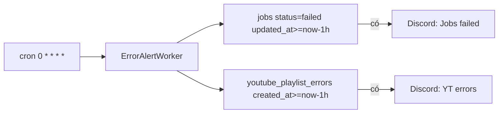

# Plan: Hourly Error → Discord Alert

## Quyết định đã chốt

1. Job window: `updated_at >= now-1h` + `status = failed`
2. Discord: **2 message** tách (Jobs / YouTube)
3. Chỉ chạy khi **cron trigger** (không chạy lúc Start)

## Mục tiêu

Mỗi giờ kiểm tra lỗi mới ở:

1. **`jobs`** — `status = failed` và `updated_at` trong 1h
2. **`youtube_playlist_errors`** — `created_at` trong 1h

Có lỗi → gửi message Discord tương ứng. Không lỗi → không gửi. `DISCORD_WEBHOOK_URL` trống → worker không schedule.

## Kiến trúc

| File | Vai trò |
|---|---|
| `services/DiscordService/main.go` | POST Incoming Webhook + truncate limit |
| `worker/ErrorAlertWorker/main.go` | Cron `0 * * * *`, query, 2 embed riêng |
| `config/site.go` | `DiscordWebhookURL` |
| `.env.example` | `DISCORD_WEBHOOK_URL`, `ERROR_ALERT_CRON` |
| `main.go` | `ErrorAlertWorker.Start()` |



## Env

```env
DISCORD_WEBHOOK_URL=https://discord.com/api/webhooks/...
ERROR_ALERT_CRON=0 * * * *
```

## Phạm vi không làm (v1)

- Không `notified_at` / outbox
- Không realtime khi fail
- Không Discord Bot
- Không stuck-job alert
