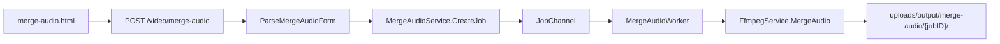

# Plan: Merge Audio (chọn format + preview)

## Phạm vi đã chốt

- Feature **mới** `merge_audio` — không đụng `JobTypeMerge` (video)
- Input: **chỉ audio** (`accept="audio/*"`), **≥2 file**, một job (multi-input như [router/merge](router/merge/main.go))
- Form: `output_format` + `audio_bitrate` (whitelist giống Extract Audio: mp3/m4a/wav/flac/ogg)
- Sau khi chọn/sắp xếp file: **tự đề xuất** `output_format` = extension xuất hiện nhiều nhất trong danh sách (tie → file đầu tiên; nếu ext không nằm whitelist → `mp3`)
- Không override nếu user đã đổi format thủ công sau lần suggest gần nhất
- **Không** crossfade / gap / metadata / volume / speed (giữ form gọn)
- UI preview: player play/seek/time **giống trim-audio** — nghe thử toàn bộ chuỗi đã nối theo thứ tự kéo-thả (Web Audio, client-side)

## Luồng xử lý



FFmpeg:

- Probe từng input; reject nếu không có audio stream
- **Fast path** (concat demuxer + `-c copy`): mọi file cùng audio codec/container tương thích **và** `output_format` khớp codec nguồn **và** bitrate = `original`
- **Re-encode path**: `filter_complex` `concat=n=N:v=0:a=1` + codec theo format (reuse mapping codec từ [extract_audio.go](services/FfmpegService/extract_audio.go) / [trim_audio.go](services/FfmpegService/trim_audio.go))
- Output name: `{firstBase}_merged.{ext}`

## Validation

| Field | Rule |
|-------|------|
| Upload | ≥2 file audio; empty → `400` tiếng Việt; max = `MaxMergeClips` (200) |
| `file_order` | Reorder như merge video |
| `output_format` | `mp3` \| `m4a` \| `wav` \| `flac` \| `ogg` (default server `mp3`) |
| `audio_bitrate` | `original` \| `64k`…`320k`; WAV/FLAC bỏ qua bitrate (như extract) |

## UI form (cốt lõi)

1. Multi-file + `fileAddMore` + sortable preview list (`name="files"`, hidden `file_order`) — copy pattern [merge.html](templates/pages/merge.html) / [merge-file-preview.js](public/static/js/merge-file-preview.js), `accept="audio/*"`
2. Config panel (hiện khi ≥2 file):
   - `output_format` select (như extract-audio)
   - `audio_bitrate` select (ẩn/disable với wav/flac)
   - `#estimateBox` — tổng duration + ước lượng thời gian xử lý
   - Preview player (reuse CSS `.trim-audio-player` hoặc rename shared class nhẹ trong `jobs-ui.css`):

```html
<label>Nghe thử bản ghép</label>
<div class="trim-audio-player" id="mergeAudioPlayer">
  <!-- play/pause + seek + time — cùng markup trim-audio -->
</div>
```

3. Submit full-width trong config panel

**Preview behavior** ([trim-audio-preview.js](public/static/js/trim-audio-preview.js) làm mẫu):

- Decode lần lượt các `File` theo thứ tự hiện tại → nối `AudioBuffer` → play/seek toàn timeline
- Đổi thứ tự / thêm / xóa file → invalidate cache, rebuild buffer
- Submit → `stopMergeAudioPreview()` trước upload

**Suggest format** (trong estimate hoặc file-preview module):

```javascript
function mostCommonAudioExt(files) {
  // count ext từ file.name; chỉ tính whitelist; tie → first file
}
// on files change: if (!userTouchedFormat) set #output_format = mostCommon...
```

localStorage key: `mergeAudioForm.options` — persist `output_format`, `audio_bitrate`; **không** persist files. Sau suggest lần đầu từ files, vẫn cho user đổi và persist.

## File cần tạo / sửa

### Frontend (checklist COMMON_PLAN)

| File | Việc |
|------|------|
| [templates/pages/merge-audio.html](templates/pages/merge-audio.html) | Form multi-file + format/bitrate + estimate + preview player + jobs history + scripts |
| [public/static/js/merge-audio-estimate.js](public/static/js/merge-audio-estimate.js) | localStorage, probe duration (`<audio>`), estimate, **suggest format**, show/hide bitrate |
| [public/static/js/merge-audio-file-preview.js](public/static/js/merge-audio-file-preview.js) | DataTransfer + drag-sort + `pageshow` + `file_order` (rút gọn từ merge-file-preview, bỏ image/gif) |
| [public/static/js/merge-audio-preview.js](public/static/js/merge-audio-preview.js) | Web Audio concat preview + seek UI |
| [public/static/js/merge-audio-jobs-panel.js](public/static/js/merge-audio-jobs-panel.js) | `JobUI.fetchJobs({ type: "merge_audio" })` |
| [public/static/js/job-ui.js](public/static/js/job-ui.js) | `TYPE_LABELS.merge_audio = "Ghép audio"` |
| [public/static/css/jobs-ui.css](public/static/css/jobs-ui.css) | Chỉ thêm nếu cần (ưu tiên reuse `.trim-audio-player` / `.file-preview-list--sortable`) |
| [templates/partials/sidebar.html](templates/partials/sidebar.html) | Nav “Merge Audio” dưới Trim Audio (reuse `audio.svg` hoặc `merge.svg`) |
| [templates/pages/home.html](templates/pages/home.html) | Link tool ngắn |
| [templates/pages/admin/dashboard.html](templates/pages/admin/dashboard.html) | Filter option `merge_audio` |

IDs: `mergeAudioForm`, jobs prefix `mergeAudioJobs*`, ActivePage `"merge-audio"`.

Script order: `job-ui.js` → jobs-panel → estimate → file-preview → preview → inline `initMergeAudio*()` + `handleMergeAudioSubmit` (ChunkUpload + validate ≥2).

### Backend

| File | Việc |
|------|------|
| [enums/JobType.go](enums/JobType.go) | `JobTypeMergeAudio = "merge_audio"` |
| [structs/MergeAudioJobExtrasDto.go](structs/MergeAudioJobExtrasDto.go) + `_test.go` | `output_format`, `audio_bitrate`; Parse/ToJSON/ParseJSON |
| [router/mergeaudio/main.go](router/mergeaudio/main.go) | GET/POST `/video/merge-audio` + legacy `301` từ `/merge-audio` |
| [router/main.go](router/main.go) | `mergeaudio.Bootstrap()` |
| [services/MergeAudioService/main.go](services/MergeAudioService/main.go) | `CreateJob(inputs []InputFile, extras, userID)` — N `JobFileData` + `SortOrder` như MergeService |
| [services/FfmpegService/merge_audio.go](services/FfmpegService/merge_audio.go) | `MergeAudio` + `CanConcatCopyAudio` + concat/re-encode |
| [worker/MergeAudioWorker/main.go](worker/MergeAudioWorker/main.go) | Load inputs theo `sort_order`, MergeAudio, output `JobFileData` |
| [worker/channels/main.go](worker/channels/main.go) | `case enums.JobTypeMergeAudio` |
| [services/JobPresenterService/main.go](services/JobPresenterService/main.go) | Multi-file filename + duration sum (nhánh giống merge) + summary `mp3 · 192k` / `flac` |

POST: `MultipartReader` + `uploadutil.ResolveMultipart`, `name="files"`, reorder qua `file_order`, một job, `303` → `/video/merge-audio`.

## Verify (sau implement)

- ≥2 file → config + preview hiện; &lt;2 → ẩn / submit báo lỗi
- Suggest format: 2 mp3 + 1 wav → chọn `mp3`; user đổi tay → không bị ghi đè khi reorder cùng set
- Refresh → restore format/bitrate từ localStorage
- Back/forward → file preview + preview sync (`pageshow`)
- Submit → 303, jobs panel thấy `merge_audio`; empty / 1 file → 400
- Cùng codec + format khớp + bitrate original → copy nhanh; khác format → re-encode nghe được
- Preview play/seek đúng tổng duration sau khi reorder
