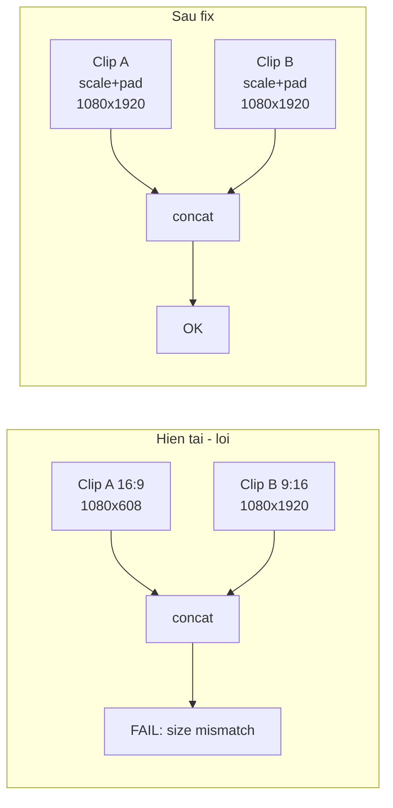
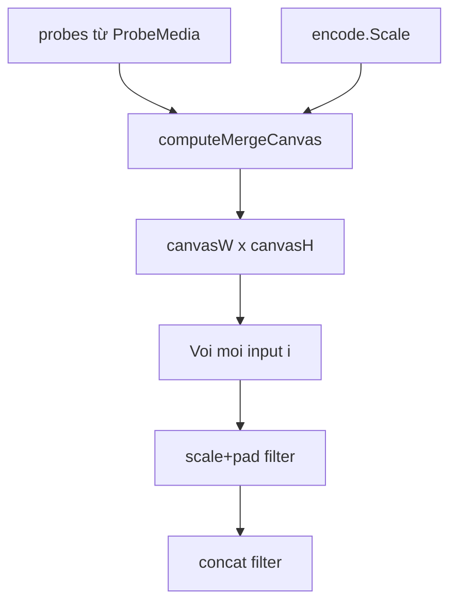

# Chuẩn hóa kích thước video khi merge (scale + pad)

## Vấn đề hiện tại

Trong [`services/FfmpegService/merge.go`](services/FfmpegService/merge.go), mọi clip dùng chung một `scaleVF`:

```167:176:services/FfmpegService/merge.go
	scaleVF := "setsar=1"
	if encode.Scale != "" {
		scaleVF = "scale=" + encode.Scale + ",setsar=1"
	}
	// ...
	filterParts = append(filterParts, fmt.Sprintf("[%d:v]%s[v%d]", i, scaleVF, i))
```

`encode.Scale` dạng `1080:-2` (từ [`structs/MergeJobExtrasDto.go`](structs/MergeJobExtrasDto.go)) chỉ cố định **chiều rộng**; chiều cao tự tính theo tỷ lệ từng clip. Hai clip khác aspect ratio (vd. 16:9 + 9:16) sẽ ra **chiều cao khác nhau** → filter `concat` báo lỗi vì yêu cầu mọi input video cùng `W×H`.



## Giải pháp

Thay `scale=1080:-2,setsar=1` bằng chuỗi filter **scale fit + pad center** với canvas cố định:

```
scale=W:H:force_original_aspect_ratio=decrease,
pad=W:H:(ow-iw)/2:(oh-ih)/2:color=black,
setsar=1
```

### Thuật toán tính canvas

Thêm helper trong [`services/FfmpegService/merge.go`](services/FfmpegService/merge.go) (hoặc file nhỏ `merge_canvas.go` cùng package):

**1. Xác định `targetW` (chiều rộng chuẩn)**

| Trường hợp | `targetW` |
|---|---|
| User chọn size (vd. 1080, 720…) — `encode.Scale` = `"1080:-2"` | Parse phần trước `:` → `1080` |
| Original Size (`encode.Scale` rỗng) — re-encode vì codec/FPS khác nhau | `max(probes[i].Width)` |

**2. Tính chiều cao sau scale từng clip (giữ tỷ lệ theo `targetW`)**

```go
func scaledHeight(targetW, srcW, srcH int) int {
    if srcW <= 0 || srcH <= 0 {
        return targetW // fallback an toàn
    }
    return even(int(math.Round(float64(targetW) * float64(srcH) / float64(srcW))))
}
```

**3. Canvas cuối**

- `canvasW = even(targetW)`
- `canvasH = even(max(scaledHeight(targetW, probe.Width, probe.Height) for all probes))`

**4. Filter cho từng input `i`**

```go
fmt.Sprintf("[%d:v]scale=%d:%d:force_original_aspect_ratio=decrease,pad=%d:%d:(ow-iw)/2:(oh-ih)/2:color=black,setsar=1[v%d]",
    i, canvasW, canvasH, canvasW, canvasH, i)
```

Helper `even(n)` làm tròn số chẵn (yêu cầu của libx264).

### Luồng trong `mergeReencode`



- Gọi `canvasW, canvasH := computeMergeCanvas(probes, encode.Scale)` **một lần** trước vòng lặp.
- Nếu `canvasW <= 0 || canvasH <= 0`: fallback `setsar=1` (giữ hành vi cũ khi không có metadata).
- Xóa biến `scaleVF` dùng chung; mỗi clip dùng cùng canvas (filter giống nhau, chỉ khác input index).

## Phạm vi thay đổi

| File | Thay đổi |
|---|---|
| [`services/FfmpegService/merge.go`](services/FfmpegService/merge.go) | `computeMergeCanvas`, `scaledHeight`, `even`, cập nhật `mergeReencode` |
| [`services/FfmpegService/merge_test.go`](services/FfmpegService/merge_test.go) | Unit test cho canvas: cùng aspect ratio, mixed 16:9+9:16, original size (max width), parse `1080:-2` |

**Không đổi** frontend, `MergeJobExtrasDto`, hay worker — logic chỉ nằm ở tầng ffmpeg merge.

## Test cases cần cover

1. **Cùng 16:9, khác resolution** (1920×1080 + 1280×720, targetW=1080): cả hai scaled height bằng nhau → canvas không cần pad (hoặc pad 0px).
2. **Khác aspect ratio** (1920×1080 + 1080×1920, targetW=1080): canvas = 1080×1920; clip ngang có letterbox trên/dưới.
3. **Original size, max width** (1280×720 + 1920×1080, `encode.Scale=""`): targetW=1920, canvasH từ clip cao nhất sau scale.
4. **Parse scale** `"1080:-2"` → targetW=1080; `"1280:720"` (nếu có) → targetW=1280.

## Ví dụ filter sau fix

Merge 2 clip (16:9 1920×1080 + 9:16 1080×1920), user chọn 1080P:

```
[0:v]scale=1080:1920:force_original_aspect_ratio=decrease,pad=1080:1920:(ow-iw)/2:(oh-ih)/2:color=black,setsar=1[v0];
[1:v]scale=1080:1920:force_original_aspect_ratio=decrease,pad=1080:1920:(ow-iw)/2:(oh-ih)/2:color=black,setsar=1[v1];
[v0][a0][v1][a1]concat=n=2:v=1:a=1[outv][outa]
```

Clip ngang (v0) sẽ có viền đen trên/dưới, clip dọc (v1) fill full chiều cao — cả hai cùng 1080×1920 trước khi concat.

## Lưu ý hành vi

- Output có thể **không phải 16:9** khi mix aspect ratio (vd. canvas 1080×1920) — đây là trade-off hợp lý để không crop nội dung.
- Chế độ **Original Size + concat copy** (clip tương thích) không đổi — chỉ ảnh hưởng nhánh `mergeReencode`.
- Có thể gỡ `fmt.Println("ffmpeg args:...")` debug nếu muốn dọn code (ngoài scope, tùy chọn).
