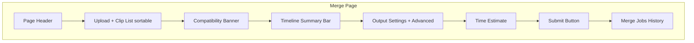
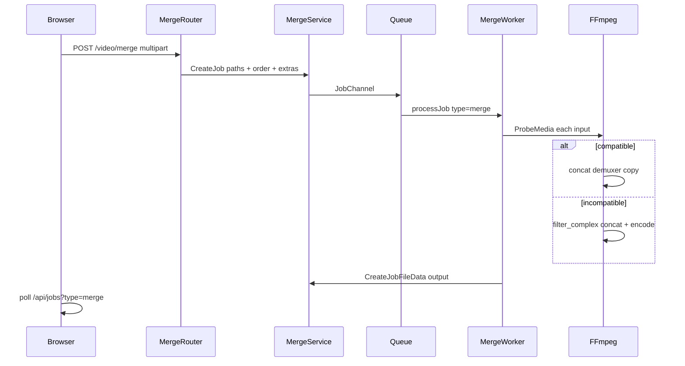

# Plan: Tính năng Ghép Video (Merge)

## Bối cảnh

Split đã hoàn chỉnh end-to-end. Merge chỉ có stub tại [`templates/pages/merge.html`](templates/pages/merge.html) (form POST `/merge` không có backend). Infrastructure dùng chung (job queue, cancel/retry, API polling, download) đã sẵn sàng — chỉ cần bổ sung type-specific layer.

**Lựa chọn đã xác nhận:**
- **Phạm vi v1:** Standard (preview metadata, cảnh báo codec, timeline tổng, ước tính thời gian)
- **Chiến lược ghép:** Auto — concat copy khi tương thích, fallback re-encode

---

## Brainstorm tính năng (theo tier)

### v1 Standard — ship trong lần này

| Nhóm | Tính năng |
|------|-----------|
| Upload | Chọn nhiều file, kéo-thả, thêm file sau, xóa từng clip / xóa tất cả |
| Thứ tự | Drag-and-drop sắp xếp clip (thứ tự = thứ tự ghép) |
| Preview | Metadata từng clipRule: resolution, duration, size; nút xem preview video |
| Timeline | Thanh tổng hợp: N clip · tổng duration · tổng dung lượng |
| Tương thích | Banner cảnh báo khi clip khác resolution/codec/fps; gợi ý chọn resolution đích |
| Output | Resolution đích, định dạng, CRF/preset/FPS/audio (tái sử dụng form split) |
| Xử lý | Auto: concat nhanh (`-c copy`) hoặc re-encode qua `filter_complex` |
| Job | 1 job / lần submit, progress bar, cancel/retry/download |
| Lịch sử | Bảng job merge riêng (poll `GET /api/jobs?type=merge`) |

### v2 — sau khi v1 ổn định

- Cắt trim đầu/cuối từng clip trước khi ghép
- Transition fade/crossfade giữa clip (2–3 giây)
- Normalize audio volume giữa các clip
- Preset nhanh: "Giữ nguyên chất lượng", "1080p cho Zalo/Discord"
- Drag-and-drop reorder trực tiếp trên timeline bar

### v3 — tương lai

- Intro/outro cố định, nhạc nền
- Ghép clip + ảnh tĩnh (slideshow)
- Export nhiều đoạn từ 1 timeline phức tạp

---

## UX màn hình Ghép Video

Layout mirror [`templates/pages/split.html`](templates/pages/split.html), chia 4 vùng:



### Wireframe logic (top → bottom)

1. **Header** — "Ghép Video Online / Merge Video Online" + mô tả ngắn song ngữ
2. **Upload zone** — `<input multiple>` + hidden "thêm file"; khu vực preview dạng card list (tái dùng CSS `.file-preview-*` từ split)
3. **Mỗi clip card** hiển thị:
   - Số thứ tự (#1, #2…)
   - Tên file, duration, size, resolution (từ `<video>` metadata client-side)
   - Handle kéo (⋮⋮), nút preview, nút xóa
4. **Compatibility banner** (ẩn nếu OK):
   - Vàng: "Clip khác resolution — sẽ re-encode về 1080p"
   - Xanh: "Tất cả clip tương thích — có thể ghép nhanh (copy stream)"
5. **Timeline summary** — `"4 clip · 12:34 tổng · ~850 MB"`
6. **Output settings** — resolution (default 1080p), **không có** split mode/size/time
7. **Advanced options** — copy nguyên khối từ split: format, CRF, preset, FPS, audio
8. **Estimate box** — ước tính dựa trên tổng duration + mode (copy vs re-encode)
9. **Submit** — "Ghép & Tải xuống" (disable + redirect 303 như split)
10. **Job history** — bảng merge jobs + modals từ [`templates/partials/job_modals.html`](templates/partials/job_modals.html)

### Khác biệt UX quan trọng vs Split

| | Split | Merge |
|---|-------|-------|
| Files → Jobs | 1 file = 1 job | N files = 1 job |
| Thứ tự | Không quan trọng | **Quan trọng** — cần drag reorder |
| Output | N segment ZIP | 1 file merged |
| Resolution "keep" | Split-only, copy stream | Hữu ích khi concat copy |
| Cảnh báo | Duplicate filename | Codec/resolution mismatch |

### Hidden form field cho thứ tự

Frontend gửi `file_order=0,2,1` (indices trong `input.files`) để backend tạo `JobFileData` đúng thứ tự.

---

## Kiến trúc kỹ thuật



### Backend — files mới / sửa

| Layer | File | Việc cần làm |
|-------|------|--------------|
| Enum | [`enums/JobType.go`](enums/JobType.go) | Thêm `JobTypeMerge = "merge"` |
| Entity | [`entities/JobFileData.go`](entities/JobFileData.go) | Thêm `SortOrder int` (giữ thứ tự clip khi retry) |
| DTO | `structs/MergeJobExtrasDto.go` | `Encode` + `OutputExt`; `ParseMergeForm()` tái dùng logic encode từ [`structs/SplitJobExtrasDto.go`](structs/SplitJobExtrasDto.go) (không split mode) |
| Service | `services/MergeService/main.go` | `CreateJob(paths[], names[], sortOrders[], extrasJSON, userID)` → 1 Job + N input JobFileData |
| Router | `router/merge/main.go` | `GET/POST /video/merge`; stream multipart giống [`router/split/main.go`](router/split/main.go); **1 job cho toàn bộ files** |
| Register | [`router/main.go`](router/main.go) | Gọi `merge.Bootstrap()` |
| FFmpeg | [`services/FfmpegService/main.go`](services/FfmpegService/main.go) | `CanConcatCopy(probes)`, `MergeVideos(ctx, inputs, output, opts, progressFn)` |
| Worker | `worker/MergeVideoWorker/main.go` | Load inputs ORDER BY sort_order; output dir `uploads/output/merges/{jobId}/` |
| Channel | [`worker/channels/main.go`](worker/channels/main.go) | `switch job.Type`: thêm case `JobTypeMerge` |
| Presenter | [`services/JobPresenterService/main.go`](services/JobPresenterService/main.go) | Merge: `FileName = "a.mp4 + 2 clip"`, `Duration = sum(inputs)` |
| Template | [`templates/pages/merge.html`](templates/pages/merge.html) | Full page như split |
| JS | `public/static/js/merge-file-preview.js` | Sortable clip list + compatibility check |
| JS | `public/static/js/merge-jobs-panel.js` | Copy pattern từ [`split-jobs-panel.js`](public/static/js/split-jobs-panel.js) |
| JS | `public/static/js/merge-estimate.js` | Estimate copy vs re-encode |
| Home | [`templates/pages/home.html`](templates/pages/home.html) | Bỏ `aria-disabled` trên nút "Ghép video" |

### FFmpeg — auto strategy

**Fast path** (khi `CanConcatCopy` = true):
- Tạo file list cho concat demuxer
- `ffmpeg -f concat -safe 0 -i list.txt -c copy output.mp4`
- Progress ~ instant → set 0→100 nhanh

**Re-encode path** (codec/resolution/fps khác nhau):
- Scale tất cả clip về resolution đích (hoặc giữ gốc nếu `size=keep` và cùng size)
- `filter_complex`: `[0:v][0:a][1:v][1:a]... concat=n=N:v=1:a=1`
- Progress: `encodedDuration / totalInputDuration` (giống SplitVideoWorker)

**Edge cases:**
- Clip không có audio → pad silent audio track trước concat
- 1 clip duy nhất → reject hoặc copy/re-encode thành output (min 2 clip)
- Giới hạn số clip (ví dụ max 20) và tổng size upload

### JobFileData cho merge

```
Job (type=merge)
├── JobFileData input sort_order=0  clip1.mp4
├── JobFileData input sort_order=1  clip2.mp4
├── JobFileData input sort_order=2  clip3.mp4
└── JobFileData output            merged.mp4  (sau worker)
```

---

## Frontend chi tiết

### `merge-file-preview.js` (dựa trên [`split-file-preview.js`](public/static/js/split-file-preview.js))

- Tái sử dụng: formatFileSize, formatDuration, preview modal, add/remove/clear
- **Mới:** SortableJS hoặc native HTML drag-and-drop trên `.file-preview-list`
- **Mới:** `checkCompatibility(files)` — so sánh `videoWidth`, `videoHeight`; hiển thị banner
- **Mới:** Cập nhật `#timelineSummary` và hidden `#fileOrder` mỗi khi list thay đổi
- Sync thứ tự vào `DataTransfer` / reorder `input.files` trước submit

### `merge-estimate.js`

- Input: tổng duration, số clip, resolution, preset, mode (copy vs re-encode)
- Copy mode: estimate ~ vài giây
- Re-encode: công thức tương tự [`split-estimate.js`](public/static/js/split-estimate.js)

### Job history column "File"

Merge job hiển thị: `"intro.mp4 → outro.mp4 (3 clip)"` thay vì tên file đơn.

---

## Thứ tự triển khai đề xuất

### Phase 1 — Backend core (có thể test bằng curl)
1. Enum + SortOrder migration
2. `MergeJobExtrasDto` + tests
3. `FfmpegService.MergeVideos` + `CanConcatCopy`
4. `MergeService` + `MergeVideoWorker`
5. Wire worker channel + router

### Phase 2 — Frontend Standard UX
6. `merge.html` full layout
7. `merge-file-preview.js` (sortable + compatibility + timeline)
8. `merge-estimate.js` + `merge-jobs-panel.js`
9. Enable home CTA + sidebar active state

### Phase 3 — Polish
10. JobPresenter merge summary
11. Error messages tiếng Việt (codec lỗi, clip thiếu audio, v.v.)
12. Manual test matrix (same codec, mixed resolution, cancel mid-job, retry)

---

## Test plan

    Ed)

- [ ] Ghép 2 clip MP4 cùng 1080p → concat copy, hoàn thành nhanh
- [ ] Ghép clip 720p + 1080p → re-encode, output đúng resolution đích
- [ ] Drag reorder clip → output đúng thứ tự
- [ ] Xóa 1 clip, thêm lại → list cập nhật đúng
- [ ] Cancel job đang re-encode → status cancelled
- [ ] Retry job failed → chạy lại với cùng inputs
- [ ] Download output qua API
- [ ] Home dashboard hiển thị merge job với badge "Merge"
- [ ] Submit 1 clip → validation error rõ ràng
