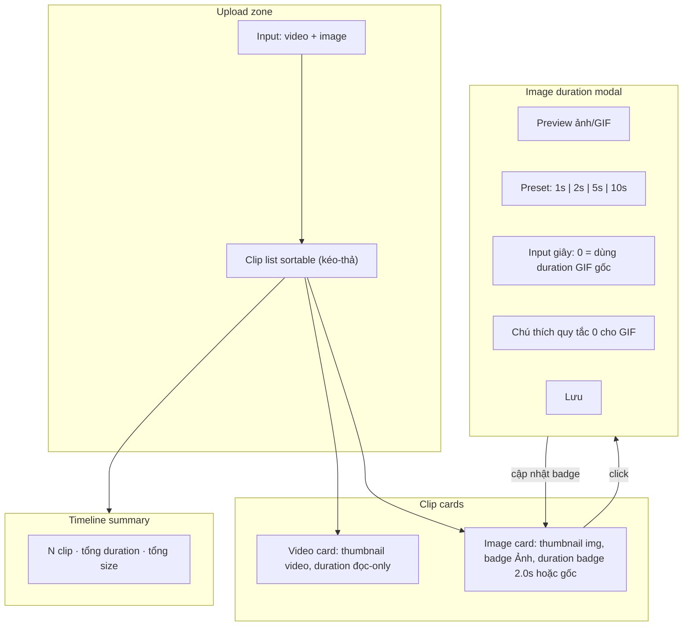
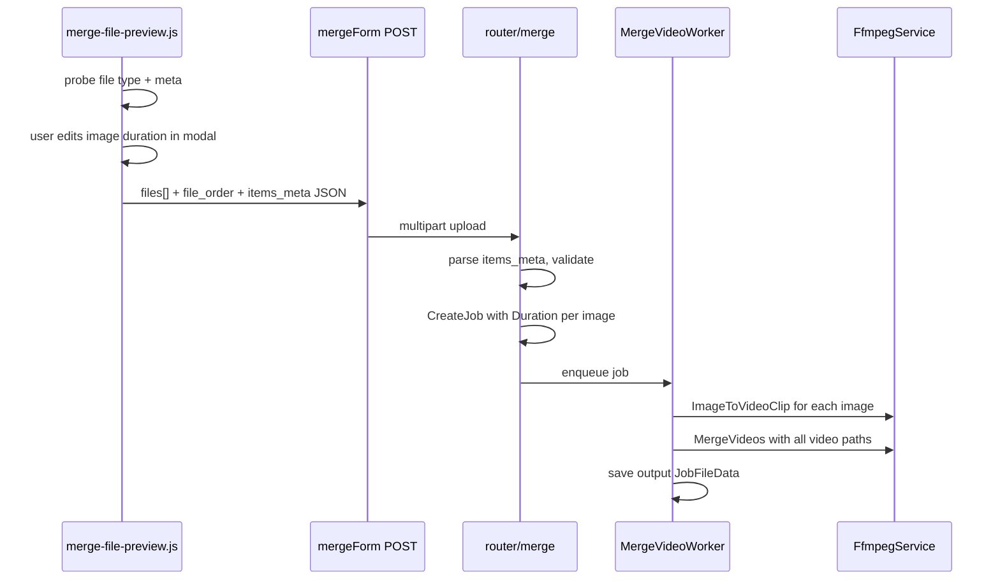

# Plan: Ghép video + ảnh tĩnh (slideshow)

## Bối cảnh

Trang merge hiện tại ([`templates/pages/merge.html`](templates/pages/merge.html)) chỉ nhận `video/*`, mỗi clip là video nguyên vẹn — không có trim, không có ảnh. Backend ([`services/FfmpegService/merge.go`](services/FfmpegService/merge.go)) concat/re-encode video thuần. Plan v3 trong [`.cursor/plans/merge_video_feature_5093965f.plan.md`](.cursor/plans/merge_video_feature_5093965f.plan.md) đã liệt kê "ghép clip + ảnh tĩnh" là tính năng tương lai.

**Lựa chọn đã xác nhận:**
- UI: **Click card ảnh → modal chỉnh duration** + preset nhanh (1s / 2s / 5s / 10s)
- Loại file: **JPG, PNG, WebP + GIF**
- **Quy tắc duration (đơn giản, 1 input duy nhất):**
  - Ảnh tĩnh (JPG/PNG/WebP/GIF 1 frame): **mặc định 2s**, bắt buộc > 0
  - GIF: **mặc định 0** — `0` = dùng thời lượng gốc của GIF (backend ffmpeg probe)
  - Không cần checkbox riêng; chú thích trong modal giải thích quy tắc `0`

---

## Đề xuất UI

### Layout tổng thể



### Card ảnh trong danh sách clip

Giữ nguyên layout horizontal sortable hiện có ([`merge-file-preview.js`](public/static/js/merge-file-preview.js) → `createPreviewItem`), phân biệt 2 loại card:

| | Video card | Image card |
|---|---|---|
| Thumbnail | `<video>` (như hiện tại) | `` hoặc `<video>` nếu GIF động |
| Badge góc | `#1` | `#1` + badge **Ảnh** (màu khác, ví dụ amber) |
| Meta line | `1920×1080 · 0:15 · 12 MB` | `1920×1080 · **2.0s** · 2 MB` hoặc `· **gốc** ·` nếu GIF = 0 |
| Click | Mở video preview modal (giữ nguyên) | Mở **image duration modal** (mới) |
| Drag handle | Giữ nguyên | Giữ nguyên |

**Default duration:**
- Ảnh tĩnh: **2 giây**
- GIF: **0** (= dùng duration gốc)

### Image duration modal (mới)

Tái sử dụng pattern `<dialog>` như [`#videoPreviewModal`](templates/pages/merge.html) (lines 204–213):

```
┌─────────────────────────────────────────┐
│  intro.gif                          [×] │
│  ┌─────────────────────────────────┐    │
│  │         [preview ảnh/GIF]       │    │
│  └─────────────────────────────────┘    │
│                                         │
│  Thời lượng hiển thị                    │
│  [ 1s ] [ 2s ] [ 5s ] [ 10s ]          │
│  [____0____] giây                       │
│                                         │
│  ℹ GIF: nhập 0 để dùng thời lượng gốc.  │
│    Ảnh tĩnh: nhập số giây (> 0).        │
│    (Nếu đọc được, hiện thêm: gốc ≈ 2.4s)│
│                                         │
│              [ Hủy ]  [ Lưu ]           │
└─────────────────────────────────────────┘
```

- **Một input duy nhất** — không checkbox
- Preset buttons set giá trị cụ thể (GIF user có thể tự nhập `0` hoặc preset)
- Ảnh tĩnh: input default `2`, min `0.5`, max `60`
- GIF: input default `0`, min `0`, max `60`; `0` → backend dùng ffmpeg probe duration gốc
- Nếu frontend probe được duration GIF → hiện hint phụ `Thời lượng gốc ≈ 2.4s` (chỉ tham khảo, không bắt buộc)
- Card badge: GIF với `0` → hiện **gốc** (hoặc `≈2.4s` nếu probe OK); ảnh tĩnh → `2.0s`
- Lưu → cập nhật badge trên card + trigger `onMergeItemsChanged` (estimate + timeline summary)

### Timeline summary bar

Bổ sung HTML cho `#timelineSummary` (JS đã có sẵn trong [`merge-file-preview.js`](public/static/js/merge-file-preview.js) lines 124–150, CSS `.merge-timeline-summary` đã có). Hiển thị:

> `4 clip · 1:23 tổng · ~45 MB`

Với ảnh/GIF: cộng `effectiveDuration` — nếu `hold_duration > 0` dùng giá trị đó; nếu GIF `hold_duration === 0` dùng `nativeDuration` đã probe (hoặc ước tính 2s nếu probe fail).

### Banner tương thích

Khi có ≥1 ảnh → luôn hiện banner:

> "Có ảnh/GIF — ảnh sẽ được chuyển thành video clip trước khi ghép. Không dùng được ghép nhanh (copy stream)."

Ẩn gợi ý "Original Size copy stream" khi mix ảnh.

### Nút "Thêm clip"

Đổi label thành **"Thêm clip/ảnh"**, `accept` mở rộng:

```html
accept="video/*,image/jpeg,image/png,image/webp,image/gif"
```

---

## Luồng dữ liệu



### Payload mới: `items_meta` (hidden JSON)

```json
[
  { "index": 0, "kind": "video" },
  { "index": 1, "kind": "image", "hold_duration": 2.0 },
  { "index": 2, "kind": "gif", "hold_duration": 0 }
]
```

- `index` khớp thứ tự trong `files[]` sau reorder
- `hold_duration`: số giây user nhập. **GIF: `0` = dùng duration gốc (ffmpeg probe).** Ảnh tĩnh: bắt buộc `> 0`
- `kind`: `"video"` | `"image"` | `"gif"` — GIF tĩnh (1 frame) xử lý như `"image"`

**Resolve duration (backend):**
- `kind=video` → probe ffmpeg
- `kind=image` → `hold_duration` (validate `>= 0.5`)
- `kind=gif` + `hold_duration == 0` → ffmpeg probe duration gốc
- `kind=gif` + `hold_duration > 0` → dùng giá trị user (loop/cắt theo `-t`)

---

## Backend

### 1. Router — [`router/merge/main.go`](router/merge/main.go)

- Parse `items_meta` từ form fields
- Validate: ≥2 items tổng, ≤**200** items (`maxMergeClips`)
- `kind=image`: `hold_duration` trong `[0.5, 60]`
- `kind=gif`: `hold_duration` trong `[0, 60]` — `0` hợp lệ (= native)
- Cho phép mix video + ảnh (không bắt buộc 2 video)
- Truyền `HoldDuration` + `Kind` vào `MergeService.InputFile`

### 2. Service — [`services/MergeService/main.go`](services/MergeService/main.go)

Mở rộng `InputFile`:

```go
type InputFile struct {
    Path         string
    Name         string
    SortOrder    int
    Kind         string   // "video" | "image" | "gif"
    HoldDuration float64  // 0 cho GIF = native; >0 = override
}
```

- Video: `Duration` = probe ffmpeg
- Image: `Duration` = `HoldDuration` (default 2)
- GIF + `HoldDuration == 0`: `Duration` = ffmpeg probe gốc (worker)
- GIF + `HoldDuration > 0`: `Duration` = `HoldDuration`

### 3. FFmpeg — [`services/FfmpegService/merge.go`](services/FfmpegService/merge.go) (file mới `image_clip.go`)

Thêm `ImageToVideoClip(ctx, opts)`:

```go
// Ảnh tĩnh / GIF → mp4 tạm
// -loop 1 -i image.png -t {duration}
// -vf scale+pad (cùng canvas logic mergeVideoFilter)
// -r {fps} -pix_fmt yuv420p -an
```

GIF + `hold_duration == 0`: convert nguyên GIF, không `-loop 1 -t` thêm — dùng duration ffmpeg probe.

GIF + `hold_duration > 0`: `-loop 1 -t {hold_duration}` loop/cắt theo thời lượng user.

Thêm helper `IsImageFile(path string) bool` theo extension.

### 4. Worker — [`worker/MergeVideoWorker/main.go`](worker/MergeVideoWorker/main.go)

Trước `MergeVideos`:

1. Với mỗi input ảnh/GIF → gọi `ImageToVideoClip` → temp mp4 trong `outputDir`
2. Thay path input bằng temp mp4
3. Nếu có bất kỳ ảnh nào → **bỏ qua** `CanConcatCopy` (force re-encode path hoặc concat sau khi đã normalize)
4. Cleanup temp files sau merge

### 5. Compat / estimate

- [`merge-estimate.js`](public/static/js/merge-estimate.js): tính tổng duration = video meta + image hold durations; khi có ảnh → luôn dùng encode multiplier (không fast-copy)
- [`JobPresenterService`](services/JobPresenterService/main.go): hiển thị tên job kiểu `clip1.mp4 → ảnh (2s) → anim.gif (gốc) → clip2.mp4`

---

## Frontend chi tiết

### File sửa / thêm

| File | Thay đổi |
|---|---|
| [`templates/pages/merge.html`](templates/pages/merge.html) | `accept` mở rộng, `#itemsMeta` hidden, `#timelineSummary`, `#imageDurationModal` dialog, cập nhật hint + validation message |
| [`public/static/js/merge-file-preview.js`](public/static/js/merge-file-preview.js) | `detectKind()`, `probeImageMeta()`, `createImagePreviewItem()`, modal editor, `syncItemsMeta()`, cập nhật timeline/compat |
| [`public/static/js/merge-estimate.js`](public/static/js/merge-estimate.js) | Nhận image durations từ preview module |
| [`public/static/css/jobs-ui.css`](public/static/css/jobs-ui.css) | Style badge ảnh, image modal, preset buttons |
| [`structs/MergeJobExtrasDto.go`](structs/MergeJobExtrasDto.go) hoặc struct mới | `ParseItemsMeta()` validation |
| Tests | `image_clip_test.go`, `ParseItemsMeta` test |

### Logic phân loại file (client)

```javascript
function detectKind(file) {
  if (file.type.startsWith("video/")) return "video";
  if (file.type === "image/gif") return "gif"; // probe sau để biết animated
  if (file.type.startsWith("image/")) return "image";
  // fallback extension
}
```

### Probe GIF (optional — chỉ để hiển thị hint, không bắt buộc)

Frontend **cố gắng** probe duration GIF qua `probeVideoMeta()` (đã có sẵn) để hiện hint `Thời lượng gốc ≈ X.Xs` trong modal. **Nếu probe fail → không sao**, user vẫn nhập `0` và backend ffmpeg xử lý.

| Loại | Default input | Quy tắc |
|---|---|---|
| JPG / PNG / WebP | **2s** | Bắt buộc `> 0` |
| GIF | **0** | `0` = dùng duration gốc (ffmpeg backend) |
| GIF tĩnh (1 frame) | **2s** | Coi như `kind=image` |

Không cần parse binary GIF hay checkbox — đơn giản hóa UX.

### Submit validation ([`handleMergeSubmit`](templates/pages/merge.html))

- Đổi message: "Cần ít nhất 2 clip (video hoặc ảnh)"
- Gọi `syncItemsMeta()` trước submit
- Validate: ảnh tĩnh `hold_duration >= 0.5`; GIF `hold_duration >= 0`

---

## Ràng buộc & edge cases

| Case | Xử lý |
|---|---|
| Chỉ 2 ảnh, không video | Cho phép — convert 2 ảnh → merge |
| Ảnh tĩnh | Default 2s, bắt buộc `hold_duration > 0` |
| GIF, user nhập 0 | Backend ffmpeg probe duration gốc, không loop thêm |
| GIF, user nhập > 0 | `-loop 1 -t {hold_duration}` theo thời lượng user |
| GIF tĩnh (1 frame) | Coi như ảnh tĩnh, default 2s |
| Frontend probe GIF fail | Input vẫn default 0; hint không hiện `≈Xs`; backend vẫn xử lý đúng |
| Resolution khác nhau | Re-encode path hiện có (uniform canvas) — ảnh cũng scale+pad |
| Original Size + có ảnh | Disable hoặc auto-switch sang re-encode; banner giải thích |
| Max 200 items | Tăng `maxMergeClips` từ 20 → **200** (router + ffmpeg + validation frontend) |

### Giới hạn số item: 200

Hiện tại giới hạn **20** nằm ở 2 chỗ backend (chưa có check frontend):

- [`router/merge/main.go`](router/merge/main.go) — `const maxMergeClips = 20`
- [`services/FfmpegService/merge.go`](services/FfmpegService/merge.go) — `const maxMergeClips = 20`

**Thay đổi khi implement:**
- Đổi cả hai thành `200` (hoặc extract shared constant nếu muốn DRY)
- Thêm validation client trong `merge-file-preview.js`: chặn thêm file khi đã đủ 200, alert rõ ràng
- Cập nhật hint trên form: *"Tối đa 200 clip/ảnh mỗi lần ghép"*
- Cân nhắc UX: với 200 item, horizontal scroll clip list vẫn OK; probe metadata tuần tự có thể chậm → có thể batch/debounce nhưng không bắt buộc v1

---

## Phạm vi không làm trong v1

- Trim video clip
- Transition fade giữa clip
- Drag resize duration trên timeline bar
- Nhạc nền cho ảnh

---

## Thứ tự triển khai đề xuất

1. **Backend image→video** + test ffmpeg (`ImageToVideoClip`)
2. **Router/Service** parse `items_meta`, lưu duration
3. **Worker** pre-process ảnh trước merge
4. **Frontend** detect kind, image cards, duration modal
5. **Polish** timeline summary, compat banner, estimate, presenter
