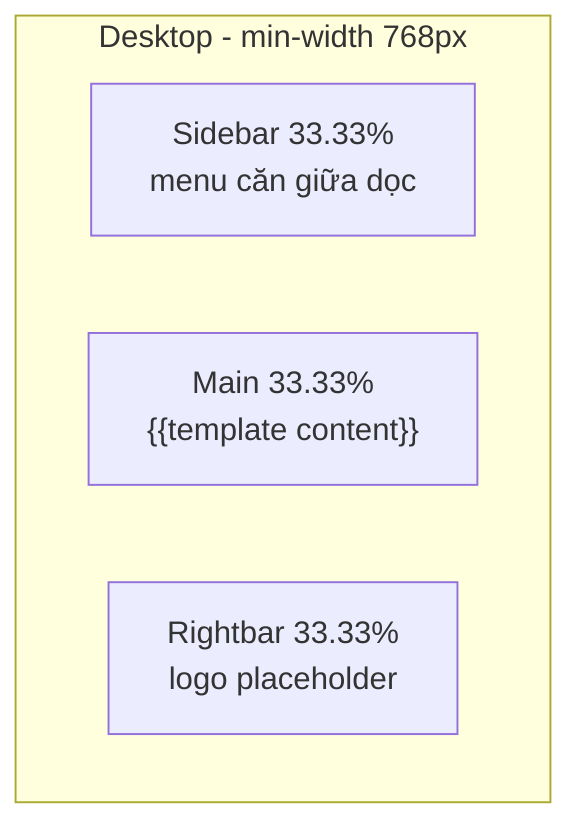
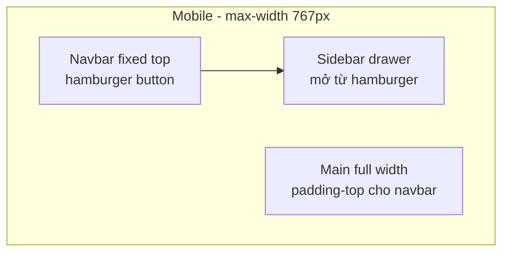

# Plan: Root Layout View

## Kiến trúc layout

**Nguyên tắc chính:** Màn hình chia **theo chiều ngang** thành 3 vùng bằng nhau — Sidebar | Main | Rightbar — nằm cạnh nhau từ trái sang phải (không xếp chồng dọc trên PC).





**Desktop (chia ngang 3 phần):**
- CSS Grid: `grid-template-columns: 1fr 1fr 1fr` — 3 cột ngang bằng nhau, full viewport height
- Không hiển thị navbar
- Sidebar menu căn giữa theo chiều dọc trong cột trái
- Main ở cột giữa, Rightbar ở cột phải — luôn hiển thị cạnh nhau

**Mobile:**
- **Navbar** `position: fixed; top: 0` — luôn cố định trên cùng, có nút hamburger
- **Sidebar** ẩn mặc định; bấm hamburger → drawer trượt xuống từ dưới navbar (overlay)
- **Main** full width, có `padding-top` bù chiều cao navbar
- **Rightbar** ẩn hoàn toàn trên mobile

---

## Cấu trúc file template

| File | Vai trò |
|------|---------|
| [`templates/layouts/root.html`](templates/layouts/root.html) | Layout chính `{{define "root"}}`, khung HTML + gọi partials + `{{template "content" .}}` |
| [`templates/partials/navbar.html`](templates/partials/navbar.html) | Navbar mobile + nút hamburger |
| [`templates/partials/sidebar.html`](templates/partials/sidebar.html) | Menu: Home, Split Video, Merge Video |
| [`templates/partials/rightbar.html`](templates/partials/rightbar.html) | Placeholder logo (trống/tạm text) |
| [`templates/pages/split.html`](templates/pages/split.html) | Nội dung Split (tách từ [`templates/index.html`](templates/index.html) hiện tại) |

### Pattern Go `html/template`

```go
// Parse layout + partials + page cùng lúc
template.ParseFiles(
  "templates/layouts/root.html",
  "templates/partials/navbar.html",
  "templates/partials/sidebar.html",
  "templates/partials/rightbar.html",
  "templates/pages/split.html",
)
tmpl.ExecuteTemplate(w, "root", data)
```

- `root.html` define block `"root"` — shell HTML
- Mỗi page define block `"content"` — chỉ phần main
- Sidebar nhận `.ActivePage` (hoặc tương tự) để highlight menu item đang active

---

## CSS & JS

Tạo [`public/static/css/layout.css`](public/static/css/layout.css) (layout mới, tách khỏi form styles):

- **CSS variables** — tái dùng palette từ [`public/static/js/root.css`](public/static/js/root.css) (`--primary`, `--bg-gradient`, ...)
- **`.app-shell`** — `display: grid; grid-template-columns: 1fr 1fr 1fr; min-height: 100vh` (desktop)
- **`.sidebar`** — `display: flex; flex-direction: column; justify-content: center; align-items: center` (căn giữa dọc menu nhỏ)
- **`.main`** — scroll nội dung, padding hợp lý
- **`.rightbar`** — căn giữa logo placeholder
- **`.navbar`** — `display: none` desktop; mobile: `position: fixed; top: 0; z-index: 100`
- **Breakpoint `@media (max-width: 767px)`** — ẩn rightbar, main full width, sidebar overlay từ top

Di chuyển CSS form hiện tại sang [`public/static/css/root.css`](public/static/css/root.css) (sửa path sai `static/css/root.css` trong index — file thực tế đang nằm ở `public/static/js/root.css`).

Tạo [`public/static/js/layout.js`](public/static/js/layout.js):
- Toggle class `sidebar-open` trên `<body>` khi click hamburger
- Đóng sidebar khi click overlay/backdrop hoặc chọn menu item

---

## Backend Go

### 1. Static file router — tạo file mới [`router/static/main.go`](router/static/main.go)

Tách riêng static routing, theo convention các router khác (`router/split`, `router/job`):

```go
package staticfiles

import "net/http"

func Bootstrap() {
  http.Handle("/static/", http.StripPrefix("/static/", http.FileServer(http.Dir("public/static"))))
}
```

Gọi từ [`router/main.go`](router/main.go):

```go
import staticfiles "app/router/static"

func Bootstrap() {
  staticfiles.Bootstrap()
  split.Bootstrap()
  // ...
}
```

Không đặt logic static trực tiếp trong `router/main.go`.

### 2. Template helper — tạo [`templates/render.go`](templates/render.go)

Gom logic parse + execute để tránh lặp:

```go
func Render(w http.ResponseWriter, page string, data any) error {
  files := []string{
    "templates/layouts/root.html",
    "templates/partials/navbar.html",
    "templates/partials/sidebar.html",
    "templates/partials/rightbar.html",
    page,
  }
  tmpl, err := template.ParseFiles(files...)
  // ExecuteTemplate(w, "root", data)
}
```

### 3. Cập nhật handler — [`router/split/main.go`](router/split/main.go)

- Dùng `templates.Render(w, "templates/pages/split.html", data)`
- Mở rộng [`structs/ChunkVideoDto.go`](structs/ChunkVideoDto.go) thêm field `ActivePage string` (hoặc struct layout riêng embed vào DTO)

### 4. Route Home — [`router/main.go`](router/main.go)

Thay `w.Write([]byte("OK!"))` bằng render page home đơn giản (`templates/pages/home.html`) dùng cùng layout.

Merge Video: tạm link `/merge` trong sidebar (placeholder page hoặc `#` — chưa có Go route).

---

## Nội dung `root.html` (khung)

```html
{{define "root"}}
<!DOCTYPE html>
<html lang="vi">
<head>
  <meta charset="UTF-8" />
  <meta name="viewport" content="width=device-width, initial-scale=1.0" />
  <title>{{.Title}} - Video Tools</title>
  <link href="https://fonts.googleapis.com/css2?family=Inter:wght@400;500;600;700&display=swap" rel="stylesheet" />
  <link href="/static/css/layout.css" rel="stylesheet" />
  <link href="/static/css/root.css" rel="stylesheet" />
</head>
<body>
  {{template "navbar" .}}
  <div class="app-shell">
    {{template "sidebar" .}}
    <main class="main">{{template "content" .}}</main>
    {{template "rightbar" .}}
  </div>
  <div class="sidebar-backdrop" aria-hidden="true"></div>
  <script src="/static/js/layout.js"></script>
</body>
</html>
{{end}}
```

Sidebar menu (3 mục, dễ mở rộng sau):

- `/` — Home
- `/video/split` — Split Video
- `/merge` — Merge Video (placeholder)

Rightbar: `<div class="logo-placeholder">Logo</div>` — sẵn sàng thay bằng `` sau.

---

## Refactor page Split

Chuyển phần body của [`templates/index.html`](templates/index.html) (welcome-box, forms, result script) sang `templates/pages/split.html`:

```html
{{define "content"}}
  <!-- giữ nguyên nội dung form Split + Merge hiện tại -->
{{end}}
```

Giữ nguyên logic JS `resultBox` trong block content.

---

## Wireframe ASCII

**Desktop:**
```
┌──────────────┬──────────────┬──────────────┐
│              │              │              │
│   [Home]     │   Welcome    │              │
│   [Split]    │   Split Form │    Logo      │
│   [Merge]    │   Merge Form │  placeholder │
│              │              │              │
└──────────────┴──────────────┴──────────────┘
     33.33%          33.33%          33.33%
```

**Mobile (sidebar đóng):**
```
┌─────────────────────────────┐
│  ☰  Video Tools             │  ← navbar fixed
├─────────────────────────────┤
│                             │
│         Main content        │
│                             │
└─────────────────────────────┘
```

**Mobile (sidebar mở):**
```
┌─────────────────────────────┐
│  ☰  Video Tools             │
├─────────────────────────────┤
│  Home                       │
│  Split Video                │  ← overlay từ top
│  Merge Video                │
├─────────────────────────────┤
│  (backdrop mờ)              │
└─────────────────────────────┘
```

---

## Thứ tự triển khai

1. Tạo CSS layout + di chuyển/sửa path CSS form
2. Tạo partials (navbar, sidebar, rightbar) + `root.html`
3. Tạo `layout.js` (hamburger toggle → mở sidebar drawer)
4. Tạo `router/static/main.go` + gọi `Bootstrap()` trong `router/main.go`
5. Tạo `templates/render.go`, tách `split.html`, cập nhật handler Split + Home route
6. Kiểm tra responsive: desktop 3 cột ngang bằng nhau; mobile navbar fixed + sidebar từ hamburger
