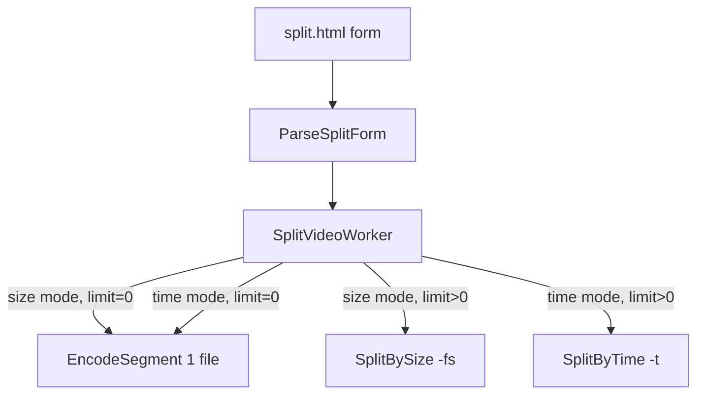

# Hỗ trợ split theo thời gian

## Hiện trạng

- [`templates/pages/split.html`](templates/pages/split.html): form chỉ có `split_size` + `split_unit` (KB/MB/GB). Giá trị `0` = xuất 1 file, không chia.
- [`structs/SplitJobExtrasDto.go`](structs/SplitJobExtrasDto.go): lưu `SizeLimit` (bytes), không có thời lượng.
- [`worker/SplitVideoWorker/main.go`](worker/SplitVideoWorker/main.go): `SizeLimit <= 0` → 1 file; `> 0` → `SplitBySize`.
- [`services/FfmpegService/main.go`](services/FfmpegService/main.go): `EncodeSegment` dùng `-ss` (bắt đầu) và `-fs` (giới hạn dung lượng). Chưa có `-t` (giới hạn thời gian).



## Thiết kế UI (radio toggle — theo lựa chọn của bạn)

Thay block "Kích thước mỗi file split" bằng:

1. **Chế độ chia** — `radio` name `split_mode`:
   - `size` (mặc định, tương thích job cũ)
   - `time`

2. **Panel theo dung lượng** (`#splitBySizePanel`) — giữ nguyên `split_size` + `split_unit`, chỉ hiện khi `split_mode=size`.

3. **Panel theo thời gian** (`#splitByTimePanel`) — mới:
   - `split_time` (number, `min="0"`, mặc định `0`)
   - `split_time_unit` (select: `sec` | `min` | `hour`, mặc định `min`)
   - Hint: *Nhập **0** để xuất **một file duy nhất**.*

4. **JS nhỏ** (inline trong `split.html` hoặc thêm vào [`split-estimate.js`](public/static/js/split-estimate.js)):
   - Toggle hiện/ẩn + `disabled` panel không dùng (tránh gửi field thừa).
   - Khi panel bị disable, field trong panel không submit (HTML native: `disabled` inputs bị bỏ qua).

## Backend

### 1. Mở rộng DTO — [`structs/SplitJobExtrasDto.go`](structs/SplitJobExtrasDto.go)

```go
type SplitJobExtrasDto struct {
    Encode    FfmpegEncodeOptionsDto `json:"encode"`
    SplitMode string                 `json:"split_mode,omitempty"` // "size" | "time"
    SizeLimit int64                  `json:"size_limit,omitempty"` // bytes
    TimeLimit float64                `json:"time_limit,omitempty"` // seconds
}
```

- `ParseSplitForm`: đọc `split_mode` (mặc định `"size"`).
- Thêm `parseSplitTime(amount, unit string) (float64, error)`:
  - `""` hoặc `"0"` → `0`
  - `sec` → ×1, `min` → ×60, `hour` → ×3600
- Validate: chỉ parse limit tương ứng với mode đang chọn; mode kia bỏ qua.
- Job cũ không có `split_mode` → coi là `"size"`, hành vi không đổi.

### 2. FFmpeg — [`services/FfmpegService/main.go`](services/FfmpegService/main.go)

**Mở rộng `EncodeSegment`** thêm tham số `timeLimit float64`:

```go
// Khi timeLimit > 0: append "-t", formatSeconds(timeLimit)
// Khi sizeLimit > 0: append "-fs", ... (giữ nguyên)
// Không dùng cả hai cùng lúc tại call site
```

**Thêm `SplitByTime`** (tương tự `SplitBySize`):

- Input: [`structs/SplitByTimeOptionsDto`](structs/SplitByTimeOptionsDto.go) mới (`InputPath`, `OutputDir`, `TimeLimit`, `Encode`, `NamePrefix`, `OnProgress`).
- Lấy `totalDuration` qua `GetDuration`.
- Vòng lặp: `startAt` từ `0` đến hết video, mỗi segment `duration = min(TimeLimit, totalDuration - startAt)`.
- Gọi `EncodeSegment(..., startAt, sizeLimit=0, timeLimit=duration)`.
- Cập nhật progress: `encodedDuration / totalDuration`.

Split theo thời gian **đơn giản hơn** split theo size vì mỗi đoạn có độ dài cố định (trừ đoạn cuối).

### 3. Worker — [`worker/SplitVideoWorker/main.go`](worker/SplitVideoWorker/main.go)

Thay nhánh `sizeLimit` đơn thuần bằng:

```go
switch extras.SplitMode {
case "time":
    if extras.TimeLimit <= 0 { /* 1 file */ }
    else { SplitByTime(...) }
default: // "size"
    if extras.SizeLimit <= 0 { /* 1 file */ }
    else { SplitBySize(...) }
}
```

Logic tạo `JobFileData` output giữ nguyên (đã có `From`/`To`/`Duration`).

### 4. Router

[`router/split/main.go`](router/split/main.go) **không cần sửa** — đã đọc mọi form field qua multipart.

## Cập nhật ước tính — [`public/static/js/split-estimate.js`](public/static/js/split-estimate.js)

- Đọc `split_mode`.
- **Size mode**: giữ logic hiện tại (`ceil(fileSize / sizeLimit)`).
- **Time mode**: `segmentCount = ceil(videoDuration / timeLimitSeconds)`; `timeLimit=0` → 1 segment.
- Thêm listener cho `split_mode`, `split_time`, `split_time_unit`.
- Gọi toggle panel từ `initSplitEstimate` (hoặc hàm riêng được gọi cùng lúc).

## Tests — [`structs/SplitJobExtrasDto_test.go`](structs/SplitJobExtrasDto_test.go)

- `split_mode=time`, `split_time=5`, `split_time_unit=min` → `TimeLimit == 300`
- `split_mode=time`, `split_time=0` → `TimeLimit == 0`
- `split_mode=time`, unit invalid / negative → error
- Round-trip JSON có `split_mode` + `time_limit`
- Job cũ (không có `split_mode`) vẫn parse size bình thường

Có thể thêm unit test cho `SplitByTime` nếu đã có pattern test ffmpeg trong repo; nếu không, test parse + worker branch là đủ.

## Phạm vi không đổi

- Encode options (CRF, FPS, preset, audio) — áp dụng cho cả hai chế độ chia.
- Jobs history panel, zip download — không cần sửa.
- Không thêm HH:MM:SS picker (có thể làm sau); dùng số + đơn vị giống pattern dung lượng.

## Thứ tự triển khai

1. DTO + `parseSplitTime` + tests
2. `EncodeSegment` (`-t`) + `SplitByTime` + `SplitByTimeOptionsDto`
3. Worker branch theo `split_mode`
4. HTML radio + panels + JS toggle
5. `split-estimate.js` cho time mode
