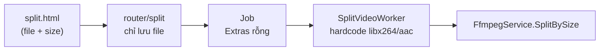
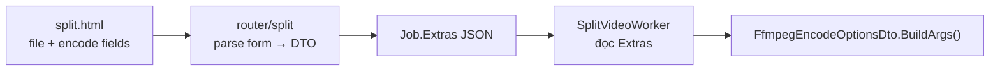
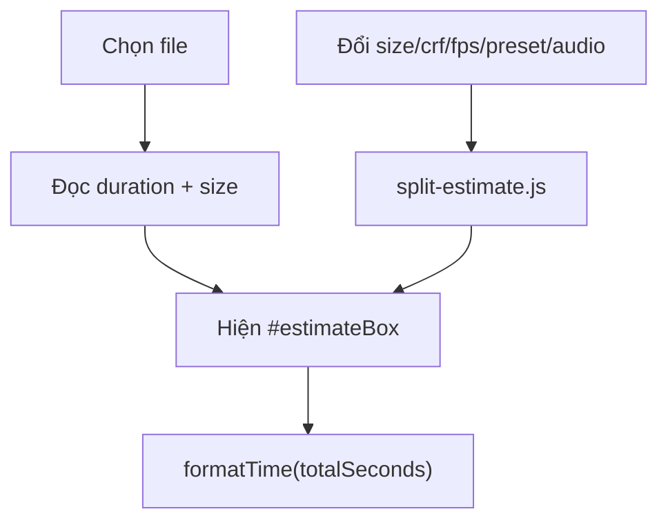

# Kế hoạch bổ sung encode options từ frontend

## Hiện trạng



- [`FfmpegEncodeOptionsDto`](structs/FfmpegEncodeOptionsDto.go) đã có `BuildArgs()` đầy đủ cho: `FPS`, `VideoCodec`, `AudioCodec`, `CRF`, `VideoBitrate`, `AudioBitrate`, `Preset`, `PixelFormat`, `Scale`, `ExtraArgs`.
- [`split.html`](templates/pages/split.html) có dropdown `size` nhưng **router không đọc** field này.
- [`SplitVideoWorker`](worker/SplitVideoWorker/main.go) hardcode encode, bỏ qua lựa chọn người dùng:

```58:62:worker/SplitVideoWorker/main.go
		Encode: structs.FfmpegEncodeOptionsDto{
			VideoCodec:  "libx264",
			AudioCodec:  "aac",
			PixelFormat: "yuv420p",
		},
```

- `Job.Extras` (`string`) đã có trong DB nhưng chưa dùng — phù hợp để lưu options dạng JSON.

Tham chiếu hành vi cũ từ [`server.js`](server.js): `size=keep` → copy stream (không re-encode); các size khác → `libx264`, `crf 23`, `scale={width}:-2`, `fps=15`.

---

## Kiến trúc đích



---

## 1. Struct lưu options job

Tạo [`structs/SplitJobExtrasDto.go`](structs/SplitJobExtrasDto.go):

```go
type SplitJobExtrasDto struct {
    Encode structs.FfmpegEncodeOptionsDto `json:"encode"`
}
```

Thêm JSON tags vào [`FfmpegEncodeOptionsDto`](structs/FfmpegEncodeOptionsDto.go) (ví dụ `json:"fps"`, `json:"videoCodec"`, …).

Thêm helper parse/validate trong cùng file hoặc `structs/SplitJobExtrasFromForm.go`:

| Form field | Map tới | Default / logic |
|---|---|---|
| `size` | `Encode.Scale` | `keep` → không scale; khác → `"{width}:-2"` (giữ logic cũ) |
| `size=keep` | `VideoCodec=copy` | Copy stream video; audio theo `audio_codec` (copy hoặc mute) |
| `crf` | `Encode.CRF` | `23` khi re-encode |
| `fps` | `Encode.FPS` | `15` (select: 15/24/25/30/60) |
| `preset` | `Encode.Preset` | `medium` (select 9 preset x264) |
| `audio_codec` | `Encode.Mute` / `Encode.AudioCodec` | `aac` (select: aac, copy, **mute**) |
| `audio_bitrate` | `Encode.AudioBitrate` | `128k` (chỉ khi `audio_codec=aac`) |

**Logic `audio_codec=mute`:**
- Set `Encode.Mute = true`, bỏ qua `AudioCodec` và `AudioBitrate`
- FFmpeg args: `-an` (không có track âm thanh trong output)
- **Re-encode** (`size ≠ keep`): `-c:v libx264 … -an`
- **Split only** (`size=keep`): `-c:v copy -an` (giữ video gốc, bỏ âm thanh)

Sửa [`FfmpegEncodeOptionsDto.BuildArgs()`](structs/FfmpegEncodeOptionsDto.go):

```go
if o.Mute {
    args = append(args, "-an")
} else if o.AudioCodec != "" {
    args = append(args, "-c:a", o.AudioCodec)
    // ... audio bitrate
}
```

**Defaults server-side** (không hiện trên form, scope basic):
- `VideoCodec`: `libx264` (khi re-encode)
- `PixelFormat`: `yuv420p`
- Không set `VideoBitrate` / `ExtraArgs` (tránh xung đột CRF)

Validation gọn:
- `CRF`: 0 hoặc 18–28
- `FPS`: whitelist `15`, `24`, `25`, `30`, `60`
- `preset`: whitelist `ultrafast`…`veryslow`
- `audio_codec`: `aac` | `copy` | `mute`
- `audio_bitrate`: whitelist `64k`, `96k`, `128k`, `192k`, `256k`
- `size`: whitelist giá trị dropdown (1080, keep, 3840, …)

---

## 2. Router — đọc form và lưu vào Job

Sửa [`router/split/main.go`](router/split/main.go):

- Khi duyệt `MultipartReader`, đọc cả **non-file parts** (`part.FormName()`, `io.ReadAll`) vào `map[string]string`, không chỉ file.
- Sau khi upload xong, gọi helper build `SplitJobExtrasDto` từ form fields.
- Serialize JSON → `job.Extras`.

Sửa [`services/SplitService/main.go`](services/SplitService/main.go):

```go
func CreateJob(videoPath, name, extras string) (entities.Job, error)
```

Gán `job.Extras = extras` trước `DB.Create`.

---

## 3. Worker — áp dụng options

Sửa [`worker/SplitVideoWorker/main.go`](worker/SplitVideoWorker/main.go):

- `json.Unmarshal` `job.Extras` → `SplitJobExtrasDto`.
- Nếu `Extras` rỗng/invalid → fallback defaults hiện tại (tương thích job cũ).
- Truyền `extras.Encode` vào `SplitBySizeOptionsDto.Encode`.

Không đổi [`FfmpegService`](services/FfmpegService/main.go) — chỉ cần mở rộng `BuildArgs()` cho field `Mute`.

---

## 4. Danh sách đầy đủ các trường & option

Mỗi trường dùng pattern HTML: `<label>` + control + `<p class="field-hint">` (hint ngắn) + `title` attribute (tooltip dài hơn nếu cần).

### 4.1. `file` (đã có)

| Thuộc tính | Giá trị |
|---|---|
| `name` | `file` |
| `type` | `file` |
| `accept` | `video/*` |
| `required` | yes |

**Hint:** *Chọn file video cần chia. Hỗ trợ MP4, MOV, MKV, …*

**Ảnh hưởng ETA:** Bắt buộc — dùng `file.size` (bytes) và `video.duration` (giây, đọc qua `<video>` + `URL.createObjectURL`) làm input cho ước tính.

---

### 4.2. `size` — Độ phân giải đầu ra (scale width)

| `value` | Label hiển thị | `Encode.Scale` | Chế độ |
|---|---|---|---|
| `1080` | 1080P Full HD **(default)** | `1080:-2` | Re-encode |
| `keep` | Original Size (Split Only) | *(rỗng)* | Copy stream |
| `3840` | 4K Ultra HD | `3840:-2` | Re-encode |
| `2560` | 2K QHD | `2560:-2` | Re-encode |
| `1920` | 1920P | `1920:-2` | Re-encode |
| `1440` | 1440P | `1440:-2` | Re-encode |
| `720` | 720P HD | `720:-2` | Re-encode |
| `480` | 480P | `480:-2` | Re-encode |
| `360` | 360P | `360:-2` | Re-encode |
| `240` | 240P | `240:-2` | Re-encode |

**Hint:** *Chiều rộng đích (px), chiều cao tự giữ tỷ lệ. Chọn **Original Size** để chỉ cắt file, không nén lại — nhanh nhất.*

**Ảnh hưởng ETA:** `keep` → hệ số ~0.2× thời lượng video. Re-encode → hệ số theo `(width/1080)²` (pixel tăng → chậm hơn theo bình phương).

---

### 4.3. `crf` — Chất lượng video (chỉ khi re-encode)

| Thuộc tính | Giá trị |
|---|---|
| `name` | `crf` |
| `type` | `number` |
| `min` / `max` / `step` | `18` / `28` / `1` |
| `default` | `23` |

**Các mức gợi ý (hiển thị trong hint, không cần option riêng):**

| CRF | Ý nghĩa |
|---|---|
| 18 | Rất cao — file lớn hơn, encode chậm hơn ~25% so với 23 |
| 20 | Cao |
| **23** | **Cân bằng (khuyến nghị)** |
| 26 | Thấp — file nhỏ hơn, encode nhanh hơn ~10% |
| 28 | Rất thấp — file nhỏ nhất trong khoảng cho phép |

**Hint:** *CRF càng thấp = chất lượng càng cao, file càng nặng, encode càng lâu. Khuyến nghị: 23.*

**Ảnh hưởng ETA:** `crfFactor = 1 + (23 - crf) × 0.05` (18 → ×1.25, 28 → ×0.75).

---

### 4.4. `fps` — Khung hình/giây (chỉ khi re-encode)

| `value` | Label | Ghi chú |
|---|---|---|
| `15` | 15 fps **(default)** | Giống hành vi server cũ |
| `24` | 24 fps | Phim |
| `25` | 25 fps | PAL |
| `30` | 30 fps | Web / TV phổ biến |
| `60` | 60 fps | Mượt, encode chậm gấp ~4× so với 15 |

Dùng `<select name="fps">` (whitelist) thay vì input tự do — dễ validate và gợi ý rõ ràng.

**Hint:** *FPS cao hơn = nhiều khung hình cần xử lý → thời gian encode tăng tỷ lệ thuận.*

**Ảnh hưởng ETA:** `fpsFactor = fps / 15`.

---

### 4.5. `preset` — Tốc độ nén x264 (chỉ khi re-encode)

| `value` | Label | Hệ số ETA (so với medium) |
|---|---|---|
| `ultrafast` | Ultrafast — nhanh nhất, file lớn hơn | ×0.25 |
| `superfast` | Superfast | ×0.35 |
| `veryfast` | Veryfast | ×0.50 |
| `faster` | Faster | ×0.65 |
| `fast` | Fast | ×0.80 |
| `medium` | Medium — cân bằng **(default)** | ×1.00 |
| `slow` | Slow — chất lượng/nén tốt hơn | ×1.50 |
| `slower` | Slower | ×2.50 |
| `veryslow` | Veryslow — chậm nhất | ×4.00 |

**Hint:** *Preset ảnh hưởng tốc độ encode nhiều nhất. **Medium** cho hầu hết trường hợp; dùng **Ultrafast** khi cần xử lý gấp.*

**Ảnh hưởng ETA:** tra bảng `presetFactors` ở trên.

---

### 4.6. `audio_codec` — Âm thanh đầu ra

Tách thành nhóm `#audioSettings` **riêng** khỏi `#encodeSettings` — luôn hiển thị (kể cả `size=keep`), vì mute/copy vẫn có ý nghĩa khi split-only.

| `value` | Label | Backend | FFmpeg |
|---|---|---|---|
| `aac` | AAC — nén lại **(default khi re-encode)** | `Mute=false`, `AudioCodec=aac` | `-c:a aac` |
| `copy` | Copy — giữ nguyên track gốc **(default khi keep)** | `Mute=false`, `AudioCodec=copy` | `-c:a copy` |
| `mute` | Mute — tắt âm thanh | `Mute=true` | `-an` |

**Option hiển thị theo chế độ `size` (JS toggle):**

| `size` | Options trong dropdown |
|---|---|
| `keep` | `copy`, `mute` |
| re-encode | `aac`, `copy`, `mute` |

Khi chuyển `keep` ↔ re-encode: nếu giá trị hiện tại không hợp lệ (vd. `aac` + `keep`) → reset về default của chế độ mới (`copy` hoặc `aac`).

**Hint:** ***Mute** xuất output không có âm thanh, file nhẹ hơn. Dùng **Copy** để giữ nguyên audio gốc; **AAC** khi cần tương thích rộng.*

**Ảnh hưởng ETA:** `aac` → ×1.05; `copy` / `mute` → ×1.00. Khi chọn `mute` hoặc `copy`, ẩn/disable `audio_bitrate`.

---

### 4.7. `audio_bitrate` — Bitrate âm thanh (chỉ khi `audio_codec=aac`)

| `value` | Label |
|---|---|
| `64k` | 64 kbps — tiết kiệm dung lượng |
| `96k` | 96 kbps |
| `128k` | 128 kbps **(default)** |
| `192k` | 192 kbps — chất lượng tốt |
| `256k` | 256 kbps — cao nhất trong danh sách |

Dùng `<select name="audio_bitrate">`, default `128k`.

**Hint:** *Bitrate cao hơn = âm thanh rõ hơn, file segment hơi nặng hơn. Ảnh hưởng thời gian encode rất nhỏ.*

**Ảnh hưởng ETA:** bỏ qua trong công thức (impact < 3%, không đáng kể).

---

### 4.8. Trường ẩn server-side (không trên form, scope basic)

| Field | Default khi re-encode |
|---|---|
| `VideoCodec` | `libx264` |
| `PixelFormat` | `yuv420p` |
| `VideoBitrate` | *(rỗng — dùng CRF)* |
| `ExtraArgs` | *(rỗng)* |

---

## 5. Hint UI & ước tính thời gian (ETA)

### 5.1. Layout hint

Mỗi field trong form:

```html
<div class="form-field">
  <label for="crf">Chất lượng (CRF)</label>
  <input id="crf" name="crf" type="number" ... />
  <p class="field-hint" id="crf-hint">CRF càng thấp = chất lượng cao hơn...</p>
</div>
```

Thêm style tối thiểu vào [`public/static/css/root.css`](public/static/css/root.css):

```css
.form-field { display: flex; flex-direction: column; gap: 6px; }
.field-hint { margin: 0; font-size: 13px; color: var(--text-muted); line-height: 1.4; }
.estimate-box { padding: 12px 16px; border-radius: 8px; background: #f0fdf4; border: 1px solid #bbf7d0; font-size: 14px; }
.estimate-box strong { color: #15803d; }
.estimate-disclaimer { font-size: 12px; color: var(--text-muted); margin-top: 4px; }
```

Nhóm `#encodeSettings` bọc các field 4.3–4.5 (CRF, FPS, preset); ẩn khi `size=keep`.
Nhóm `#audioSettings` bọc 4.6–4.7; **luôn hiện**.

### 5.2. Hộp ước tính

Thêm dưới form, trên nút Submit:

```html
<div id="estimateBox" class="estimate-box" hidden>
  <span>Ước tính thời gian xử lý: <strong id="estimateTime">—</strong></span>
  <p class="estimate-disclaimer">Ước tính tham khảo. Thời gian thực tế phụ thuộc CPU, codec nguồn và nội dung video.</p>
</div>
```

Hiển thị khi đã chọn file (có duration). Format: `~2 phút 30 giây` hoặc `< 1 phút`.

### 5.3. Công thức ước tính (client-side)

File mới: [`public/static/js/split-estimate.js`](public/static/js/split-estimate.js), load từ `split.html`.

**Input:**
- `duration` — giây, từ `HTMLVideoElement` sau `loadedmetadata`
- `fileSize` — bytes, từ `File.size`
- Các giá trị form: `size`, `crf`, `fps`, `preset`, `audio_codec`

**Hằng số:**
- `sizeLimit = 8 * 1024 * 1024` (khớp worker)
- `baseEncodeMultiplier = 1.5` — hệ số CPU trung bình cho libx264 re-encode

**Thuật toán:**

```
segmentCount = ceil(fileSize / sizeLimit)
splitOverhead = segmentCount * 2   // giây, seek/ffmpeg startup mỗi part

if size == "keep":
  encodeSeconds = duration * 0.2 + splitOverhead
else:
  width = parseInt(size)
  resFactor = (width / 1080) ** 2
  presetFactor = PRESET_TABLE[preset]   // bảng 4.5
  fpsFactor = fps / 15
  crfFactor = 1 + (23 - crf) * 0.05
  audioFactor = (audio_codec == "aac") ? 1.05 : 1.0   // copy và mute đều ×1.0

  encodeSeconds = duration * baseEncodeMultiplier
                  * resFactor * presetFactor * fpsFactor * crfFactor * audioFactor
                  + splitOverhead

totalSeconds = max(encodeSeconds, 5)   // tối thiểu 5s
```

**Ví dụ** (video 10 phút = 600s, file 80MB → 10 segments):

| Cấu hình | Ước tính |
|---|---|
| keep | ~600×0.2 + 20 ≈ **2 phút** |
| 1080, CRF 23, 15fps, medium | ~600×1.5×1×1×1×1.05 + 20 ≈ **16 phút** |
| 720, CRF 26, 15fps, fast | ~600×1.5×0.44×0.8×0.85×1.05 + 20 ≈ **5 phút** |
| 3840, CRF 18, 30fps, slow | ~600×1.5×12.7×1.5×2×1.25×1.05 + 20 ≈ **7+ giờ** |

**Trigger recalculate** (`input`/`change` trên: `file`, `size`, `crf`, `fps`, `preset`, `audio_codec`):
1. Chọn file mới → tạo object URL, đọc metadata
2. Đổi bất kỳ option → gọi `updateEstimate()`
3. `size=keep` → ẩn `#encodeSettings`, vẫn hiện `#audioSettings`, cập nhật ETA



---

## 6. Tests

Thêm tests cho helper parse form trong `structs/`:

- `size=1920` → `Scale=1920:-2`, codecs mặc định re-encode
- `size=keep` + `audio_codec=copy` → `VideoCodec=copy`, `AudioCodec=copy`, `Mute=false`
- `size=keep` + `audio_codec=mute` → `VideoCodec=copy`, `Mute=true`
- `size=1920` + `audio_codec=mute` → `Scale=1920:-2`, `Mute=true`, `-an`
- CRF/FPS/preset/audio hợp lệ được map đúng
- Giá trị invalid → error hoặc fallback an toàn (quyết định trong helper, ưu tiên reject invalid CRF/FPS)

Giữ và mở rộng [`FfmpegEncodeOptionsDto_test.go`](structs/FfmpegEncodeOptionsDto_test.go) — thêm case `Mute=true` → output chứa `-an`, không có `-c:a`.

---

## Lưu ý kỹ thuật

- **CRF vs bitrate**: form basic không gửi `video_bitrate`; worker không set field này → không xung đột.
- **Scale vs FPS**: DTO dùng `-r` cho FPS (khác script cũ dùng `fps` trong `-vf`); chấp nhận được, hành vi gần tương đương.
- **Tương thích ngược**: job không có `Extras` vẫn chạy với defaults worker hiện tại.
- **Mute + keep**: `-c:v copy -an` — không re-encode video, loại bỏ hoàn toàn audio track.
- **Mute + re-encode**: encode video bình thường, `-an` bỏ qua mọi audio settings.
- **Size limit**: vẫn hardcode `8MB` trong worker; không nằm trong scope lần này.

---

## Files thay đổi

| File | Thay đổi |
|---|---|
| `structs/FfmpegEncodeOptionsDto.go` | JSON tags + field `Mute bool` + `BuildArgs()` hỗ trợ `-an` |
| `structs/SplitJobExtrasDto.go` | **mới** — DTO + parse/validate form |
| `structs/SplitJobExtrasDto_test.go` | **mới** — unit tests |
| `router/split/main.go` | Đọc form fields, lưu Extras |
| `services/SplitService/main.go` | Nhận `extras` param |
| `worker/SplitVideoWorker/main.go` | Đọc Extras, build encode opts |
| `templates/pages/split.html` | Form đầy đủ option + hints + estimate box |
| `public/static/js/split-estimate.js` | **mới** — logic ETA client-side |
| `public/static/css/root.css` | Style `.form-field`, `.field-hint`, `.estimate-box` |
