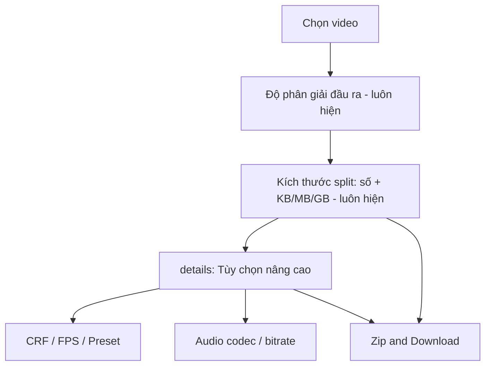

# Cập nhật form Split Video

## Hiện trạng

[`templates/pages/split.html`](templates/pages/split.html) hiện có 4 nhóm field phẳng: file, độ phân giải, encode (CRF/FPS/preset), audio. Worker hardcode **8MB** tại [`worker/SplitVideoWorker/main.go`](worker/SplitVideoWorker/main.go) — form chưa gửi kích thước split.

```19:57:worker/SplitVideoWorker/main.go
const defaultSizeLimit = 8 * 1024 * 1024 // 8MB
// ...
SizeLimit:  defaultSizeLimit,
```

[`structs/SplitJobExtrasDto.go`](structs/SplitJobExtrasDto.go) chỉ lưu `Encode`, không có `size_limit`. `SplitBySize` từ chối `SizeLimit <= 0`.

## Thiết kế UI (HTML native)

Luồng form sau khi sửa:



### Luôn hiển thị (ngoài `<details>`)

1. **Video file** — giữ nguyên
2. **Độ phân giải đầu ra** — giữ `select#size`
3. **Kích thước mỗi file split** — 2 input cạnh nhau:
   - `split_size` (number, `min="0"`, **mặc định `0`** theo lựa chọn của bạn)
   - `split_unit` (select: `kb` | `mb` | `gb`, mặc định `mb` — chỉ có ý nghĩa khi `split_size > 0`)
   - Hint: *Nhập **0** để xuất **một file duy nhất**, không chia nhỏ.*

### Gom vào expand (không cần JS)

Dùng [`<details>` / `<summary>`](https://developer.mozilla.org/en-US/docs/Web/HTML/Element/details) — trình duyệt xử lý mở/đóng sẵn:

```html
<details class="advanced-options">
  <summary>Tùy chọn nâng cao</summary>
  <div class="gap-col-16">
    <!-- #encodeSettings: CRF, FPS, preset -->
    <!-- #audioSettings: audio_codec, audio_bitrate -->
  </div>
</details>
```

Giữ nguyên `id="encodeSettings"` và `id="audioSettings"` để [`split-estimate.js`](public/static/js/split-estimate.js) vẫn hoạt động (ẩn/disable encode khi chọn **Original Size**, toggle audio bitrate khi chọn AAC).

Estimate box + nút submit vẫn ngoài `<details>`.

## CSS tối thiểu

Thêm vào [`public/static/css/root.css`](public/static/css/root.css) (hoặc `layout.css` nếu phù hợp hơn):

- `.input-row` — flex, gap nhỏ: input số chiếm phần lớn, select đơn vị cố định (~100px)
- `.advanced-options` / `.advanced-options summary` — padding, cursor, border-radius khớp `.form-field`

Không thêm JS cho expand.

## Backend — lưu và xử lý kích thước split

### 1. Mở rộng DTO

[`structs/SplitJobExtrasDto.go`](structs/SplitJobExtrasDto.go):

```go
type SplitJobExtrasDto struct {
    Encode    FfmpegEncodeOptionsDto `json:"encode"`
    SizeLimit int64                  `json:"size_limit,omitempty"` // bytes; 0 = không split
}
```

Thêm `parseSplitSize(amount, unit string) (int64, error)`:
- `amount == ""` hoặc `"0"` → `0`
- `amount > 0` + unit → nhân hệ số: KB=`×1024`, MB=`×1024²`, GB=`×1024³`
- Validate: số không âm, unit hợp lệ khi amount > 0

Gọi từ `ParseSplitForm(fields)` với `fields["split_size"]`, `fields["split_unit"]`.

### 2. Worker đọc từ extras

[`worker/SplitVideoWorker/main.go`](worker/SplitVideoWorker/main.go):

- Bỏ hằng `defaultSizeLimit = 8MB` làm mặc định hành vi
- `resolveSizeLimit(job)` từ `extras.SizeLimit` (mặc định `0` nếu thiếu)
- Nhánh xử lý:
  - **`SizeLimit <= 0`**: encode **1 file** duy nhất
  - **`SizeLimit > 0`**: gọi `SplitBySize` như hiện tại

### 3. FfmpegService — encode full file

[`services/FfmpegService/main.go`](services/FfmpegService/main.go):

Thêm `EncodeFull(ctx, input, output, opts)` — tương tự `EncodeSegment` nhưng **không** dùng `-ss` / `-fs`, encode toàn bộ video một lần, trả về `SegmentResultDto` với `Index: 1`.

Worker gọi hàm này khi `SizeLimit == 0`.

### 4. Tests

Cập nhật / bổ sung trong [`structs/SplitJobExtrasDto_test.go`](structs/SplitJobExtrasDto_test.go):

- `split_size=0` → `SizeLimit == 0`
- `split_size=8`, `split_unit=mb` → `8 * 1024 * 1024`
- `split_size=512`, `split_unit=kb` → `512 * 1024`
- Invalid unit / negative amount → error

## Cập nhật ước tính thời gian (JS nhỏ)

[`public/static/js/split-estimate.js`](public/static/js/split-estimate.js):

- Thay `SIZE_LIMIT = 8 * 1024 * 1024` cố định bằng hàm đọc `#split_size` + `#split_unit`
- `split_size === 0` → `segmentCount = 1` (không cộng overhead split nhiều phần)
- Thêm listener `change`/`input` cho 2 field mới

Không thêm JS cho `<details>`.

## Phạm vi không đổi

- [`router/split/main.go`](router/split/main.go) — đã đọc mọi form field qua multipart, không cần sửa
- Logic encode/audio hiện có (keep → copy, AAC bitrate, …) — giữ nguyên

## Thứ tự triển khai

1. Backend: DTO + parse + `EncodeFull` + worker branch
2. Tests parse size
3. HTML restructure + CSS
4. Cập nhật `split-estimate.js`
