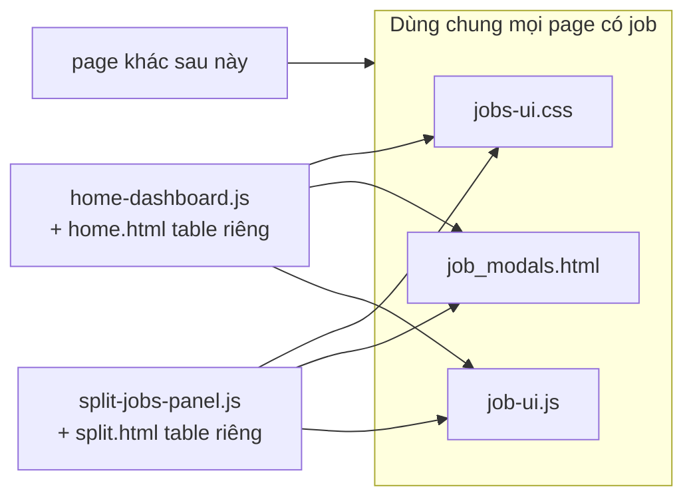

# Bảng job split + common Job UI (không common table HTML)

## Mục tiêu

1. Cuối [`templates/pages/split.html`](templates/pages/split.html): bảng **job split có phân trang** (5 job/trang, prev/next giống home), poll **5s** khi còn `pending`/`processing`.
2. **Common** phần có thể tái sử dụng trên page khác (merge, …): **CSS**, **modal HTML**, **JS actions** (tải, hủy, xem lỗi).
3. **Không common** markup/layout bảng — mỗi page tự viết `<table>` / card list phù hợp layout riêng.

## Ranh giới common vs per-page

| Thành phần | Common | Per-page |
|------------|--------|----------|
| CSS `.history-table`, `.badge`, `.btn`, `.home-modal`, pagination, cards | `jobs-ui.css` | — |
| Modal error + download | `partials/job_modals.html` | — |
| `cancelJob`, `actionButtonsHtml`, `bindRowActions`, download modal logic | `job-ui.js` | — |
| Formatters (`badgeHtml`, `formatDateTime`, `truncateFileName`, …) | `job-ui.js` | — |
| Cấu trúc `<table>` / cột / filter HTML | — | `home.html`, `split.html` |
| Pagination HTML (prev/next, range) | cùng class `jobs-ui.css` | markup riêng mỗi page |
| `JobUI.updatePagination(els, data)` | `job-ui.js` | — |
| `renderTable`, `buildTableRow`, poll orchestration | — | `home-dashboard.js`, `split-jobs-panel.js` |

## Kiến trúc



## 1. CSS — [`public/static/css/jobs-ui.css`](public/static/css/jobs-ui.css)

Tách từ [`home.css`](public/static/css/home.css) các class job UI (không mang stats/welcome/active panel):

- `.btn` variants (primary, secondary, ghost, danger, sm)
- `.badge` + status/type variants
- `.history-table*`, `.history-card*`, `.history-pagination*`
- `.home-modal` → đổi tên **`.job-modal`** (alias `.home-modal` giữ 1 release nếu cần, hoặc update HTML partial luôn)
- `.cell-filename`, `.cell-actions*`, `.download-modal*`
- `.home-empty` → **`.job-empty`** (tương tự)

[`home.css`](public/static/css/home.css) giữ: `.home-dashboard`, welcome, stats-grid, active-jobs-list, `.job-row`, filters.

**Load:**

- Home: `home.css` + `jobs-ui.css`
- Split: `jobs-ui.css` (không cần full `home.css`)

## 2. HTML modal — [`templates/partials/job_modals.html`](templates/partials/job_modals.html)

Chỉ 2 `<dialog>` (copy từ home dòng 134–158):

- `#errorModal` — chi tiết lỗi job failed
- `#downloadModal` — chọn file tải multi-segment

Include trong page cần job actions:

```html
{{template "jobModals" .}}
```

Thêm file vào [`templates/render.go`](templates/render.go) `layoutFiles` (hoặc parse kèm page — cùng pattern partials hiện có).

**Không** tạo `job_table_section.html` — table markup viết trực tiếp trong từng page.

## 3. JS — [`public/static/js/job-ui.js`](public/static/js/job-ui.js)

Export `window.JobUI` — module stateless, init một lần per page:

```js
JobUI.init({
  modals: {
    errorModal, errorModalMessage, errorModalClose,
    downloadModal, downloadModalJobName, downloadSelectAll,
    downloadFileList, downloadModalCancel, downloadModalConfirm,
  },
  onCancelSuccess: function () { /* page reloads its list */ },
});
```

**API public (dùng lại ở mọi page):**

| API | Mô tả |
|-----|--------|
| `JobUI.actionButtonsHtml(job)` | HTML nút Tải / Chọn file / Xem lỗi / Hủy |
| `JobUI.bindRowActions(container, job)` | Gắn click handlers vào row/card |
| `JobUI.cancelJob(identifier)` | `POST /job/cancel?...` |
| `JobUI.showError(message)` | Mở error modal |
| `JobUI.openDownloadModal(job)` | Mở download picker |
| `JobUI.badgeHtml(value, kind)` | Badge trạng thái/loại |
| `JobUI.formatDateTime(iso)` | Format ngày |
| `JobUI.truncateFileName(name, maxLen)` | Rút gọn tên file |
| `JobUI.escapeHtml(str)` | Escape HTML |
| `JobUI.formatFileSize(bytes)` | Hiển thị dung lượng |
| `JobUI.getOutputFiles(job)` | Chuẩn hóa output_files / download_url |
| `JobUI.fetchJobs(query)` | `GET /api/jobs` helper (query object → URLSearchParams) |
| `JobUI.updatePagination(els, data)` | Cập nhật range / « Trước / Sau » / disable nút (logic giống home `renderHistory` dòng 725–743) |

**Nội bộ module:** localStorage `vt_download_selections`, `renderDownloadFileList`, `downloadFiles`, confirm flow — chuyển từ [`home-dashboard.js`](public/static/js/home-dashboard.js).

`updatePagination` nhận `els: { pagination, range, pageInfo, pagePrev, pageNext }` + response `{ items, total, page, limit, total_pages }` — home và split đều gọi sau khi render rows.

**Không** export `renderHistory` / `buildTableRow` — mỗi page tự build row HTML, gọi `JobUI.bindRowActions(tr, job)` cuối cùng.

### Ví dụ row build (split page)

```js
tr.innerHTML =
  '<td class="cell-filename">...</td>' +
  '<td>' + JobUI.badgeHtml(job.status, 'status') + '</td>' +
  '<td>' + pct + '</td>' +
  // ... cột riêng split ...
  '<td class="cell-actions"><div class="cell-actions__inner">' +
    JobUI.actionButtonsHtml(job) + '</div></td>';
JobUI.bindRowActions(tr, job);
```

## 4. Refactor [`home-dashboard.js`](public/static/js/home-dashboard.js)

- `JobUI.init({ modals: ..., onCancelSuccess: loadDashboard })` trong `initHomeDashboard`.
- Thay `actionButtonsHtml`, `bindRowActions`, modal helpers, `cancelJob`, formatters → `JobUI.*`.
- **Giữ nguyên** trong file: stats, active jobs, filters, `renderHistory`, `buildTableRow`, `buildHistoryCard`, polling 3s.
- Pagination trong `renderHistory` → gọi `JobUI.updatePagination(...)` thay logic inline.
- `buildTableRow` vẫn có cột Loại; chỉ delegate actions sang `JobUI`.

Rủi ro thấp hơn plan trước — không đụng logic render/pagination home.

## 5. Split page

### [`templates/pages/split.html`](templates/pages/split.html)

- `<link href="/static/css/jobs-ui.css">`
- Section + **table HTML riêng** (6 cột, không Loại, **không filter**)
- **Pagination block** (copy structure từ home, id prefix `splitJobs`):
  - `#splitJobsPagination`, `#splitJobsRange`, `#splitJobsPageInfo`, `#splitJobsPagePrev`, `#splitJobsPageNext`
- `{{template "jobModals" .}}`
- Scripts: `job-ui.js` → `split-jobs-panel.js`

### [`public/static/js/split-jobs-panel.js`](public/static/js/split-jobs-panel.js)

- `PAGE_SIZE = 5`, state `{ page: 1 }`
- `JobUI.init(...)` + `initSplitJobsPanel()`
- `loadJobs()` → `JobUI.fetchJobs({ type: 'split', limit: 5, page: state.page })`
- `renderSplitJobs(data)` — empty, skeleton, table body, mobile cards
- Sau render rows → `JobUI.updatePagination(paginationEls, data)`
- Prev/next click: `state.page--` / `state.page++` → `loadJobs()` (không sync URL — không có filter)
- Poll 5s: `GET /api/jobs?type=split&active_only=true&limit=1` → `total > 0` thì tiếp tục; mỗi tick refetch **trang hiện tại** (`state.page`)
- `visibilitychange` pause/resume poll

## 6. Backend — filter `type`

- [`services/JobService/main.go`](services/JobService/main.go): `Type *enums.JobType` + filter
- [`router/api/jobs/main.go`](router/api/jobs/main.go): parse `type=split`

## Script load order

```html
<!-- Home -->
<link href="/static/css/home.css" rel="stylesheet" />
<link href="/static/css/jobs-ui.css" rel="stylesheet" />
<script src="/static/js/job-ui.js"></script>
<script src="/static/js/home-dashboard.js"></script>

<!-- Split -->
<link href="/static/css/jobs-ui.css" rel="stylesheet" />
<script src="/static/js/job-ui.js"></script>
<script src="/static/js/split-jobs-panel.js"></script>
```

## Mở rộng sau (merge page, …)

1. Load `jobs-ui.css` + `job-ui.js`
2. Include `{{template "jobModals" .}}`
3. Viết table HTML layout riêng
4. Render loop + `JobUI.actionButtonsHtml` / `bindRowActions`

Không cần sửa `job-ui.js` trừ khi thêm action mới.

## Kiểm tra thủ công

1. **Home:** filter, pagination, download modal, cancel, error — không regression
2. **Split:** phân trang 5 job/trang, prev/next, poll 5s, actions qua JobUI
3. **CSS:** split không load `home.css` vẫn hiển thị table/modal đúng

## Phạm vi không đổi

- POST split redirect `/#historyHeading`
- Stats / active jobs panel — chỉ home
