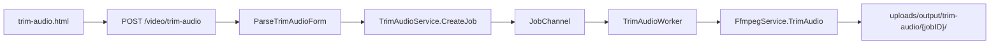

# Plan: Trim Audio (feature độc lập + fade)

## Phạm vi đã chốt

- Feature **mới**, không sửa Extract Audio
- Input: **chỉ audio** (`accept="audio/*"`)
- Form: `start`, `end`, `fade` — số giây, **cho phép thập phân** (vd. `1.5`)
- `fade` = một giá trị áp dụng cho **cả fade-in và fade-out** (`afade=t=in` + `afade=t=out`); `0` = không fade
- Output: **cùng định dạng/extension** với file nguồn (mp3/m4a/wav/flac/ogg/…); không thêm chọn format/bitrate/metadata

## Luồng xử lý



FFmpeg (tóm tắt):

- Seek/cut: `-ss {start}` + `-to {end}` (hoặc `-t {end-start}`) trước/sau `-i` theo pattern hiện có trong [`gif.go`](services/FfmpegService/gif.go)
- Fade: `-af "afade=t=in:st=0:d={fade},afade=t=out:st={segDur-fade}:d={fade}"` khi `fade > 0`
- `fade == 0`: cố gắng `-c:a copy`; có fade thì re-encode theo codec phù hợp extension (reuse logic codec từ [`extract_audio.go`](services/FfmpegService/extract_audio.go))

## Validation

| Field | Rule |
|-------|------|
| `start` | `>= 0`, float |
| `end` | `> start`, float |
| `fade` | `>= 0`, float; `2 * fade <= (end - start)` |
| Upload | bắt buộc ≥1 file audio; empty → `400` tiếng Việt |
| Duration | worker probe; nếu `end > duration` → fail rõ ràng |

Defaults: `start=0`, `end` trống → lỗi (bắt buộc nhập), `fade=0`.

## File cần tạo / sửa

### Frontend (theo checklist COMMON_PLAN)

| File | Việc |
|------|------|
| [`templates/pages/trim-audio.html`](templates/pages/trim-audio.html) | Form: file audio + `start`/`end`/`fade` (`.input-row` + unit “giây”), estimate box, jobs history, scripts |
| [`public/static/js/trim-audio-estimate.js`](public/static/js/trim-audio-estimate.js) | localStorage `trimAudioForm.options`, probe duration qua `<audio>`, ước lượng theo đoạn cắt |
| [`public/static/js/trim-audio-file-preview.js`](public/static/js/trim-audio-file-preview.js) | DataTransfer + `pageshow` (copy pattern extract-audio; `accept=audio/*`) |
| [`public/static/js/trim-audio-jobs-panel.js`](public/static/js/trim-audio-jobs-panel.js) | `JobUI.fetchJobs({ type: "trim_audio" })` |
| [`templates/partials/sidebar.html`](templates/partials/sidebar.html) | Nav “Trim Audio” (reuse `audio.svg`) ngay dưới Extract Audio |
| [`templates/pages/home.html`](templates/pages/home.html) | Link tool ngắn |
| [`public/static/js/job-ui.js`](public/static/js/job-ui.js) | `TYPE_LABELS.trim_audio = "Cắt audio"` |

Form IDs: `trimAudioForm`, fields `start` / `end` / `fade`, jobs prefix `trimAudioJobs*`.

### Backend

| File | Việc |
|------|------|
| [`enums/JobType.go`](enums/JobType.go) | `JobTypeTrimAudio = "trim_audio"` |
| [`structs/TrimAudioJobExtrasDto.go`](structs/TrimAudioJobExtrasDto.go) + `_test.go` | Parse/ToJSON/ParseJSON + validation thập phân |
| [`router/trimaudio/main.go`](router/trimaudio/main.go) | GET/POST `/video/trim-audio` + legacy `301` từ `/trim-audio` |
| [`router/main.go`](router/main.go) | `trimaudio.Bootstrap()` |
| [`services/TrimAudioService/main.go`](services/TrimAudioService/main.go) | `CreateJob` giống ExtractAudio |
| [`services/FfmpegService/trim_audio.go`](services/FfmpegService/trim_audio.go) | `TrimAudio(ctx, opts)` + build args/filters |
| [`worker/TrimAudioWorker/main.go`](worker/TrimAudioWorker/main.go) | Probe → TrimAudio → output `JobFileData` |
| [`worker/channels/main.go`](worker/channels/main.go) | `case enums.JobTypeTrimAudio` + cancel context |
| [`services/JobPresenterService/main.go`](services/JobPresenterService/main.go) | Summary kiểu `3.5s–12s · fade 0.5s` |

POST: `MultipartReader` + `uploadutil.ResolveMultipart`, mỗi file một job, `303` về `/video/trim-audio`.

## UI form (cốt lõi)

```html
<div class="form-field">
  <label for="start">Thời điểm bắt đầu</label>
  <div class="input-row">
    <input id="start" name="start" type="number" min="0" step="any" value="0" required />
    <span>giây</span>
  </div>
</div>
<!-- end, fade tương tự; field-hint giải thích fade in + out -->
```

Script order: `job-ui.js` → `trim-audio-jobs-panel.js` → `trim-audio-estimate.js` → `trim-audio-file-preview.js` → inline `initTrimAudio*()`.

## Verify (sau implement)

- Refresh → restore `start`/`end`/`fade` từ localStorage
- Back/forward → file preview sync (`pageshow`)
- Submit → 303, jobs panel thấy `trim_audio`
- Empty upload / `end <= start` / fade quá dài → 400
- Fade `0` vs `>0` đều ra file nghe được; thập phân (`1.25`) đúng
