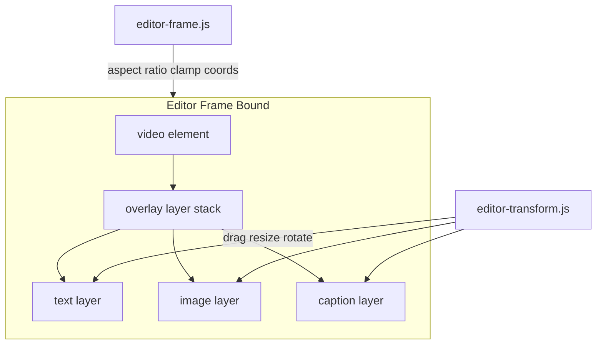
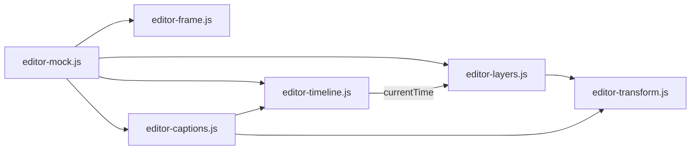

# Video Editor Mock UI

## Mục tiêu

Trang editor độc lập cho phép user upload video (chỉ xử lý trên browser), chỉnh sửa **các layer bên trong frame bound** (khung = kích thước video gốc), xem preview khi play, và xuất cấu hình JSON mock — **không POST, không FFmpeg, không job history**.

## Khái niệm cốt lõi: Frame Bound + Layers



- **Frame bound** (`.editor-frame`): khung đại diện **toàn bộ video** (`videoWidth × videoHeight`). Giữ đúng aspect ratio (CSS `aspect-ratio`), scale fit trong vùng preview — mọi tọa độ layer tính **tương đối 0–1** so với frame này, không phải viewport browser.
- **Layers**: mọi thành phần (text watermark, image logo, caption) đều là **layer** trong frame bound, tương tác giống Figma/Photoshop — select → bounding box + handles → kéo thả thoải mái.
- **Caption** thêm thuộc tính thời gian (`start`/`end`); khi ngoài khoảng thời gian thì ẩn trên frame nhưng vẫn có trong layers panel.

## Kiến trúc module



| Module | Trách nhiệm |
|--------|-------------|
| `editor-frame.js` | Tạo/cập nhật frame bound, map pixel ↔ normalized coords, clamp trong `[0,1]` |
| `editor-transform.js` | Pointer drag, 8-handle resize, rotate handle — **dùng chung cho mọi layer** |
| `editor-layers.js` | Thêm/xóa/select layer, render DOM overlay, z-index, layers panel |
| `editor-captions.js` | Timeline segments (start/end), sync visibility với playhead |
| `editor-timeline.js` | Playhead scrub, play/pause, hiển thị thời gian |
| `editor-mock.js` | State tổng, toolbar, properties panel, export JSON |

## Layout UI

```
┌──────────────────────────────────────────────────────────────┐
│ Page header + Upload video                                   │
├──────────────────────────────────────────────────────────────┤
│ Toolbar: [+ Text] [+ Logo] [+ Caption]  ▶ Play  ⏸ Pause     │
│          [Export JSON]                                       │
├──────────┬───────────────────────────────┬─────────────────┤
│ Layers   │  ┌─ Frame Bound ─────────┐   │ Properties      │
│ (z-order)│  │ video + layer stack   │   │ (selected layer)│
│          │  └───────────────────────┘   │                 │
├──────────┴───────────────────────────────┴─────────────────┤
│ Timeline: playhead | caption segments (start/end)          │
└──────────────────────────────────────────────────────────────┘
```

- **Layers panel**: danh sách layer theo z-index (trên cùng = phía trước); click select, toggle visibility, xóa; hiển thị loại (text/image/caption).
- **Frame bound**: viền rõ ràng (border dashed hoặc shadow) để user biết ranh giới video; click vùng trống → deselect.
- **Properties panel**: form động theo `kind` của layer đang chọn.
- **Timeline**: chỉ caption segments (start/end); watermark luôn hiện trên frame.

## Data model (client-side only)

Model thống nhất — mọi thành phần là layer:

```json
{
  "frame": { "width": 1920, "height": 1080 },
  "video": { "name": "demo.mp4", "duration": 120.5 },
  "layers": [
    {
      "id": "layer-1",
      "kind": "text",
      "x": 0.85, "y": 0.05,
      "width": 0.12, "height": 0.06,
      "rotation": 0,
      "opacity": 0.8,
      "zIndex": 1,
      "visible": true,
      "text": "© My Brand",
      "fontSize": 24,
      "color": "#ffffff"
    },
    {
      "id": "layer-2",
      "kind": "image",
      "x": 0.05, "y": 0.85,
      "width": 0.1, "height": 0.1,
      "rotation": -15,
      "opacity": 0.7,
      "zIndex": 2,
      "visible": true,
      "src": "blob:..."
    },
    {
      "id": "layer-3",
      "kind": "caption",
      "x": 0.2, "y": 0.8,
      "width": 0.6, "height": 0.12,
      "rotation": 0,
      "opacity": 1,
      "zIndex": 3,
      "visible": true,
      "text": "Xin chào!",
      "start": 2.0,
      "end": 5.5,
      "fontSize": 28,
      "color": "#ffffff",
      "bgColor": "rgba(0,0,0,0.5)"
    }
  ]
}
```

- `x/y/width/height`: tỷ lệ **0–1 so với frame bound** (map sang FFmpeg: `x_px = x * frame.width`).
- Mọi layer đều có transform đầy đủ; caption thêm `start`/`end`.

## Transform UX (dùng chung cho mọi layer)

Module [`editor-transform.js`](public/static/js/editor-transform.js):

| Thao tác | Hành vi |
|----------|---------|
| **Kéo thả** | Pointer drag trên layer body → cập nhật `x`, `y`; clamp không vượt frame bound |
| **Select** | Click layer → bounding box + 8 handles + rotate handle; click frame trống → deselect |
| **Resize góc** (4 corner handles) | **Aspect lock mặc định** — giữ tỷ lệ `width/height` của layer khi kéo góc |
| **Resize cạnh** (4 edge handles) | Chỉ đổi một chiều (width hoặc height) |
| **Shift + resize** | **Uniform scale** — scale đều từ tâm layer (cả width & height thay đổi cùng tỷ lệ) |
| **Rotate** | Handle phía trên bounding box; tính góc từ tâm layer |
| **Constraints** | Layer luôn nằm trong frame bound; min size ~2% frame |

Implementation notes:
- Dùng `pointerdown/move/up` + `setPointerCapture` (pattern từ [`gif-timeline.js`](public/static/js/gif-timeline.js)).
- Lưu `aspectRatio = width/height` khi bắt đầu resize góc; áp delta theo trục dominant.
- `event.shiftKey` khi resize → uniform scale từ anchor center.
- Transform box render absolute trong overlay container, sync từ state normalized coords × frame pixel size.

## Frame bound

Module [`editor-frame.js`](public/static/js/editor-frame.js):

- Sau probe video metadata → set `frame.width`, `frame.height`, CSS `aspect-ratio: W / H` trên `.editor-frame`.
- Overlay container `position: absolute; inset: 0` khớp video.
- Helpers: `normToPx(x, y)`, `pxToNorm(x, y)`, `clampLayer(layer)` — đảm bảo layer không tràn frame.
- Khi resize browser: frame scale nhưng tọa độ normalized không đổi → overlay luôn đúng vị trí tương đối.

## Layers panel (kiểu design tool)

Module [`editor-layers.js`](public/static/js/editor-layers.js):

| Thao tác | Hành vi |
|----------|---------|
| Thêm text | Toolbar → layer mới giữa frame, kind `text` |
| Thêm logo | Toolbar → file input → layer kind `image` |
| Thêm caption | Toolbar → layer kind `caption` + segment timeline mặc định |
| Select | Click row hoặc click layer trên frame |
| Visibility | Toggle icon — ẩn/hiện trên frame |
| Z-index | Nút ↑/↓ hoặc kéo reorder trong panel (mock: nút ↑/↓ đủ cho phase 1) |
| Delete | Nút xóa layer |

Mọi layer khi visible đều **kéo thả + resize + rotate** qua `editor-transform.js`.

## Caption timeline

Module [`editor-captions.js`](public/static/js/editor-captions.js):

- Caption layer có thêm `start`/`end` — segment trên timeline track (pattern range + thumbs từ GIF editor).
- Kéo thumb start/end, kéo block để dịch cả đoạn thời gian.
- `video.timeupdate` → caption layer chỉ render trên frame khi `start ≤ currentTime ≤ end`.
- Trên frame: caption layer **cùng transform UX** như watermark (bounding box, resize text box, kéo vị trí).
- Caption mới: `start = currentTime`, `end = min(start + 3, duration)`.

## Timeline & playback

Module [`editor-timeline.js`](public/static/js/editor-timeline.js):

- Playhead scrubber (click/drag).
- Sync `video.currentTime` ↔ playhead.
- Hiển thị `current / total` (`m:ss`).

## Mock export

- Nút "Export JSON" → `<dialog>` pretty-printed JSON (copy được).
- Toast: *"Mock only — chưa xử lý video thật"*.

## Files cần tạo / sửa

| File | Hành động |
|------|-----------|
| [`router/editor/main.go`](router/editor/main.go) | **Mới** — `GET /video/editor` only |
| [`router/main.go`](router/main.go) | Import `editor.Bootstrap()` |
| [`templates/pages/editor.html`](templates/pages/editor.html) | **Mới** — frame bound markup, toolbar, panels |
| [`templates/partials/sidebar.html`](templates/partials/sidebar.html) | Link "Video Editor" |
| [`public/static/css/editor.css`](public/static/css/editor.css) | Frame bound, transform handles, layers panel, timeline |
| [`public/static/js/editor-mock.js`](public/static/js/editor-mock.js) | State, init, properties, export |
| [`public/static/js/editor-frame.js`](public/static/js/editor-frame.js) | **Mới** — frame bound + coord mapping |
| [`public/static/js/editor-transform.js`](public/static/js/editor-transform.js) | **Mới** — shared drag/resize/rotate |
| [`public/static/js/editor-layers.js`](public/static/js/editor-layers.js) | **Mới** — layer CRUD + panel |
| [`public/static/js/editor-captions.js`](public/static/js/editor-captions.js) | Caption timeline + visibility |
| [`public/static/js/editor-timeline.js`](public/static/js/editor-timeline.js) | Playhead + playback |

Sau khi thêm assets: `go run cmd/assetbuild`.

## Ngoài scope (phase này)

- Backend POST / FFmpeg
- Job queue, history table
- Upload SRT parser
- Crop/resize frame bound (frame = video gốc, cố định)
- Undo/redo
- localStorage persist

## Kiểm tra thủ công

1. Upload video → frame bound hiện đúng aspect ratio.
2. Thêm text/image/caption → mọi layer đều kéo thả được trong frame.
3. Resize góc → giữ aspect ratio layer; giữ Shift → uniform scale từ tâm.
4. Resize cạnh → chỉ đổi một chiều.
5. Rotate handle hoạt động trên mọi layer type.
6. Caption: segment timeline + hiện/ẩn đúng thời gian; khi hiện vẫn resize/drag được.
7. Layers panel: select, visibility, z-index, delete.
8. Export JSON → config có `frame` + `layers` với transform đầy đủ.
9. Resize browser → layer giữ vị trí tương đối trong frame bound.
