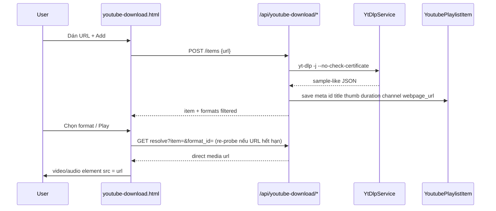

# YouTube Playlist + Player (yt-dlp, no file storage)

## Quyết định đã chốt (thay plan job cũ)

- **Không** tạo `JobType` / worker / lưu file media trên server.
- Server chỉ chạy `yt-dlp -j --no-check-certificate "<url>"` (như [sample.json](sample.json)) để lấy metadata + danh sách format kèm `url` trực tiếp.
- User chọn format → nhận **direct URL** để play trên web hoặc mở/download (browser execute link).
- **Playlist lưu BE** (scoped cookie `vt_user_id`): khi add link, persist metadata ổn định để lần sau render lại.
- Player: play / pause / next / prev / loop — **ghi nhớ lựa chọn loop** (localStorage).
- **CORS / proxy download = phase 2** — phase 1 chấp nhận play/download có thể fail nếu CDN chặn; UI vẫn trả URL.

Slug: `youtube-download` / `ActivePage: "youtube-download"` / route `/video/youtube-download`.



## 1. Docker

Cài **yt-dlp** binary vào:

- [`.docker/local/Dockerfile`](.docker/local/Dockerfile)
- [`.docker/prod/Dockerfile`](.docker/prod/Dockerfile) (stage runner)

Tải release binary → `/usr/local/bin/yt-dlp`. Không cần job worker; ffmpeg không bắt buộc cho phase 1 (chỉ `-j`).

## 2. Data model (BE playlist)

Entity mới `entities/YoutubePlaylistItem`:

| Field | Nguồn từ sample.json | Ghi chú |
|-------|----------------------|---------|
| `ID` | — | PK |
| `UserID` | cookie | scope playlist |
| `YoutubeID` | `id` / `display_id` | unique per user |
| `Title` | `title` | |
| `Thumbnail` | `thumbnail` | |
| `Duration` | `duration` | seconds |
| `Channel` | `channel` | |
| `WebpageURL` | `webpage_url` / `original_url` | |
| `Position` | — | thứ tự playlist |
| `CreatedAt` / `UpdatedAt` | — | |

- **Không** lưu toàn bộ `formats[].url` lâu dài (CDN `expire=...` hết hạn).
- Khi cần play/download: re-run `yt-dlp -j` theo `WebpageURL`, chọn `format_id`, trả `url` mới.
- Optional cache ngắn: field `FormatsJSON` + `ProbedAt` — nếu còn &lt; ~30 phút thì tái dùng; hết hạn thì probe lại. Phase 1 implement cache này để add → chọn format không gọi yt-dlp 2 lần liên tiếp.

AutoMigrate trong [`common/Global/main.go`](common/Global/main.go).

## 3. YtDlpService

`services/YtDlpService/`:

```go
// Command: yt-dlp -j --no-check-certificate --no-playlist <url>
Probe(ctx, url) → YoutubeProbeDto
```

Map từ raw JSON → DTO gọn:

- Meta: `id`, `title`, `thumbnail`, `duration`, `channel`, `webpage_url`
- Formats: lọc bỏ `format_note == storyboard` / `ext == mhtml` / protocol mhtml
- Mỗi format: `format_id`, `ext`, `resolution`, `fps`, `vcodec`, `acodec`, `filesize`/`filesize_approx`, `format_note`, `url`, `kind` (`audio` | `video` | `muxed`)

`kind`:

- `audio`: `vcodec` none/null, có `acodec`
- `video`: `acodec` none, có `vcodec`
- `muxed`: cả video + audio (ưu tiên cho play in-browser)

Exec: `exec.CommandContext`, args slice — không shell interpolate.

## 4. API + page router

Package `router/youtubedownload/` (+ bootstrap trong [`router/main.go`](router/main.go)):

| Method | Path | Việc |
|--------|------|------|
| GET | `/video/youtube-download` | Render page + (SSR optional) empty shell |
| GET | `/api/youtube-download/playlist` | List items theo user, order `Position` |
| POST | `/api/youtube-download/playlist` | Body `{url}` → Probe → upsert item meta → trả item + formats |
| PATCH | `/api/youtube-download/playlist/{id}` | Reorder (`position`) hoặc update nhẹ |
| DELETE | `/api/youtube-download/playlist/{id}` | Xóa item |
| GET | `/api/youtube-download/playlist/{id}/formats` | Probe (hoặc cache) → formats list |
| GET | `/api/youtube-download/playlist/{id}/resolve?format_id=` | Trả `{ url, ext, kind, headers? }` cho play/download |

Validate URL host: `youtube.com` / `youtu.be`. Lỗi probe → `400`/`502` tiếng Việt.

**Không** dùng PRG multipart / jobs panel / `job-ui` cho feature này (exception COMMON_PLAN — domain khác).

## 5. Frontend UI

Template [`templates/pages/youtube-download.html`](templates/pages/youtube-download.html):

1. **Add bar**: input URL + nút “Thêm vào playlist”
2. **Playlist** (cột chính / danh sách): thumbnail, title, channel, duration, nút xóa, click để chọn track
3. **Format list** (khi chọn track): bảng format (filter Audio / Video / Muxed); chọn 1 format
4. **Player bar**: `<video>` hoặc `<audio>` tùy kind
   - Play / Pause
   - Prev / Next (theo `Position` playlist)
   - Loop toggle (off / one / all) — persist `localStorage` key `youtubeDownloadPlayer.prefs`
   - Sau khi chọn format + Play → `resolve` → set `src` = direct URL
5. Nút **Download / Mở link**: `window.open(url)` hoặc `<a download>` (phase 1; CORS có thể chặn — ghi chú UI nhẹ)

JS modules (IIFE, `"use strict"`):

- `youtube-download-playlist.js` — CRUD API, render list
- `youtube-download-player.js` — controls, loop prefs, next/prev, ended handler
- `youtube-download-formats.js` — load/render formats, selection

CSS: tái dụng `root.css` / `jobs-ui.css` class có sẵn; chỉ thêm tối thiểu vào `jobs-ui.css` hoặc block nhỏ trong page nếu player cần (tránh file CSS mới trừ khi thật sự cần — ưu tiên classes hiện có).

### Playability (phase 1)

- **Muxed** hoặc **audio**: set `src` trực tiếp → play.
- **Video-only (DASH)**: vẫn hiện trong list để “mở/download URL”; nút Play báo “format này không có audio trong trình duyệt — chọn muxed/audio hoặc tải về” (không mux client-side).

## 6. Nav / SEO

- [`templates/partials/sidebar.html`](templates/partials/sidebar.html) — link YouTube Download
- Home / about / footer / [`router/seo/main.go`](router/seo/main.go)

## 7. Phase 2 (ngoài scope implement hiện tại)

- Proxy stream qua server (hoặc signed short-lived redirect) để bypass CORS khi play/download từ browser.
- Có thể thêm “Download qua server” optional lúc đó.

## 8. Verify

- Docker có `yt-dlp --version`
- Add URL → item hiện trong playlist với title/thumb từ probe
- Reload trang → playlist vẫn còn (BE)
- Chọn format muxed/audio → Play chạy; Next/Prev đúng; Loop nhớ sau refresh
- Resolve lại sau khi cache hết hạn vẫn ra URL mới
- Không tạo thư mục `uploads/output/youtube-*`
- sample.json chỉ dùng tham chiếu shape — không commit vào runtime path
